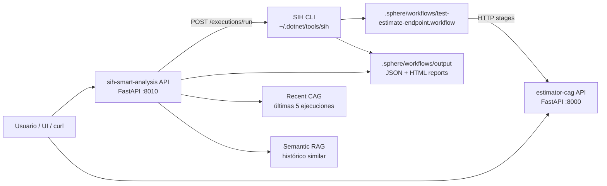
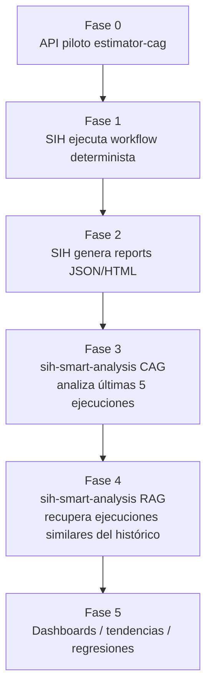

# LIdrMaster

Repositorio de ejercicios y extensiones alrededor de CAG, RAG y ejecución determinista de workflows con SphereIntegrationHub.

## Proyectos

| Proyecto | Puerto | Rol | Fase IA |
|----------|--------|-----|---------|
| [`estimator-cag`](./estimator-cag) | `8000` | API que estima proyectos software desde una transcripción | CAG |
| [`sih-smart-analysis`](./sih-smart-analysis) | `8010` | API que ejecuta workflows SIH y analiza reports históricos | CAG ahora, RAG preparado |

## Relación entre piezas

## Fases

## API Versioning

Ambas APIs exponen sus endpoints funcionales bajo `/api/v1`.

La transición de CAG a RAG en `sih-smart-analysis` no exige cambiar de versión si se mantiene el contrato externo y solo cambia la estrategia interna del controller/use case. Si aparece un contrato incompatible, por ejemplo otro shape de respuesta o un modelo de fuentes distinto, entonces se debería añadir `/api/v2` manteniendo `/api/v1` estable.

## Repo Skills

Este repo incluye skills locales para mantener disciplina de trabajo:

| Skill | Propósito |
|-------|-----------|
| [keep-project-docs-updated](./.codex/skills/keep-project-docs-updated/SKILL.md) | Mantener actualizado el README del proyecto afectado cuando cambien APIs, arquitectura, fases, configuración, SIH, CAG/RAG o tests. |
| [make-functional-commits](./.codex/skills/make-functional-commits/SKILL.md) | Preparar commits pequeños, funcionales, validados y con documentación incluida cuando corresponda. |
