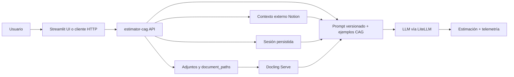

# LIdrMaster

Workspace del máster centrado principalmente en **`estimator-cag`**, el proyecto de estimación de software basado en **CAG (Context Augmented Generation)**.

Aunque el repo incluye `sih-smart-analysis`, ese proyecto aquí actúa como complemento y banco de pruebas alrededor de workflows y reports. El núcleo real del trabajo, de la evolución reciente y de la propuesta funcional está en `estimator-cag`.

## Proyecto principal

### [`estimator-cag`](./estimator-cag)

API FastAPI y UI Streamlit para estimar proyectos software a partir de una conversación, una transcripción o material documental de apoyo.

El proyecto mantiene una aproximación deliberadamente **CAG** en su flujo principal de estimación:

- el contexto relevante viaja en cada invocación al modelo

En paralelo, el repo incorpora ya un carril semántico separado para presupuestos históricos:

- chunking estructural y variantes comparables
- embeddings OpenAI
- persistencia opcional en `pgvector`
- búsqueda semántica y evaluación básica de retrieval

La base del ejercicio del máster era construir un estimador con contexto estático y llamada a LLM. Sobre esa base, el repositorio ya recoge una versión bastante más completa.

## Lo implementado recientemente

### Sesión 5 del máster

`estimator-cag` ya no es solo un endpoint de estimación aislado. En esta iteración quedó llevado a una experiencia conversacional y de producto más cercana a uso real:

- sesiones persistidas con `session_id` reutilizable
- historial conversacional rehidratable en UI
- continuidad multi-turno sobre el mismo proyecto
- UI Streamlit orientada a chat con estado persistente
- telemetría visible de proveedor, modelo, latencia y tokens

### Sesión 6 del máster

Sobre esa base, `estimator-cag` incorpora ahora un stress test reproducible del CAG:

- observación agregada por turno (`turn_observed`)
- runner de escenarios multi-turno y adjuntos sintéticos
- métricas deterministas de latencia, coste y deriva de memoria
- artefactos de salida versionados en `evals/stress/results.csv` y `evals/stress/REPORT.md`

### Añadido por nosotros

Además de lo trabajado en la sesión, el proyecto se amplió con capacidades prácticas que lo hacen más útil como acelerador de discovery y preestimación:

- adjuntos por turno y referencias a documentos por ruta
- extracción documental on-demand vía **Docling Serve**
- soporte de `.pdf`, `.docx`, `.pptx`, imágenes, `.md` y `.txt`
- contexto externo opcional desde **Notion**
- inferencia de términos de búsqueda a partir de la conversación y metadatos del proyecto
- prompts versionados con Jinja2
- selección de proveedor/modelo mediante `friendly_name`
- soporte multi proveedor vía **LiteLLM**
- pipeline semántico de embeddings con persistencia vectorial y search endpoints

## Cómo encaja el flujo principal

## Estructura del repo

| Ruta | Rol |
|------|-----|
| [`estimator-cag`](./estimator-cag) | Proyecto principal del repo. |
| [`sih-smart-analysis`](./sih-smart-analysis) | Proyecto secundario para ejecución y análisis de reports SIH. |
| [`ClassRoom`](./ClassRoom) | Material de aula y ejercicios base. |
| [`doc`](./doc) | Instrucciones y material auxiliar del máster. |
| [`training-archive`](./training-archive) | Archivado local de contenidos del campus para repaso en Markdown. |

## Proyecto secundario

### [`sih-smart-analysis`](./sih-smart-analysis)

Está presente porque sirve para experimentar con ejecución de workflows de SphereIntegrationHub y análisis de reports históricos, pero no representa el foco principal actual del repositorio.

Si se consulta este repo para entender el trabajo del máster, conviene empezar por `estimator-cag`, no por `sih-smart-analysis`.

## API versioning

Las APIs activas usan `/api/v1`. En el caso de `estimator-cag`, el valor está en mantener estable el contrato mientras evoluciona la composición interna del contexto, no en abrir versiones nuevas por cada mejora del prompt o del pipeline de enriquecimiento.

## Repo skills

| Skill | Propósito |
|-------|-----------|
| [keep-project-docs-updated](./.codex/skills/keep-project-docs-updated/SKILL.md) | Mantener la documentación alineada con cambios reales del proyecto. |
| [make-functional-commits](./.codex/skills/make-functional-commits/SKILL.md) | Preparar commits pequeños, funcionales y validados. |
