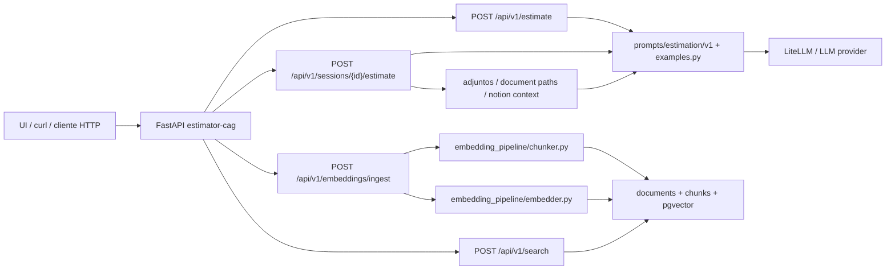
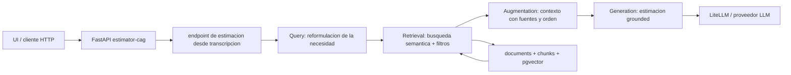

# Arquitectura actual y evolucion necesaria hacia RAG en `estimator-cag`

## 1. Diagrama de la arquitectura actual

Este diagrama describe el estado util al cierre de la sesion 8: ya existia un carril semantico con `pgvector`, pero la estimacion principal seguia dependiendo de CAG y de ejemplos estaticos.



Estado observado:

- La API ya podia ingerir presupuestos historicos y buscar chunks similares.
- La ruta principal de estimacion seguia siendo CAG con ejemplos estaticos.
- El retrieval existia como capacidad paralela, no como parte obligatoria del camino `transcripcion -> estimacion`.
- El hueco estaba entre `POST /api/v1/search` y la generacion final: faltaba enlazar evidence retrieval con prompt y respuesta.

## 2. Trace anotado de una transcripcion

La guia del campus pedia `02_ambiguous.txt`, pero ese fichero no esta en este snapshot del repo. La evidencia disponible localmente para reproducir el analisis es:

- `estimator-cag/sample-transcriptions/meeting-health-clinic.md`
- `estimator-cag/output_examples.txt`
- `estimator-cag/evals/session-08-query-eval.md`

He usado la transcripcion de clinica como sustituto local y el artefacto `ambiguous` ya versionado como evidencia real del comportamiento del retriever.

Transcripcion disponible en el repo:

```text
Reunion con una clinica privada que necesita una aplicacion web interna para gestionar citas medicas, consultar un historial resumido de pacientes y enviar recordatorios automaticos por email y SMS. El personal de recepcion tambien necesita un panel para confirmar asistencia, reprogramar citas y bloquear huecos en agenda.
```

### Paso 1. Comando reproducible para inspeccionar el retrieval

El repo ya incluye el cliente usado en sesion 8 para lanzar queries de referencia:

```bash
cd estimator-cag
python scripts/query_examples.py --base-url http://127.0.0.1:8000 --k 5 --model text-embedding-3-small
```

Comentario:

- Este comando no consume el prompt CAG ni genera una estimacion.
- Solo permite observar la etapa de retrieval sobre el corpus historico persistido.
- Esa separacion ya anticipa el hueco arquitectonico: buscar no es todavia estimar.

### Paso 2. Respuesta real preservada para la query ambigua

El repo conserva la salida real del carril semantico en `estimator-cag/output_examples.txt`. El bloque mas parecido al caso pedido por el ejercicio es `ambiguous`:

```text
## ambiguous
Query: integration external system
  1. chunk_id=83 | ref=BUD-2024-012::SEN-001 | distance=0.5922 | chunk_type=budget_component
  2. chunk_id=77 | ref=BUD-2024-009::REQ-001 | distance=0.6232 | chunk_type=budget_component
  3. chunk_id=84 | ref=BUD-2024-012::ALR-002 | distance=0.6386 | chunk_type=budget_component
  4. chunk_id=72 | ref=BUD-2024-006::DRV-002 | distance=0.6395 | chunk_type=budget_component
  5. chunk_id=78 | ref=BUD-2024-009::TRI-002 | distance=0.6581 | chunk_type=budget_component
```

Comentario:

- La query ambigua devuelve candidatos parciales, pero no una unica evidencia claramente dominante.
- Las distancias top-1 y top-5 quedan demasiado juntas para afirmar que el sistema "entiende" bien el caso.
- El retriever responde "lo mas parecido", no "lo suficientemente relevante".

### Paso 3. Lectura critica de los chunks devueltos

Apoyandome en `estimator-cag/evals/session-08-query-eval.md`, la lectura rapida del caso ambiguo ya estaba documentada asi:

```text
Consulta ambigua: sirve para observar mezcla de candidatos, no para aprobar o suspender automaticamente.
```

Comentarios por tipo de candidato:

- `BUD-2024-012::*` pertenece a un dashboard de operaciones agricolas con alertas de riego. Tiene senales de panel y alertas, pero sector y problema de negocio no encajan con una clinica.
- `BUD-2024-009::*` pertenece a backoffice de gestion de solicitudes ciudadanas. Puede parecerse en backoffice y flujo operativo, pero no en dominio ni requisitos de agenda medica.
- `BUD-2024-006::DRV-002` pertenece a logistica y actualizaciones para conductores. Es un indicio claro de mezcla semantica: hay UX operativa, pero no evidencia fuerte del dominio pedido.

Diagnostico del trace:

- El retriever no estaba fallando por estar vacio.
- El fallo era mas sutil: recuperaba similitud superficial sin una senal fuerte de relevancia de negocio.
- Eso justifica que la sesion 9 empiece por Query y Retrieval antes de hablar de generacion.

## 3. Diagnostico: cinco fallos identificados

### Fallo 1. La transcripcion cruda no era una query util

- Problema observado: el sistema de busqueda estaba pensado para queries cortas y limpias; una transcripcion larga mete demasiadas intenciones y ruido en un solo embedding.
- Causa probable: la entrada al retriever no tenia una etapa explicita de reformulacion o simplificacion de la necesidad del cliente.
- Propuesta de solucion: introducir una etapa Query que destile requisitos, sector, restricciones y palabras clave operativas antes de embedir.

### Fallo 2. El retrieval devolvia similitud, no evidencia suficiente

- Problema observado: en el caso ambiguo aparecen varios candidatos parciales con distancias cercanas entre si.
- Causa probable: el contrato de busqueda estaba centrado en top-`k` por similitud coseno y no en una politica de suficiencia de evidencia.
- Propuesta de solucion: anadir umbrales de relevancia, filtros estructurales y una salida explicita de baja confianza.

### Fallo 3. El dominio de negocio se perdia pronto

- Problema observado: aparecen proyectos de agricultura, sector publico y logistica cuando el caso que nos interesa es sanitario.
- Causa probable: el retrieval semantico no priorizaba todavia metadata de sector o no recibia una query suficientemente estructurada para usarlas bien.
- Propuesta de solucion: combinar similitud vectorial con filtros y senales estructurales del dominio.

### Fallo 4. Buscar y estimar eran dos carriles separados

- Problema observado: existia `POST /api/v1/search`, pero la estimacion principal seguia apoyandose en CAG y ejemplos estaticos.
- Causa probable: la arquitectura habia crecido por fases y el carril semantico aun no se habia conectado de forma disciplinada al orquestador de estimacion.
- Propuesta de solucion: crear un flujo explicito `Query -> Retrieval -> Augmentation -> Generation` donde retrieval deje de ser una capacidad paralela.

### Fallo 5. No habia ensamblado de contexto orientado al LLM

- Problema observado: el trace disponible termina en resultados de busqueda; no existe en esta fase un bloque de contexto estructurado con fuentes listo para generacion.
- Causa probable: faltaba una etapa Augmentation que ordenara, truncara y etiquetara la evidencia recuperada.
- Propuesta de solucion: introducir un ensamblador de contexto con fuentes identificables y metadatos utiles para citacion y grounding.

## 4. Propuesta de evolucion arquitectonica



Responsabilidad de los modulos nuevos:

- `Query`: convertir la transcripcion en una consulta mas discriminativa para el buscador.
- `Retrieval`: recuperar evidencia historica util y descartar lo insuficiente.
- `Augmentation`: preparar contexto legible por el modelo, con delimitacion clara de fuentes.
- `Generation`: producir la estimacion final usando solo la evidencia recuperada.

Dato que fluye entre etapas:

- Transcripcion cruda.
- Query reformulada.
- Chunks recuperados con metadata.
- Contexto ensamblado y trazable.
- Estimacion final con base explicable.

La pieza mas critica para atacar primero es `Retrieval`, porque si la evidencia recuperada es mala o debil, el resto del pipeline solo va a maquillar una base incorrecta. En este modulo el mayor palanqueo no esta en "mejor prompt", sino en recuperar mejor.
