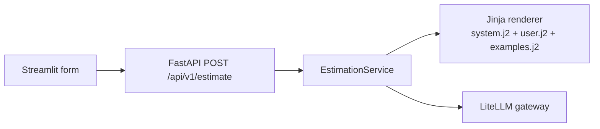

# estimator-cag

Servicio FastAPI para estimar proyectos software con un contrato tipado y prompts versionados en Jinja2.

Este proyecto implementa el ejercicio de pasar de un chat libre a una interfaz de producto:
- el cliente ya no envía una transcripción arbitraria como chat
- el servicio recibe un `EstimationRequest` tipado
- el prompt ya no vive como `f-string` en código
- los prompts están versionados en `app/prompts/estimation/v1/*.j2`

## Arquitectura



### Responsabilidades

- [app/schemas.py](/Users/jmr.pineda/Projects/GitHub/PinedaTec.eu/Lidr.co-Master/estimator-cag/app/schemas.py): contrato de entrada y salida.
- [app/application/estimation.py](/Users/jmr.pineda/Projects/GitHub/PinedaTec.eu/Lidr.co-Master/estimator-cag/app/application/estimation.py): caso de uso y puertos.
- [app/prompts/loader.py](/Users/jmr.pineda/Projects/GitHub/PinedaTec.eu/Lidr.co-Master/estimator-cag/app/prompts/loader.py): renderer Jinja2 con `StrictUndefined`.
- [app/prompts/estimation/v1/system.j2](/Users/jmr.pineda/Projects/GitHub/PinedaTec.eu/Lidr.co-Master/estimator-cag/app/prompts/estimation/v1/system.j2): reglas del modelo.
- [app/prompts/estimation/v1/user.j2](/Users/jmr.pineda/Projects/GitHub/PinedaTec.eu/Lidr.co-Master/estimator-cag/app/prompts/estimation/v1/user.j2): bloque de descripción del proyecto.
- [app/prompts/estimation/v1/examples.j2](/Users/jmr.pineda/Projects/GitHub/PinedaTec.eu/Lidr.co-Master/estimator-cag/app/prompts/estimation/v1/examples.j2): few-shot examples.
- [app/services/llm_service.py](/Users/jmr.pineda/Projects/GitHub/PinedaTec.eu/Lidr.co-Master/estimator-cag/app/services/llm_service.py): gateway LiteLLM y resolución de rutas de modelo.
- [streamlit_app.py](/Users/jmr.pineda/Projects/GitHub/PinedaTec.eu/Lidr.co-Master/estimator-cag/streamlit_app.py): formulario tipado que hace `POST` a la API.

## Estructura

```text
estimator-cag/
├── app/
│   ├── application/
│   │   └── estimation.py
│   ├── prompts/
│   │   ├── loader.py
│   │   └── estimation/
│   │       └── v1/
│   │           ├── examples.j2
│   │           ├── system.j2
│   │           └── user.j2
│   ├── routers/
│   │   └── estimations.py
│   ├── services/
│   │   └── llm_service.py
│   ├── config.py
│   ├── dependencies.py
│   ├── main.py
│   └── schemas.py
├── tests/
│   ├── prompts/
│   │   └── test_estimation_v1.py
│   └── test_api.py
├── streamlit_app.py
└── pyproject.toml
```

## API

### `GET /health`

```json
{
  "status": "ok",
  "service": "estimator-cag",
  "version": "0.1.0"
}
```

### `POST /api/v1/estimate`

Request:

```json
{
  "description": "Necesitamos una plataforma SaaS para reservas con pagos, roles y panel operativo.",
  "project_type": "web_saas",
  "detail_level": "medium",
  "output_format": "phases_table"
}
```

Response:

```json
{
  "text": "## Estimación...\n",
  "prompt_version": "v1"
}
```

### `GET /api/v1/estimate/friendly-names`

Devuelve aliases de proveedor disponibles para la infraestructura LiteLLM actual.

## Contrato tipado

`EstimationRequest`:
- `description`: `str`, min 20, max 2000
- `project_type`: `mobile_app | web_saas | internal_tool | data_pipeline`
- `detail_level`: `summary | medium | detailed`
- `output_format`: `phases_table | line_items | narrative`

`EstimationResponse`:
- `text`
- `prompt_version`

## Prompts versionados

La carpeta requerida por el ejercicio ya existe:

```text
app/prompts/
├── loader.py
└── estimation/
    └── v1/
        ├── system.j2
        ├── user.j2
        └── examples.j2
```

El loader expone:

```python
render_estimation_prompt(request, version="v1") -> tuple[str, str]
```

Detalles de implementación:
- `Environment`
- `StrictUndefined`
- `trim_blocks=True`
- `lstrip_blocks=True`

## Cliente Streamlit

El cliente ya no es un chat. Ahora usa `st.form` y hace `POST` al servicio.

Variable opcional para el cliente:

```bash
export ESTIMATOR_API_BASE_URL=http://localhost:8000/api/v1
```

## Instalación

```bash
cd estimator-cag
python3.11 -m venv .venv
source .venv/bin/activate
pip install -e ".[dev]"
```

## Arranque

API:

```bash
uvicorn app.main:app --reload
```

Cliente:

```bash
streamlit run streamlit_app.py
```

## Validación manual

```bash
curl -X POST http://localhost:8000/api/v1/estimate \
  -H "Content-Type: application/json" \
  -d '{
    "description": "Necesitamos una herramienta interna para gestionar solicitudes de compra, aprobaciones y auditoría operativa para tres departamentos.",
    "project_type": "internal_tool",
    "detail_level": "detailed",
    "output_format": "phases_table"
  }'
```

## Tests

Tests esperados:
- contrato HTTP de la API
- render de templates sin llamadas externas

Ficheros principales:
- [tests/test_api.py](/Users/jmr.pineda/Projects/GitHub/PinedaTec.eu/Lidr.co-Master/estimator-cag/tests/test_api.py)
- [tests/prompts/test_estimation_v1.py](/Users/jmr.pineda/Projects/GitHub/PinedaTec.eu/Lidr.co-Master/estimator-cag/tests/prompts/test_estimation_v1.py)

Ejecución:

```bash
cd estimator-cag
source .venv/bin/activate
pytest
```

Los tests de prompt deben correr en milisegundos y no consumen LLM real.
