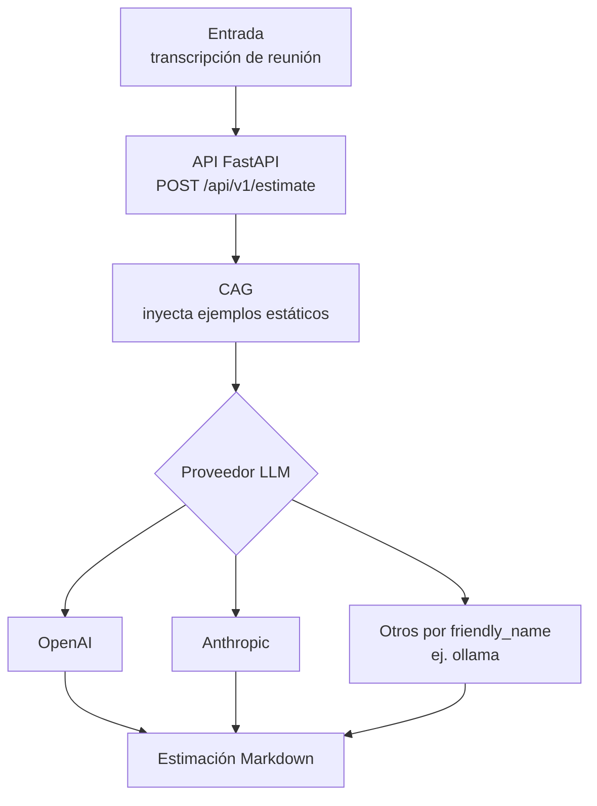
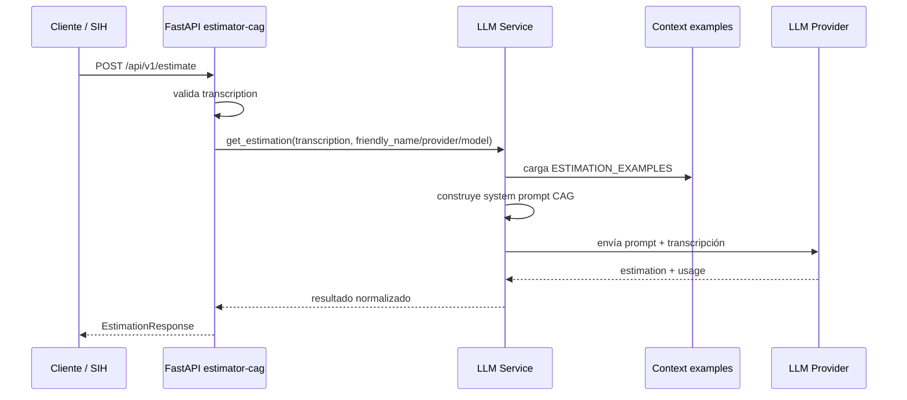
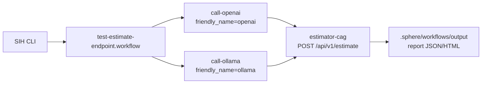

# estimator-cag

Servicio FastAPI de estimación de software basado en arquitectura **CAG** (Context Augmented Generation). Recibe contexto de proyecto, soporta sesiones conversacionales persistidas y puede enriquecer cada turno con adjuntos usando **Docling Serve** o referencias a documentos por ruta antes de llamar al modelo.

No hay base de datos, no hay retrieval: todo el contexto viaja en cada llamada al LLM.

---

## Descripción

El servicio actúa como un estimador experto entrenado por contexto estático. Al recibir una transcripción, construye un `system prompt` que incluye 10 ejemplos de proyectos reales con sus estimaciones, desglose de tareas, horas, equipo recomendado y duración, y envía la petición al LLM configurado.

El modelo devuelve una estimación calibrada en el mismo estilo y formato que los ejemplos, garantizando consistencia sin fine-tuning.

**Proveedores soportados:**
- OpenAI (`gpt-4o-mini` por defecto)
- Anthropic (`claude-haiku-4-5-20251001` por defecto)
- Ollama (`gemma4:e2b` en la configuración de ejemplo)
- Configuraciones por `friendly_name`, usadas por el workflow SIH piloto para comparar `openai`, `anthropic` y `ollama`.

Las llamadas a modelos se enrutan mediante **LiteLLM**, manteniendo un formato común para completions y streaming entre proveedores.

---

## Fases del proyecto



Este proyecto es deliberadamente CAG:

- No tiene ingesta documental persistida ni indexación.
- No tiene vector store.
- No hace retrieval.
- El conocimiento de referencia principal está en `app/context/examples.py`.

Los adjuntos de cada turno se convierten on-demand con Docling y se inyectan en la petición actual, pero no se almacenan ni se indexan fuera de la sesión en memoria.

La transición a RAG no se implementa aquí. La evolución natural está en `sih-smart-analysis`, que consume los reports generados por SIH al ejecutar esta API.

---

## Estructura del proyecto

```
estimator-cag/
├── app/
│   ├── config.py              # Settings desde variables de entorno
│   ├── main.py                # Aplicación FastAPI + router + health
│   ├── context/
│   │   └── examples.py        # 10 ejemplos de estimaciones (contexto CAG)
│   ├── prompts/
│   │   ├── loader.py          # Loader Jinja2 con versiones de prompt
│   │   └── estimation/
│   │       └── v1/
│   │           ├── system.j2
│   │           ├── user.j2
│   │           └── examples.j2
│   ├── sessions.py            # Estado conversacional persistido, ULIDs y metadatos de proyecto
│   ├── schemas.py             # Contrato tipado para la interfaz de producto
│   ├── routers/
│   │   └── estimations.py     # Endpoint POST /api/v1/estimate
│   └── services/
│       ├── attachment_extraction.py
│       ├── llm_service.py     # Lógica de llamada a proveedores LLM
│       └── session_service.py # Orquestación multi-turno, persistencia y adjuntos
├── sample-transcriptions/
│   └── meeting-health-clinic.md
├── sample-documents/
│   ├── session-01-marketplace-discovery.txt
│   ├── session-02-ops-automation.md
│   └── session-03-clinic-modernization.pdf
├── docs-assets/
│   └── session-05-generated-md-sample.png
├── streamlit_app.py           # Formulario web de producto para el estimador CAG
├── tests/                     # Tests API y validación del contrato HTTP
├── pyproject.toml
├── .gitignore
├── .env.example               # Plantilla de variables de entorno
└── .env                       # Variables de entorno reales (no comitear)
```

---

## Endpoints

Número de endpoints funcionales: **4** bajo `/api/v1`.

Número de endpoints operativos: **1** fuera de `/api/v1`.

### `GET /health`

Comprueba que el servicio está activo.

**Respuesta:**
```json
{
  "status": "ok",
  "service": "estimator-cag",
  "version": "0.1.0"
}
```

---

### `POST /api/v1/estimate`

Genera una estimación de software a partir de un request tipado de producto.

**Request body:**
```json
{
  "description": "El cliente necesita una app web para gestión de reservas con panel operativo y recordatorios por email.",
  "project_type": "web_saas",
  "detail_level": "medium",
  "output_format": "narrative"
}
```

Campos:

| Campo | Obligatorio | Descripción |
|-------|-------------|-------------|
| `description` | Sí | Descripción funcional del proyecto a estimar. Entre 20 y 2000 caracteres. |
| `project_type` | Sí | Uno de `mobile_app`, `web_saas`, `internal_tool`, `data_pipeline`. |
| `detail_level` | Sí | Uno de `summary`, `medium`, `detailed`. |
| `output_format` | Sí | Uno de `phases_table`, `line_items`, `narrative`. |

Parámetros de query opcionales:
- `friendly_name`
- `provider`
- `model`

**Respuesta:**
```json
{
  "text": "## Estimación: ...\n\n### Desglose de tareas:\n...",
  "prompt_version": "v1"
}
```

**Errores:**
| Código | Causa |
|--------|-------|
| `400`  | `friendly_name` desconocido |
| `422`  | body inválido o `description` demasiado corta |
| `500`  | Error en la llamada al LLM |

---

### `GET /api/v1/estimate/friendly-names`

Devuelve los alias de proveedores/modelos configurados.

**Respuesta:**

```json
{
  "friendly_names": ["openai", "anthropic", "ollama"]
}
```

Este endpoint ayuda a SIH o a una UI a saber qué variantes de ejecución puede invocar sin hardcodear configuraciones.

---

### `POST /api/v1/sessions`

Crea una sesión conversacional persistida y devuelve un identificador reutilizable.

El identificador usa formato **ULID**, pensado para poder compartirlo en URLs del tipo `?chatid=<ulid>`.

**Respuesta:**

```json
{
  "session_id": "01JVNQ5DB7W6M8M7W7Q3NZXK2S"
}
```

---

### `GET /api/v1/sessions/{session_id}`

Recupera una sesión existente con:
- historial de turnos
- `project_metadata`
- rutas documentales ya asociadas

Esto permite rehidratar una conversación en la UI usando `?chatid=<session_id>`.

---

### `POST /api/v1/sessions/{session_id}/estimate`

Continúa una conversación existente y acepta adjuntos opcionales vía `multipart/form-data`.

Campos de form-data:
- `transcript`
- `project_type`
- `detail_level`
- `output_format`
- `attachments` opcional
- `document_paths` opcional, repetible

Camino elegido para adjuntos: **Docling Serve por HTTP**.
Razón:
- desacopla el parsing documental del estimador
- evita mantener librerías de parsing distintas dentro de la API
- mantiene el flujo agnóstico respecto al proveedor LLM
- prepara mejor el salto futuro a chunking y RAG

Tipos soportados actualmente:
- `.pdf`
- `.docx`
- `.pptx`
- `.html`
- `.htm`
- `.png`
- `.jpg`
- `.jpeg`
- `.tiff`
- `.bmp`
- `.txt`
- `.md`

Notas:
- `.txt` y `.md` se leen localmente porque ya son texto plano
- el resto se convierte a Markdown llamando a `POST /v1/convert/file` de Docling
- `document_paths` guarda solo la ruta de origen en la sesión; no persiste el binario del fichero

---

### `GET /docs`

Swagger UI con documentación interactiva de la API.

### `GET /redoc`

Documentación alternativa en formato ReDoc.

---

## Flujo de la petición



El `system_prompt` se construye en cada llamada concatenando los ejemplos estáticos. La invocación a proveedores se centraliza con LiteLLM para evitar wrappers específicos por SDK y mantener el mismo flujo para respuesta completa y streaming.

---

## Instalación y arranque

### Requisitos

- Python 3.11 o superior
- Una API key válida del proveedor LLM que vayas a usar
- Opcional: Ollama local si quieres probar la ruta `friendly_name=ollama`

### Configuración

Copia la plantilla y edita tus credenciales:

```bash
cd estimator-cag
cp .env.example .env
```

Contenido mínimo recomendado para OpenAI:

```env
LLM_PROVIDER=openai

OPENAI_API_KEY=sk-...
LLM_MODEL=
APP_ENV=development
LOG_LEVEL=info
```

### Instalar dependencias y arrancar

Flujo recomendado para la sesión 1 con `uv`:

```bash
cd estimator-cag
uv sync --extra dev
uv run uvicorn app.main:app --reload
```

El servicio queda disponible en `http://localhost:8000`.

### Arranque unificado del workspace

Desde la raíz del repo puedes levantar Docling y los procesos locales con un único entrypoint:

```bash
./launch.sh all
```

Perfiles disponibles:
- `./launch.sh api` levanta Docling y la API FastAPI
- `./launch.sh portal` levanta Docling y la UI Streamlit
- `./launch.sh all` levanta Docling, API y UI

El script usa el `docker-compose.yml` raíz para arrancar `docling`, y abre `http://localhost:8501` cuando se inicia el portal.

Si necesitas valores locales adicionales, el script carga automáticamente `.env.local` desde la raíz del repo.

### Continuar una conversación por URL

La UI Streamlit acepta un parámetro `chatid`:

```text
http://localhost:8501/?chatid=01JVNQ5DB7W6M8M7W7Q3NZXK2S
```

Comportamiento:
- si la sesión existe en el store persistido, la UI rehidrata el historial
- si no existe, crea una nueva sesión y actualiza la URL
- el estado se guarda en `SESSION_STORE_PATH`

### Documentos de prueba incluidos

El repo deja varios adjuntos listos para demos manuales y pruebas exploratorias:

- [session-01-marketplace-discovery.txt](/Users/jmr.pineda/Projects/GitHub/PinedaTec.eu/Lidr.co-Master/estimator-cag/sample-documents/session-01-marketplace-discovery.txt)
- [session-02-ops-automation.md](/Users/jmr.pineda/Projects/GitHub/PinedaTec.eu/Lidr.co-Master/estimator-cag/sample-documents/session-02-ops-automation.md)
- [session-03-clinic-modernization.pdf](/Users/jmr.pineda/Projects/GitHub/PinedaTec.eu/Lidr.co-Master/estimator-cag/sample-documents/session-03-clinic-modernization.pdf)

Los tres representan historias distintas para ver cómo cambia el contexto del estimador según el tipo de entrada.

Si no tienes `uv` disponible, también puedes usar el entorno virtual ya creado en local:

```bash
cd estimator-cag
source .venv/bin/activate
python -m pip install -e ".[dev]"
uvicorn app.main:app --reload
```

## Validación rápida para una persona externa

Estos pasos validan el entregable sin necesidad de conocer el repo:

### 1. Arrancar la API

```bash
./launch.sh api
```

### 2. Comprobar healthcheck

```bash
curl http://localhost:8000/health
```

Respuesta esperada:

```json
{"status":"ok","service":"estimator-cag","version":"0.1.0"}
```

### 3. Abrir Swagger

Abre [http://localhost:8000/docs](http://localhost:8000/docs) y verifica que aparecen:
- `POST /api/v1/sessions`
- `GET /api/v1/sessions/{session_id}`
- `POST /api/v1/sessions/{session_id}/estimate`
- `POST /api/v1/estimate`
- `GET /api/v1/estimate/friendly-names`
- `GET /health`

### 4. Probar el endpoint principal

```bash
curl -X POST http://localhost:8000/api/v1/estimate \
  -H "Content-Type: application/json" \
  -d '{
    "description": "El cliente necesita una landing page con formulario de contacto, integración con HubSpot y un blog editable. El diseño ya existe en Figma y quiere tenerlo en producción en 4 semanas.",
    "project_type": "web_saas",
    "detail_level": "medium",
    "output_format": "narrative"
  }'
```

Respuesta esperada:
- `status 200`
- JSON con `text` y `prompt_version`

### 5. Probar con una transcripción versionada

El repo incluye una transcripción de ejemplo para repetir la prueba sin inventar un caso nuevo:

```bash
curl -X POST http://localhost:8000/api/v1/estimate \
  -H "Content-Type: application/json" \
  -d "$(jq -Rs '{description: ., project_type: \"internal_tool\", detail_level: \"medium\", output_format: \"narrative\"}' sample-transcriptions/meeting-health-clinic.md)"
```

## Tests automatizados

El proyecto incluye tests de contrato HTTP y tests unitarios de servicio para verificar lo básico sin consumir LLM real.

### Ejecutar tests

```bash
cd estimator-cag
uv run pytest
```

Cobertura actual de tests:
- `GET /health`
- `POST /api/v1/sessions`
- `GET /api/v1/sessions/{session_id}`
- `GET /api/v1/estimate/friendly-names`
- rechazo de `description` inválida
- rechazo de `friendly_name` desconocido
- respuesta exitosa de `POST /api/v1/estimate` con el servicio LLM mockeado
- actualización de `project_metadata` en sesiones multi-turno
- influencia de adjuntos `.docx` convertidos por Docling en el request efectivo al LLM
- influencia de `document_paths` en el request efectivo al LLM
- recorte del historial a `MAX_TURNS`
- rechazo de tipos de adjunto no soportados
- parseo defensivo de la respuesta de Docling
- persistencia de sesiones a disco
- validación del schema tipado del formulario de producto
- render de templates Jinja2 por versión y variantes de formato/detalle
- ventana deslizante de historial y store de sesión en memoria
- construcción del `system prompt`
- resumen del contexto CAG expuesto a la UI
- resolución de rutas de proveedor/modelo
- normalización de uso de tokens

Los tests no llaman a OpenAI, Anthropic ni Ollama. Validan el contrato HTTP y el comportamiento base de la API.

### Pipeline CI

La validación automática también queda cubierta en GitHub Actions:

```text
.github/workflows/estimator-cag-ci.yml
```

Ese pipeline instala dependencias con `uv` y ejecuta `uv run pytest` cada vez que cambian archivos de `estimator-cag`.

### Interfaz conversacional con Streamlit

El wrapper web reutiliza el mismo `system prompt` y la misma lógica de proveedores que el endpoint `POST /api/v1/estimate`.

```bash
./launch.sh portal
```

La interfaz usa `st.form` para construir cada turno, crea o recupera un `session_id` al cargar la página, permite adjuntar ficheros, aceptar rutas documentales locales, mantiene el historial visible de solicitudes y respuestas y expone `project_metadata` y `document_sources` en sidebar para debugging. El panel lateral también muestra el prompt activo, las métricas básicas de la última llamada y las transcripciones versionadas del directorio `sample-transcriptions/`.

Captura real de la UI con uno de los documentos generados para pruebas:


Alcance actual de esta capa:
- formulario multi-turno tipado sobre el mismo flujo CAG del backend
- memoria conversacional persistida por `session_id`
- recuperación por URL vía `?chatid=...`
- referencias documentales persistidas por ruta
- visibilidad de `project_metadata` y métricas básicas en sidebar

Quedan fuera de esta fase:
- fallback automático entre proveedores
- persistencia de memoria entre reinicios
- compresión avanzada de memoria y estrategia de anclas
- actor-critic-boss

---

## Validación con SIH (Sphere Integration Hub)

SIH permite ejecutar y validar los endpoints del servicio mediante workflows declarativos.

En este repo el workflow piloto está en:

```text
.sphere/workflows/test-estimate-endpoint.workflow
```

Ese workflow ejecuta dos stages HTTP contra `POST /api/v1/estimate`:



### 1. Listar workflows disponibles

```
mcp__sphere-integration-hub__list_available_workflows
```

Muestra los workflows registrados para este proyecto. Busca los que incluyan `estimator` o `estimate`.

### 2. Inspeccionar el workflow de estimación

```
mcp__sphere-integration-hub__get_workflow_inputs_outputs
  workflow: "estimate-workflow"
```

Devuelve los campos de entrada requeridos (`transcription`) y la estructura de salida esperada.

### 3. Planificar la ejecución antes de lanzarla

```
mcp__sphere-integration-hub__plan_workflow_execution
  workflow: "estimate-workflow"
  inputs:
    transcription: "Startup de salud necesita app móvil para gestión de citas médicas y historial clínico básico."
```

Muestra los pasos que se ejecutarán y las llamadas HTTP que se realizarán contra el servicio.

### 4. Validar el workflow

```
mcp__sphere-integration-hub__validate_workflow
  workflow: "estimate-workflow"
```

Comprueba que la estructura del workflow es correcta y que los campos de entrada/salida están bien definidos antes de ejecutarlo.

### 5. Ejecutar y leer el reporte

Tras la ejecución, lista los reportes disponibles:

```
mcp__sphere-integration-hub__list_execution_reports
```

Y lee el último:

```
mcp__sphere-integration-hub__read_execution_report
  report: "<id-del-reporte>"
```

El reporte incluye el resultado de cada stage, los tokens consumidos y el Markdown de estimación generado.

### Ejemplo de payload para prueba manual (curl)

```bash
curl -X POST http://localhost:8000/api/v1/estimate \
  -H "Content-Type: application/json" \
  -d '{
    "transcription": "Startup de salud necesita app móvil para gestión de citas médicas y historial clínico básico. El equipo del cliente no tiene desarrolladores propios y quieren lanzar en 3 meses."
  }'
```

---

## Variables de entorno de referencia

| Variable | Valores posibles | Default |
|----------|-----------------|---------|
| `LLM_PROVIDER` | `openai` \| `anthropic` \| `ollama` | `openai` |
| `LLM_MODEL` | cualquier model ID | vacío (usa default del proveedor) |
| `OPENAI_API_KEY` | `sk-...` | — |
| `ANTHROPIC_API_KEY` | `sk-ant-...` | — |
| `OLLAMA_API_KEY` | cualquier string | `ollama` |
| `OLLAMA_BASE_URL` | URL LiteLLM/Ollama | `http://localhost:11434/v1` |
| `OLLAMA_PORT` | puerto entero | `11434` |
| `DOCLING_SERVE_URL` | URL base del contenedor Docling | `http://localhost:5001` |
| `DOCLING_TIMEOUT_SECONDS` | timeout HTTP de conversión | `60` |
| `SESSION_STORE_PATH` | fichero JSON de sesiones persistidas | `.data/estimator-sessions.json` |
| `APP_ENV` | `development` \| `production` | `development` |
| `LOG_LEVEL` | `debug` \| `info` \| `warning` | `info` |
