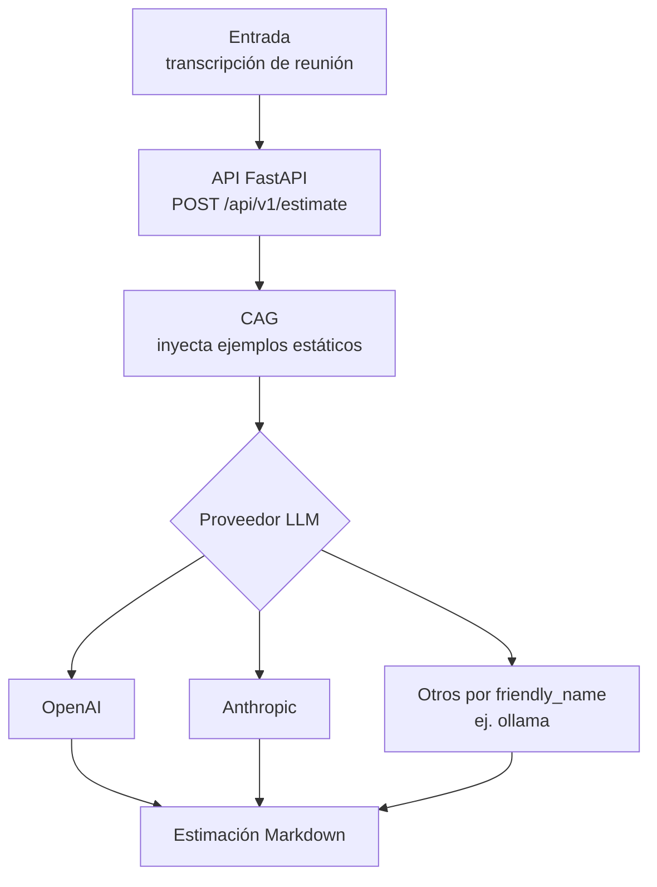
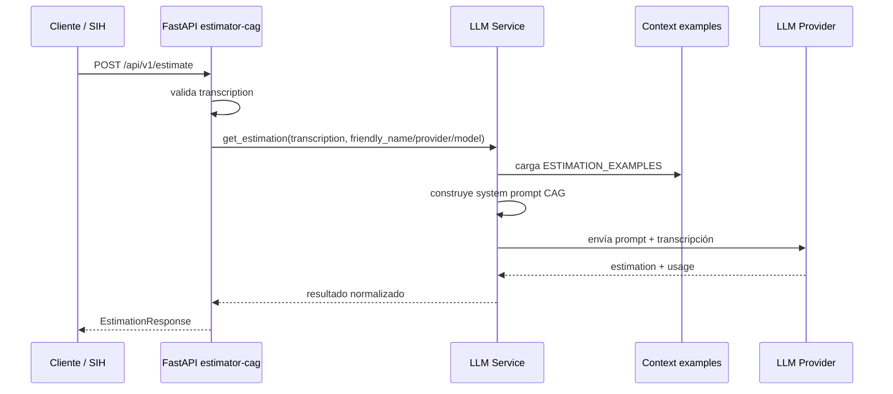
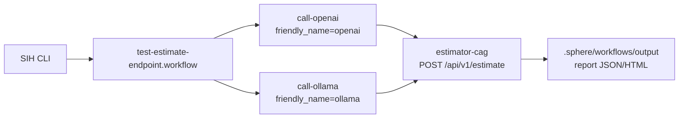

# estimator-cag

Servicio FastAPI de estimación de software basado en arquitectura **CAG** (Context Augmented Generation). Recibe la transcripción de una reunión con un cliente, inyecta un conjunto de estimaciones previas directamente en el prompt del modelo y devuelve una estimación detallada de esfuerzo en formato Markdown.

No hay base de datos, no hay retrieval: todo el contexto viaja en cada llamada al LLM.

---

## Descripción

El servicio actúa como un estimador experto entrenado por contexto estático. Al recibir una transcripción, construye un `system prompt` que incluye 10 ejemplos de proyectos reales con sus estimaciones — desglose de tareas, horas, equipo recomendado y duración — y envía la petición al LLM configurado (OpenAI o Anthropic).

El modelo devuelve una estimación calibrada en el mismo estilo y formato que los ejemplos, garantizando consistencia sin fine-tuning.

**Proveedores soportados:**
- OpenAI (`gpt-4o-mini` por defecto)
- Anthropic (`claude-haiku-4-5-20251001` por defecto, con prompt caching activado)
- Configuraciones por `friendly_name`, usadas por el workflow SIH piloto para comparar `openai` y `ollama`.

Las llamadas a modelos se enrutan mediante **LiteLLM**, manteniendo un formato común para completions y streaming entre proveedores.

---

## Fases del proyecto



Este proyecto es deliberadamente CAG:

- No tiene ingesta documental.
- No tiene vector store.
- No hace retrieval.
- El conocimiento de referencia está en `app/context/examples.py`.

La transición a RAG no se implementa aquí. La evolución natural está en `sih-smart-analysis`, que consume los reports generados por SIH al ejecutar esta API.

---

## Estructura del proyecto

```
estimator-cag/
├── app/
│   ├── config.py              # Settings desde variables de entorno
│   ├── main.py                # Aplicación FastAPI + router + health
│   ├── context/
│   │   └── examples.py        # 10 ejemplos de estimaciones (contexto CAG)
│   ├── routers/
│   │   └── estimations.py     # Endpoint POST /api/v1/estimate
│   └── services/
│       └── llm_service.py     # Lógica de llamada a proveedores LLM
├── streamlit_app.py           # Chat web conversacional para el estimador CAG
├── pyproject.toml
└── .env                       # Variables de entorno (no comitear)
```

---

## Endpoints

Número de endpoints funcionales: **2** bajo `/api/v1`.

Número de endpoints operativos: **1** fuera de `/api/v1`.

### `GET /health`

Comprueba que el servicio está activo.

**Respuesta:**
```json
{
  "status": "ok",
  "service": "estimator-cag",
  "version": "0.1.0"
}
```

---

### `POST /api/v1/estimate`

Genera una estimación de software a partir de la transcripción de una reunión.

**Request body:**
```json
{
  "transcription": "El cliente necesita una app web para gestión de reservas...",
  "friendly_name": "openai",
  "provider": null,
  "model": null
}
```

Campos:

| Campo | Obligatorio | Descripción |
|-------|-------------|-------------|
| `transcription` | Sí | Texto de la reunión o descripción funcional a estimar. |
| `friendly_name` | No | Alias de configuración de proveedor/modelo. Ejemplo: `openai`, `ollama`. |
| `provider` | No | Override directo del proveedor. |
| `model` | No | Override directo del modelo. |

**Respuesta:**
```json
{
  "estimation": "## Estimación: ...\n\n### Desglose de tareas:\n...",
  "model": "gpt-4o-mini",
  "provider": "openai",
  "tokens_used": {
    "prompt": 2840,
    "completion": 512,
    "total": 3352
  },
  "timestamp": "2026-04-30T10:23:45.123456+00:00"
}
```

**Errores:**
| Código | Causa |
|--------|-------|
| `400`  | `transcription` vacía o solo espacios |
| `500`  | Error en la llamada al LLM |

---

### `GET /api/v1/estimate/friendly-names`

Devuelve los alias de proveedores/modelos configurados.

**Respuesta:**

```json
{
  "friendly_names": ["openai", "ollama"]
}
```

Este endpoint ayuda a SIH o a una UI a saber qué variantes de ejecución puede invocar sin hardcodear configuraciones.

---

### `GET /docs`

Swagger UI con documentación interactiva de la API.

### `GET /redoc`

Documentación alternativa en formato ReDoc.

---

## Flujo de la petición

```

```

El `system_prompt` se construye en cada llamada concatenando los ejemplos estáticos. La invocación a proveedores se centraliza con LiteLLM para evitar wrappers específicos por SDK y mantener el mismo flujo para respuesta completa y streaming.

---

## Instalación y arranque

### Requisitos

- Python 3.11 o superior

### Configuración

Crea un archivo `.env` en la raíz del proyecto:

```env
# Proveedor activo: openai | anthropic
LLM_PROVIDER=openai

# Claves de API (solo la del proveedor activo es obligatoria)
OPENAI_API_KEY=sk-...
ANTHROPIC_API_KEY=sk-ant-...

# Modelo concreto (opcional — usa el default del proveedor si se omite)
LLM_MODEL=

APP_ENV=development
LOG_LEVEL=info
```

### Instalar dependencias y arrancar

```bash
cd estimator-cag
python -m venv .venv && source .venv/bin/activate
pip install -e .
uvicorn app.main:app --reload
```

El servicio queda disponible en `http://localhost:8000`.

### Interfaz conversacional con Streamlit

El wrapper web reutiliza el mismo `system prompt` y la misma lógica de proveedores que el endpoint `POST /api/v1/estimate`.

```bash
streamlit run streamlit_app.py
```

La interfaz permite pegar una transcripción en un chat, mantiene el historial durante la sesión y muestra la estimación en streaming. El panel lateral expone el prompt activo, los ejemplos CAG inyectados y las métricas básicas de la última llamada.

---

## Validación con SIH (Sphere Integration Hub)

SIH permite ejecutar y validar los endpoints del servicio mediante workflows declarativos.

En este repo el workflow piloto está en:

```text
.sphere/workflows/test-estimate-endpoint.workflow
```

Ese workflow ejecuta dos stages HTTP contra `POST /api/v1/estimate`:



### 1. Listar workflows disponibles

```
mcp__sphere-integration-hub__list_available_workflows
```

Muestra los workflows registrados para este proyecto. Busca los que incluyan `estimator` o `estimate`.

### 2. Inspeccionar el workflow de estimación

```
mcp__sphere-integration-hub__get_workflow_inputs_outputs
  workflow: "estimate-workflow"
```

Devuelve los campos de entrada requeridos (`transcription`) y la estructura de salida esperada.

### 3. Planificar la ejecución antes de lanzarla

```
mcp__sphere-integration-hub__plan_workflow_execution
  workflow: "estimate-workflow"
  inputs:
    transcription: "Startup de salud necesita app móvil para gestión de citas médicas y historial clínico básico."
```

Muestra los pasos que se ejecutarán y las llamadas HTTP que se realizarán contra el servicio.

### 4. Validar el workflow

```
mcp__sphere-integration-hub__validate_workflow
  workflow: "estimate-workflow"
```

Comprueba que la estructura del workflow es correcta y que los campos de entrada/salida están bien definidos antes de ejecutarlo.

### 5. Ejecutar y leer el reporte

Tras la ejecución, lista los reportes disponibles:

```
mcp__sphere-integration-hub__list_execution_reports
```

Y lee el último:

```
mcp__sphere-integration-hub__read_execution_report
  report: "<id-del-reporte>"
```

El reporte incluye el resultado de cada stage, los tokens consumidos y el Markdown de estimación generado.

### Ejemplo de payload para prueba manual (curl)

```bash
curl -X POST http://localhost:8000/api/v1/estimate \
  -H "Content-Type: application/json" \
  -d '{
    "transcription": "Startup de salud necesita app móvil para gestión de citas médicas y historial clínico básico. El equipo del cliente no tiene desarrolladores propios y quieren lanzar en 3 meses."
  }'
```

---

## Variables de entorno de referencia

| Variable | Valores posibles | Default |
|----------|-----------------|---------|
| `LLM_PROVIDER` | `openai` \| `anthropic` | `openai` |
| `LLM_MODEL` | cualquier model ID | vacío (usa default del proveedor) |
| `OPENAI_API_KEY` | `sk-...` | — |
| `ANTHROPIC_API_KEY` | `sk-ant-...` | — |
| `APP_ENV` | `development` \| `production` | `development` |
| `LOG_LEVEL` | `debug` \| `info` \| `warning` | `info` |
