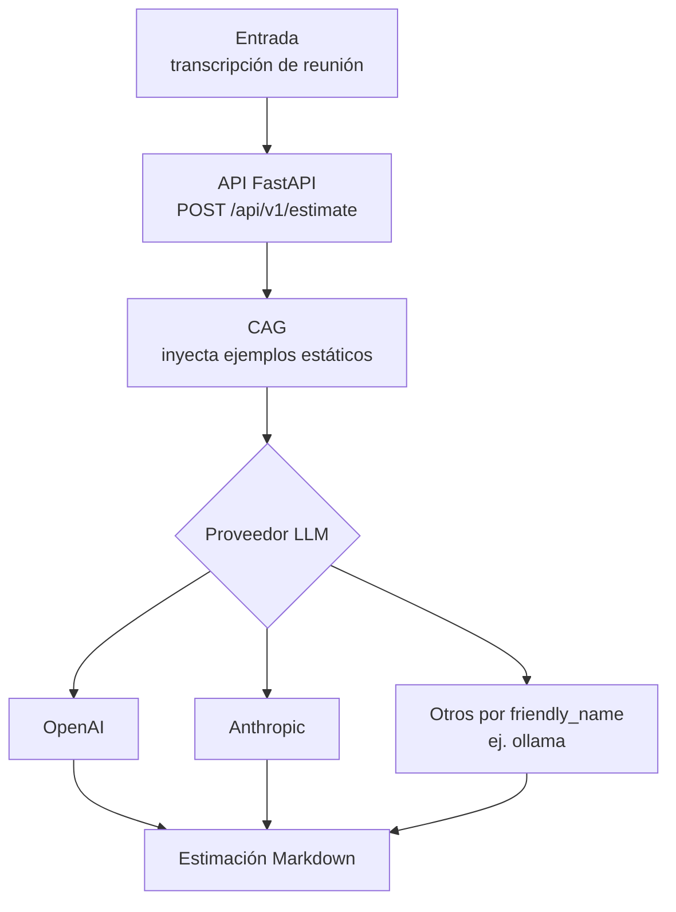
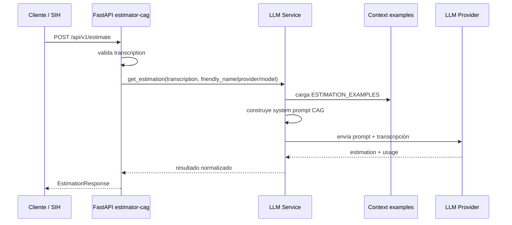
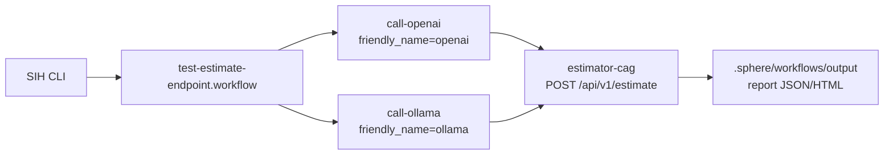

# estimator-cag

Servicio FastAPI de estimación de software basado en arquitectura **CAG** (Context Augmented Generation). Recibe contexto de proyecto, soporta sesiones conversacionales persistidas y puede enriquecer cada turno con adjuntos usando **Docling Serve**, referencias a documentos por ruta y contexto externo recuperado desde **Notion** antes de llamar al modelo.

Además incluye un carril semántico separado para presupuestos históricos estructurados en JSON. Ese flujo soporta varias estrategias de chunking, generación de embeddings con OpenAI, persistencia opcional en **pgvector**, búsqueda semántica y evaluación básica de retrieval.

La ruta principal de estimación sigue siendo CAG: el contexto del estimador viaja en cada llamada al LLM. La persistencia vectorial solo aplica al módulo `embedding_pipeline`.

---

## Descripción

El servicio actúa como un estimador experto entrenado por contexto estático. Al recibir una transcripción, construye un `system prompt` que incluye 10 ejemplos de proyectos reales con sus estimaciones, desglose de tareas, horas, equipo recomendado y duración, y envía la petición al LLM configurado.

El modelo devuelve una estimación calibrada en el mismo estilo y formato que los ejemplos, garantizando consistencia sin fine-tuning.

Cada sesión fija además un `user_tier` de una lista cerrada (`developer`, `pm`, `executive`) y un `user_display_name` visible. Ambos se persisten con la sesión y ajustan el `system prompt` de forma consistente durante toda la conversación sin permitir cambios a mitad de hilo.

**Proveedores soportados:**
- OpenAI (`gpt-4o-mini` por defecto)
- Anthropic (`claude-haiku-4-5-20251001` por defecto)
- Ollama (`gemma4:e2b` en la configuración de ejemplo)
- Configuraciones por `friendly_name`, usadas por el workflow SIH piloto para comparar `openai`, `anthropic` y `ollama`.

Las llamadas a modelos se enrutan mediante **LiteLLM**, manteniendo un formato común para completions y streaming entre proveedores.

---

## Fases del proyecto



Este proyecto es deliberadamente CAG:

- No tiene ingesta documental persistida ni indexación.
- No tiene vector store.
- No hace retrieval.
- El conocimiento de referencia principal está en `app/context/examples.py`.

Los adjuntos de cada turno se convierten on-demand con Docling y se inyectan en la petición actual. La sesión persiste a disco el historial, las referencias documentales, la última telemetría y el último contexto enriquecido visible, pero no mantiene un índice documental ni hace retrieval vectorial.

La transición a RAG no se implementa aquí. La evolución natural está en `sih-smart-analysis`, que consume los reports generados por SIH al ejecutar esta API.

---

## Estructura del proyecto

```
estimator-cag/
├── app/
│   ├── config.py              # Settings desde variables de entorno
│   ├── main.py                # Aplicación FastAPI + router + health
│   ├── context/
│   │   └── examples.py        # 10 ejemplos de estimaciones (contexto CAG)
│   ├── embedding_pipeline/
│   │   ├── chunker.py         # Chunking estructural de presupuestos JSON
│   │   ├── embedder.py        # Embeddings OpenAI + batching + retries básicos
│   │   ├── router.py          # Endpoint POST /api/v1/embeddings/ingest
│   │   └── schemas.py         # Contratos tipados del pipeline de embeddings
│   ├── prompts/
│   │   ├── loader.py          # Loader Jinja2 con versiones de prompt y tier por sesión
│   │   └── estimation/
│   │       └── v1/
│   │           ├── system.j2
│   │           ├── tiers/     # Instrucciones específicas por developer/pm/executive
│   │           ├── user.j2
│   │           └── examples.j2
│   ├── sessions.py            # Estado conversacional persistido, ULIDs y metadatos de proyecto
│   ├── schemas.py             # Contrato tipado para la interfaz de producto
│   ├── routers/
│   │   └── estimations.py     # Endpoint POST /api/v1/estimate
│   └── services/
│       ├── attachment_extraction.py
│       ├── external_context_service.py
│       ├── llm_service.py     # Lógica de llamada a proveedores LLM
│       ├── notion_context_provider.py
│       └── session_service.py # Orquestación multi-turno, persistencia y adjuntos
├── data/
│   └── budgets_sample.json    # Dataset de ejemplo para ingest y demos
├── scripts/
│   └── compare.py             # CLI para similitud coseno con embeddings
├── sample-transcriptions/
│   └── meeting-health-clinic.md
├── sample-documents/
│   ├── session-01-marketplace-discovery.txt
│   ├── session-02-ops-automation.md
│   └── session-03-clinic-modernization.pdf
├── docs-assets/
│   └── session-05-chat-persisted-external-context.png
├── streamlit_app.py           # Formulario web de producto para el estimador CAG
├── tests/                     # Tests API y validación del contrato HTTP
├── pyproject.toml
├── .gitignore
├── .env.example               # Plantilla de variables de entorno
└── .env                       # Variables de entorno reales (no comitear)
```

---

## Endpoints

Número de endpoints funcionales: **9** bajo `/api/v1`.

Número de endpoints operativos: **1** fuera de `/api/v1`.

### `GET /health`

Comprueba que el servicio está activo.

**Respuesta:**
```json
{
  "status": "ok",
  "service": "estimator-cag",
  "version": "0.1.0"
}
```

---

### `POST /api/v1/estimate`

Genera una estimación de software a partir de un request tipado de producto.

**Request body:**
```json
{
  "description": "El cliente necesita una app web para gestión de reservas con panel operativo y recordatorios por email.",
  "project_type": "web_saas",
  "detail_level": "medium",
  "output_format": "narrative"
}
```

Campos:

| Campo | Obligatorio | Descripción |
|-------|-------------|-------------|
| `description` | Sí | Descripción funcional del proyecto a estimar. Entre 20 y 2000 caracteres. |
| `project_type` | Sí | Uno de `mobile_app`, `web_saas`, `internal_tool`, `data_pipeline`. |
| `detail_level` | Sí | Uno de `summary`, `medium`, `detailed`. |
| `output_format` | Sí | Uno de `phases_table`, `line_items`, `narrative`. |

Parámetros de query opcionales:
- `friendly_name`
- `provider` (`openai`, `anthropic`, `ollama`)
- `model`

**Respuesta:**
```json
{
  "text": "## Estimación: ...\n\n### Desglose de tareas:\n...",
  "prompt_version": "v1"
}
```

**Errores:**
| Código | Causa |
|--------|-------|
| `400`  | `friendly_name` o `provider` desconocido |
| `422`  | body inválido o `description` demasiado corta |
| `500`  | Error en la llamada al LLM |

---

### `GET /api/v1/estimate/friendly-names`

Devuelve los alias de proveedores/modelos configurados.

**Respuesta:**

```json
{
  "friendly_names": ["openai", "anthropic", "ollama"]
}
```

Este endpoint ayuda a SIH o a una UI a saber qué variantes de ejecución puede invocar sin hardcodear configuraciones.

---

### `POST /api/v1/embeddings/ingest`

Ingiere un presupuesto histórico estructurado, genera sus chunks y embeddings, y persiste todo como `document` + `chunks` en una sola transacción.

Decisiones de diseño relevantes:
- se mantiene el namespace `/api/v1` para no romper la convención actual del servicio
- el chunking es pluggable: `structural`, `fixed_window` y `hierarchical`
- cada chunk puede incluir contexto del presupuesto padre y enriquecimiento opcional vía LLM
- la persistencia ya no es opcional en esta fase: la ingesta existe para poblar el corpus searchable
- el endpoint devuelve métricas e identificadores, no los vectores completos

**Request body:**

```json
{
  "source_path": "data/budgets/budget_2024_q1_fintech.json",
  "document_type": "historical_budget",
  "content": {
    "budget_id": "BUD-2024-001",
    "client_metadata": {
      "name": "FintechCorp",
      "sector": "finance",
      "country": "ES"
    },
    "project_summary": "Mobile banking API with OAuth 2.0 authentication and PSD2 compliance",
    "main_technology": "ruby_on_rails",
    "year": 2024,
    "total_estimated_hours": 480,
    "components": [
      {
        "component_id": "AUTH-001",
        "name": "OAuth 2.0 authentication backend",
        "description": "Implementation of authorization code, refresh token and session revocation flows.",
        "tech_stack": ["ruby_on_rails", "postgresql", "redis"],
        "complexity": "high",
        "estimated_hours": 120
      }
    ]
  },
  "chunking": {
    "strategy": "structural",
    "include_parent_context": true,
    "max_characters": 900,
    "overlap_characters": 120,
    "llm_enrich_context": false
  },
  "embedding_model": "text-embedding-3-small"
}
```

**Respuesta:**

```json
{
  "document_id": 42,
  "chunks_created": 17,
  "embedding_dimension": 1536,
  "ingestion_time_ms": 1240
}
```

**Errores:**
| Código | Causa |
|--------|-------|
| `409`  | ya existe un documento con ese `source_path` |
| `422`  | payload inválido |
| `500`  | error al generar embeddings o al persistir la transacción |

El dataset de ejemplo sigue estando en [budgets_sample.json](/Users/jmr.pineda/Projects/GitHub/PinedaTec.eu/Lidr.co-Master/estimator-cag/data/budgets_sample.json), pero ahora la API espera un único documento por request. Ese dataset sirve como corpus fuente para construir requests individuales de ingesta.

`ingestion_time_ms` mide el tiempo total de chunking, embedding, inserción del documento y persistencia de todos los chunks.

---

### `GET /api/v1/embeddings/options`

Devuelve las estrategias de chunking y modelos de embeddings soportados.

---

### `POST /api/v1/embeddings/search`

Endpoint heredado del carril semántico anterior. La búsqueda alineada con la sesión 8 se expone en `POST /api/v1/search`.

---

### `POST /api/v1/search`

Busca chunks persistidos en `chunks` usando `cosine_distance` sobre `pgvector`.

**Request body:**

```json
{
  "query": "REST API with OAuth authentication for fintech sector",
  "k": 5,
  "embedding_model": "text-embedding-3-small"
}
```

**Respuesta:**

```json
{
  "query": "REST API with OAuth authentication for fintech sector",
  "k": 5,
  "search_time_ms": 87,
  "results": [
    {
      "chunk_id": 156,
      "document_id": 12,
      "chunk_type": "budget_component",
      "content": "Backend service implementation with JWT-based authentication...",
      "distance": 0.231,
      "metadata": {
        "scope": "backend",
        "technologies": ["python", "fastapi"]
      }
    }
  ]
}
```

La búsqueda usa el mismo modelo de embeddings para la query que para los chunks persistidos y ordena por `cosine_distance` ascendente.

---

### `POST /api/v1/sessions`

Crea una sesión conversacional persistida y devuelve un identificador reutilizable.

El identificador usa formato **ULID**, pensado para poder compartirlo en URLs del tipo `?chatid=<ulid>`.

**Respuesta:**

```json
{
  "session_id": "01JVNQ5DB7W6M8M7W7Q3NZXK2S"
}
```

---

### `GET /api/v1/sessions/{session_id}`

Recupera una sesión existente con:
- historial de turnos
- `message_count` total visible
- `turn_observations` persistidos por turno
- `last_turn_observed` para inspección rápida del último snapshot
- `user_tier` persistido para la conversación
- `user_display_name` persistido para personalizar el trato al usuario
- `project_metadata`
- configuración de contexto externo para la sesión
- rutas documentales ya asociadas
- último contexto externo resuelto
- último bloque de telemetría visible en la UI (`provider`, `model`, `tokens`, `latency`)

Esto permite rehidratar una conversación en la UI usando `?chatid=<session_id>`.

Campos operativos relevantes añadidos para stress/evals:
- `message_count`
- `anchors_count` actualmente `0` en esta base
- `summary_chars` actualmente `0` en esta base
- `last_resolved_tier`
- `last_tier_rule`
- `turn_observations`
- `last_turn_observed`

---

### `POST /api/v1/sessions/{session_id}/estimate`

Continúa una conversación existente y acepta adjuntos opcionales vía `multipart/form-data`.

Campos de form-data:
- `transcript`
- `project_type`
- `detail_level`
- `output_format`
- `attachments` opcional
- `document_paths` opcional, repetible

Camino elegido para adjuntos: **Docling Serve por HTTP**.
Razón:
- desacopla el parsing documental del estimador
- evita mantener librerías de parsing distintas dentro de la API
- mantiene el flujo agnóstico respecto al proveedor LLM
- prepara mejor el salto futuro a chunking y RAG

Tipos soportados actualmente:
- `.pdf`
- `.docx`
- `.pptx`
- `.html`
- `.htm`
- `.png`
- `.jpg`
- `.jpeg`
- `.tiff`
- `.bmp`
- `.txt`
- `.md`

Notas:
- `.txt` y `.md` se leen localmente porque ya son texto plano
- el resto se convierte a Markdown llamando a `POST /v1/convert/file` de Docling
- `document_paths` guarda solo la ruta de origen en la sesión; no persiste el binario del fichero
- si la sesión tiene `notion_page_ids` o `notion_search_terms`, antes de llamar al LLM se resuelve un bloque adicional de `<external_context>` desde Notion

**Errores:**
| Código | Causa |
|--------|-------|
| `400`  | `document_paths` inválido o tipo de adjunto no soportado |
| `404`  | `session_id` no encontrado |
| `408`  | timeout al convertir adjuntos con Docling o al consultar Notion |
| `422`  | form-data incompleto o enum inválido |
| `502`  | respuesta HTTP/JSON inválida desde Docling o Notion |
| `500`  | fallo no controlado del backend o del proveedor LLM |

---

### `GET /docs`

Swagger UI con documentación interactiva de la API.

### `GET /redoc`

Documentación alternativa en formato ReDoc.

---

## Flujo de la petición



El `system_prompt` se construye en cada llamada concatenando los ejemplos estáticos. La invocación a proveedores se centraliza con LiteLLM para evitar wrappers específicos por SDK y mantener el mismo flujo para respuesta completa y streaming.

---

## Instalación y arranque

### Requisitos

- Python 3.11 o superior
- Una API key válida del proveedor LLM que vayas a usar
- Opcional: Ollama local si quieres probar la ruta `friendly_name=ollama`

### Configuración

Copia la plantilla y edita tus credenciales:

```bash
cd estimator-cag
cp .env.example .env
```

Contenido mínimo recomendado para OpenAI:

```env
LLM_PROVIDER=openai

OPENAI_API_KEY=sk-...
LLM_MODEL=
APP_ENV=development
LOG_LEVEL=info
```

### Instalar dependencias y arrancar

Flujo recomendado para la sesión 1 con `uv`:

```bash
cd estimator-cag
uv sync --extra dev
uv run uvicorn app.main:app --reload
```

El servicio queda disponible en `http://localhost:8000`.

### Preparación de PostgreSQL + pgvector para la sesión 8

El carril semántico usa dos URLs distintas a propósito:

- `DATABASE_URL`: conexión async de SQLAlchemy/Alembic sobre `asyncpg`
- `VECTOR_DATABASE_URL`: conexión simple usada por el adapter actual de `pgvector`

Arranque mínimo recomendado:

```bash
docker compose up -d pgvector
docker compose exec pgvector psql -U estimator -d estimator -c "SELECT version();"
```

La base de migraciones queda preparada en:

- [alembic.ini](/Users/jmr.pineda/Projects/GitHub/PinedaTec.eu/Lidr.co-Master/estimator-cag/alembic.ini)
- [alembic/env.py](/Users/jmr.pineda/Projects/GitHub/PinedaTec.eu/Lidr.co-Master/estimator-cag/alembic/env.py)
- [0001_initial_schema.py](/Users/jmr.pineda/Projects/GitHub/PinedaTec.eu/Lidr.co-Master/estimator-cag/alembic/versions/0001_initial_schema.py)

El schema base de la sesión 8 queda modelado con dos tablas:

- `documents`: identidad y metadatos del documento ingestado
- `chunks`: fragmentos persistidos con `content`, `embedding` y `metadata`

La creación de schema deja de ocurrir en el arranque de FastAPI. A partir de aquí la fuente de verdad del DDL son las migraciones de Alembic, no el runtime.

### Arranque unificado del workspace

Desde la raíz del repo puedes levantar Docling y los procesos locales con un único entrypoint:

```bash
./launch.sh all
```

Perfiles disponibles:
- `./launch.sh api` levanta Docling y la API FastAPI
- `./launch.sh portal` levanta Docling y la UI Streamlit
- `./launch.sh all` levanta Docling, API y UI

El script usa el `docker-compose.yml` raíz para arrancar `docling`, y abre `http://localhost:8501` cuando se inicia el portal.

Si necesitas valores locales adicionales, el script carga automáticamente `.env.local` desde la raíz del repo.

### Continuar una conversación por URL

La UI Streamlit acepta un parámetro `chatid`:

```text
http://localhost:8501/?chatid=01JVNQ5DB7W6M8M7W7Q3NZXK2S
```

Comportamiento:
- si la sesión existe en el store persistido, la UI rehidrata el historial
- también rehidrata el bloque `Última llamada` del sidebar con el último `provider`, `model`, `tokens` y `latency` persistidos
- también recupera la configuración de fuentes externas de la sesión y el último contexto externo resuelto
- si no existe, crea una nueva sesión y actualiza la URL
- el estado se guarda en `SESSION_STORE_PATH`

### Por qué existe el flujo multi-turno

El caso de uso no es abrir chats inconexos para estimaciones arbitrarias, sino permitir que una misma estimación evolucione a medida que el usuario aporta más contexto.

Workflow esperado:
1. primer turno con una descripción base del proyecto
2. segundo turno aclarando alcance, restricciones o feedback sobre la primera propuesta
3. turnos posteriores con adjuntos, documentos versionados o fuentes externas como Notion
4. nueva estimación sobre la misma sesión, conservando memoria, metadatos e hipótesis previas

Eso convierte la UI en una herramienta de refinamiento progresivo, no en un chat genérico.

Este patrón de trabajo encaja especialmente bien cuando la salida no se resuelve en una única respuesta, sino mediante iteraciones guiadas entre modelo y usuario hasta estabilizar alcance, supuestos y entregables. En esa línea, merece una referencia explícita [SpecForge.AI](https://github.com/PinedaTec-EU/SpecForge.AI), que opera sobre un esquema comparable de refinamiento progresivo y, en escenarios de especificación estructurada, puede apoyarse en un sistema igual o más potente para conducir ese ciclo de ida y vuelta.

### Documentos de prueba incluidos

El repo deja varios adjuntos listos para demos manuales y pruebas exploratorias:

- [session-01-marketplace-discovery.txt](/Users/jmr.pineda/Projects/GitHub/PinedaTec.eu/Lidr.co-Master/estimator-cag/sample-documents/session-01-marketplace-discovery.txt)
- [session-02-ops-automation.md](/Users/jmr.pineda/Projects/GitHub/PinedaTec.eu/Lidr.co-Master/estimator-cag/sample-documents/session-02-ops-automation.md)
- [session-03-clinic-modernization.pdf](/Users/jmr.pineda/Projects/GitHub/PinedaTec.eu/Lidr.co-Master/estimator-cag/sample-documents/session-03-clinic-modernization.pdf)

Los tres representan historias distintas para ver cómo cambia el contexto del estimador según el tipo de entrada.

Si no tienes `uv` disponible, también puedes usar el entorno virtual ya creado en local:

```bash
cd estimator-cag
source .venv/bin/activate
python -m pip install -e ".[dev]"
uvicorn app.main:app --reload
```

## Validación rápida para una persona externa

Estos pasos validan el entregable sin necesidad de conocer el repo:

### 1. Arrancar la API

```bash
./launch.sh api
```

### 2. Comprobar healthcheck

```bash
curl http://localhost:8000/health
```

Respuesta esperada:

```json
{"status":"ok","service":"estimator-cag","version":"0.1.0"}
```

### 3. Abrir Swagger

Abre [http://localhost:8000/docs](http://localhost:8000/docs) y verifica que aparecen:
- `POST /api/v1/sessions`
- `GET /api/v1/sessions/{session_id}`
- `POST /api/v1/sessions/{session_id}/estimate`
- `POST /api/v1/estimate`
- `GET /api/v1/estimate/friendly-names`
- `GET /api/v1/embeddings/options`
- `POST /api/v1/embeddings/ingest`
- `POST /api/v1/search`
- `GET /health`

### 4. Probar el endpoint principal

```bash
curl -X POST http://localhost:8000/api/v1/estimate \
  -H "Content-Type: application/json" \
  -d '{
    "description": "El cliente necesita una landing page con formulario de contacto, integración con HubSpot y un blog editable. El diseño ya existe en Figma y quiere tenerlo en producción en 4 semanas.",
    "project_type": "web_saas",
    "detail_level": "medium",
    "output_format": "narrative"
  }'
```

Respuesta esperada:
- `status 200`
- JSON con `text` y `prompt_version`

### 5. Probar con una transcripción versionada

El repo incluye una transcripción de ejemplo para repetir la prueba sin inventar un caso nuevo:

```bash
curl -X POST http://localhost:8000/api/v1/estimate \
  -H "Content-Type: application/json" \
  -d "$(jq -Rs '{description: ., project_type: \"internal_tool\", detail_level: \"medium\", output_format: \"narrative\"}' sample-transcriptions/meeting-health-clinic.md)"
```

### 6. Probar la ingesta de embeddings

```bash
curl -X POST http://localhost:8000/api/v1/embeddings/ingest \
  -H "Content-Type: application/json" \
  --data @data/budgets_sample.json
```

Respuesta esperada:
- `status 200`
- JSON con `chunks` vectorizados y `stats`

### 7. Probar búsqueda semántica

Primero ingiere un documento histórico. Después:

```bash
curl -X POST http://localhost:8000/api/v1/search \
  -H "Content-Type: application/json" \
  -d '{
    "query": "JWT-based authorization service for a banking application",
    "k": 3,
    "embedding_model": "text-embedding-3-small"
  }'
```

### 8. Probar benchmark de modelos

```bash
cd estimator-cag
python scripts/benchmark_embeddings.py
```

## Tests automatizados

El proyecto incluye tests de contrato HTTP y tests unitarios de servicio para verificar lo básico sin consumir LLM real.

### Ejecutar tests

```bash
cd estimator-cag
uv run pytest
```

Cobertura actual de tests:
- `GET /health`
- `POST /api/v1/sessions`
- `GET /api/v1/sessions/{session_id}`
- `GET /api/v1/estimate/friendly-names`
- rechazo de `description` inválida
- rechazo de `friendly_name` desconocido
- respuesta exitosa de `POST /api/v1/estimate` con el servicio LLM mockeado
- validación tipada del request de embeddings
- chunking estructural de un componente por chunk
- respuesta exitosa de `POST /api/v1/embeddings/ingest` con embedder mockeado
- actualización de `project_metadata` en sesiones multi-turno
- persistencia de configuración y contexto externo en sesiones
- inferencia base de términos para búsqueda en Notion
- paso de `external_context` al servicio LLM
- influencia de adjuntos `.docx` convertidos por Docling en el request efectivo al LLM
- influencia de `document_paths` en el request efectivo al LLM
- recorte del historial a `MAX_TURNS`
- rechazo de tipos de adjunto no soportados
- `404` al continuar una sesión inexistente
- `408` cuando Docling agota timeout al enriquecer adjuntos
- `502` cuando Notion devuelve una respuesta corrupta al enriquecer contexto externo
- parseo defensivo de la respuesta de Docling
- validación tipada del payload de Docling antes de extraer Markdown
- persistencia de sesiones a disco
- validación del schema tipado del formulario de producto
- render de templates Jinja2 por versión y variantes de formato/detalle
- ventana deslizante de historial y store de sesión en memoria
- construcción del `system prompt`
- métricas de stress (`LatencyBudgetMetric`, `CostBudgetMetric`, `MemoryDriftMetric`)
- resumen del contexto CAG expuesto a la UI
- resolución de rutas de proveedor/modelo
- normalización de uso de tokens

Los tests no llaman a OpenAI, Anthropic ni Ollama. Validan el contrato HTTP y el comportamiento base de la API.

## Pipeline mínimo de embeddings

### Qué hace

1. Recibe presupuestos JSON normalizados.
2. Convierte cada componente del presupuesto en un chunk independiente.
3. Añade cabeceras contextuales del presupuesto padre al texto del chunk.
4. Puede añadir una línea contextual generada por LLM antes del embedding.
5. Cuenta tokens con `tiktoken` para detectar chunks anómalos antes de la llamada remota.
6. Genera embeddings con `text-embedding-3-small` o `text-embedding-3-large` en batches.
7. Puede persistir los vectores en `pgvector`.
8. Expone búsqueda semántica y evaluación de retrieval.

### Por qué esta solución es defendible

- La estrategia estructural mantiene trazabilidad máxima; las variantes `fixed_window` e `hierarchical` sirven para comparar trade-offs sin rehacer el pipeline.
- Las cabeceras contextuales reducen el riesgo de que chunks genéricos como `Authentication backend` pierdan significado.
- La persistencia en `pgvector` queda encapsulada en un adapter propio, no mezclada con los routers.
- El contrato de entrada y salida se modela con Pydantic explícito en lugar de `dict` sueltos; eso hace Swagger y el razonamiento del flujo mucho más claros.

### Limitaciones actuales

- El coste estimado usa constantes de precio y debe revisarse cuando OpenAI cambie tarifas.
- El enriquecimiento contextual vía LLM mejora semántica, pero añade coste y latencia.
- `fixed_window` y `hierarchical` están implementadas como comparativas prácticas; no sustituyen técnicas avanzadas como `late chunking`.
- Si falta `OPENAI_API_KEY`, el endpoint falla con `500` y el CLI aborta con un mensaje claro.

## CLI `compare.py`

Compara dos textos usando el mismo embedder del backend y calcula la similitud coseno manualmente.

Dentro del contenedor:

```bash
docker compose exec estimator-cag python scripts/compare.py \
  --text-a "OAuth 2.0 authentication backend for fintech" \
  --text-b "JWT-based authorization service for banking app" \
  --model text-embedding-3-small
```

Fuera del contenedor:

```bash
cd estimator-cag
/Users/jmr.pineda/.cache/codex-runtimes/codex-primary-runtime/dependencies/python/bin/python3 scripts/compare.py \
  --text-a "OAuth 2.0 authentication backend for fintech" \
  --text-b "JWT-based authorization service for banking app" \
  --model text-embedding-3-large
```

Si prefieres usar `uv`, el comando equivalente es:

```bash
uv run python scripts/compare.py \
  --text-a "OAuth 2.0 authentication backend for fintech" \
  --text-b "JWT-based authorization service for banking app" \
  --model text-embedding-3-small
```

Comparativa rápida entre modelos:

```bash
python scripts/benchmark_embeddings.py
```

## Stress test del CAG

La sesión 6 añade un baseline cuantitativo sobre el comportamiento del estimador cuando crece el contexto conversacional o el tamaño de adjuntos.

Artefactos:
- `evals/stress/scenarios.py`
- `evals/stress/metrics.py`
- `evals/stress/fixtures/build_pdfs.py`
- `evals/stress/run.py`
- `evals/stress/results.csv`
- `evals/stress/REPORT.md`

Comando de ejecución usado para el baseline mínimo del repo:

```bash
cd estimator-cag
./.venv/bin/python -m evals.stress.run \
  --provider openai \
  --friendly-name openai \
  --model gpt-4o-mini \
  --turn-counts 1,3,6,10,20
```

Notas:
- el runner escribe una fila por turno en `evals/stress/results.csv`
- el reporte agregado queda en `evals/stress/REPORT.md`
- esta base no implementa `anchors` ni `summary` persistidos; el stress los reporta explícitamente como `0` para que la limitación quede visible
- para PDFs sintéticos se usa generación determinista local y conversión vía **Docling Serve**
- los intervalos `1,3,6,10,20` significan conversaciones independientes de longitud total `N`; no son incrementos acumulativos sobre una misma sesión

### Pipeline CI

La validación automática también queda cubierta en GitHub Actions:

```text
.github/workflows/estimator-cag-ci.yml
```

Ese pipeline instala dependencias con `uv` y ejecuta `uv run pytest` cada vez que cambian archivos de `estimator-cag`.

### Interfaz conversacional con Streamlit

El wrapper web reutiliza el mismo `system prompt` y la misma lógica de proveedores que el endpoint `POST /api/v1/estimate`.

```bash
./launch.sh portal
```

La interfaz usa `st.form` para construir cada turno, crea o recupera un `session_id` al cargar la página, permite adjuntar ficheros, seleccionar documentos versionados del repo desde sidebar, configurar contexto externo por sesión y mantener el historial visible de solicitudes y respuestas. El panel lateral también muestra el prompt activo, las métricas de la última llamada, la configuración de fuentes externas y las transcripciones versionadas del directorio `sample-transcriptions/`.

Cuando no existe sesión activa, la UI abre un modal obligatorio para fijar el `user_tier` y el `user_display_name`. Ambos quedan bloqueados durante toda la conversación y solo se vuelven a pedir al crear una nueva charla.

La zona principal añade dos acciones de inspección:
- `Ver system prompt activo`
- `Ver output de Docling`
- `Ver contexto externo efectivo`

La segunda abre un diálogo con el texto documental exacto que entró al contexto en el último turno enriquecido.

El sidebar también ofrece:
- `Sample file` para cargar una transcripción versionada
- `Sample documents` para añadir documentos locales versionados del repo sin escribir rutas manualmente
- `Notion page IDs` y `Notion search terms` para asociar contexto externo explícito o inferido a la sesión
- modales para inspeccionar `project metadata`, `document sources`, `external context` y su configuración

Captura real de la UI con uno de los documentos generados para pruebas:


Alcance actual de esta capa:
- formulario multi-turno tipado sobre el mismo flujo CAG del backend
- memoria conversacional persistida por `session_id`
- recuperación por URL vía `?chatid=...`
- referencias documentales persistidas por ruta, resolviendo documentos versionados del repo desde un selector
- contexto externo recuperado desde Notion por sesión
- visibilidad de `project_metadata`, contexto externo y métricas en sidebar

Quedan fuera de esta fase:
- fallback automático entre proveedores
- compresión avanzada de memoria y estrategia de anclas
- actor-critic-boss

---

## Validación con SIH (Sphere Integration Hub)

SIH permite ejecutar y validar los endpoints del servicio mediante workflows declarativos.

En este repo el workflow piloto está en:

```text
.sphere/workflows/test-estimate-endpoint.workflow
```

Ese workflow ejecuta dos stages HTTP contra `POST /api/v1/estimate`:



### 1. Listar workflows disponibles

```
mcp__sphere-integration-hub__list_available_workflows
```

Muestra los workflows registrados para este proyecto. Busca los que incluyan `estimator` o `estimate`.

### 2. Inspeccionar el workflow de estimación

```
mcp__sphere-integration-hub__get_workflow_inputs_outputs
  workflow: "estimate-workflow"
```

Devuelve los campos de entrada requeridos (`transcription`) y la estructura de salida esperada.

### 3. Planificar la ejecución antes de lanzarla

```
mcp__sphere-integration-hub__plan_workflow_execution
  workflow: "estimate-workflow"
  inputs:
    transcription: "Startup de salud necesita app móvil para gestión de citas médicas y historial clínico básico."
```

Muestra los pasos que se ejecutarán y las llamadas HTTP que se realizarán contra el servicio.

### 4. Validar el workflow

```
mcp__sphere-integration-hub__validate_workflow
  workflow: "estimate-workflow"
```

Comprueba que la estructura del workflow es correcta y que los campos de entrada/salida están bien definidos antes de ejecutarlo.

### 5. Ejecutar y leer el reporte

Tras la ejecución, lista los reportes disponibles:

```
mcp__sphere-integration-hub__list_execution_reports
```

Y lee el último:

```
mcp__sphere-integration-hub__read_execution_report
  report: "<id-del-reporte>"
```

El reporte incluye el resultado de cada stage, los tokens consumidos y el Markdown de estimación generado.

### Ejemplo de payload para prueba manual (curl)

```bash
curl -X POST http://localhost:8000/api/v1/estimate \
  -H "Content-Type: application/json" \
  -d '{
    "transcription": "Startup de salud necesita app móvil para gestión de citas médicas y historial clínico básico. El equipo del cliente no tiene desarrolladores propios y quieren lanzar en 3 meses."
  }'
```

---

## Variables de entorno de referencia

| Variable | Valores posibles | Default |
|----------|-----------------|---------|
| `LLM_PROVIDER` | `openai` \| `anthropic` \| `ollama` | `openai` |
| `LLM_MODEL` | cualquier model ID | vacío (usa el default centralizado del proveedor activo) |
| `OPENAI_API_KEY` | `sk-...` | — |
| `ANTHROPIC_API_KEY` | `sk-ant-...` | — |
| `OLLAMA_API_KEY` | cualquier string | `ollama` |
| `OLLAMA_BASE_URL` | URL LiteLLM/Ollama | `http://localhost:11434/v1` |
| `OLLAMA_PORT` | puerto entero | `11434` |
| `DOCLING_SERVE_URL` | URL base del contenedor Docling | `http://localhost:5001` |
| `DOCLING_TIMEOUT_SECONDS` | timeout HTTP de conversión | `60` |
| `NOTION_API_KEY` | token de integración de Notion | — |
| `NOTION_API_BASE_URL` | URL base de la API de Notion | `https://api.notion.com/v1` |
| `NOTION_API_VERSION` | versión de API de Notion | `2022-06-28` |
| `NOTION_TIMEOUT_SECONDS` | timeout HTTP de Notion | `30` |
| `NOTION_MAX_ITEMS` | máximo de páginas externas por turno | `3` |
| `SESSION_STORE_PATH` | fichero JSON de sesiones persistidas | `.data/estimator-sessions.json` |
| `DATABASE_URL` | DSN async de SQLAlchemy/Alembic | vacío |
| `VECTOR_DATABASE_URL` | DSN PostgreSQL/pgvector | vacío |
| `VECTOR_DB_INITIALIZE_ON_START` | `true` \| `false` | `true` |
| `EMBEDDING_CONTEXT_MODEL` | modelo chat para enriquecer chunks | `gpt-4o-mini` |
| `CHUNKING_DEFAULT_STRATEGY` | `structural` \| `fixed_window` \| `hierarchical` | `structural` |
| `CHUNKING_INCLUDE_PARENT_CONTEXT` | `true` \| `false` | `true` |
| `CHUNKING_MAX_CHARACTERS` | entero | `900` |
| `CHUNKING_OVERLAP_CHARACTERS` | entero | `120` |
| `CHUNKING_ENABLE_LLM_CONTEXT` | `true` \| `false` | `false` |
| `APP_ENV` | `development` \| `production` | `development` |
| `LOG_LEVEL` | `debug` \| `info` \| `warning` | `info` |
