# Session 08 Query Evaluation

## Lectura en 10 segundos

- Base URL: `http://127.0.0.1:8000`
- Modelo: `text-embedding-3-small`
- Top K: `5`
- Queries evaluadas: `5`
- Estado rápido: `3 ok`, `1 warn`, `1 review`
- Distancia media top-1 observada: `0.5392`

| query | status | expected | observed | top-1 ref | lectura rápida |
|---|---|---:|---:|---|---|
| direct-match | ok | 1 | 1 | BUD-2024-001::AUTH-001 | Baseline retrieval fuerte. |
| semantic-rephrase | ok | 3 | 1 | BUD-2024-001::AUTH-001 | La semántica aguanta reformulación. |
| out-of-domain | warn | 6 | n/a | BUD-2024-010::PAY-002 | El sistema sigue viendo demasiado parecido un caso que debería alejarse. |
| ambiguous | review | review | n/a | BUD-2024-012::SEN-001 | Consulta ambigua: sirve para observar mezcla de candidatos, no para aprobar o suspender automáticamente. |
| very-specific | ok | 6 | n/a | BUD-2024-004::ING-001 | La distancia empeora claramente frente al caso fácil. |

## Desvío visual

```mermaid
xychart-beta
    title "Expected Rank vs Observed Rank"
    x-axis ["direct-match", "semantic-rephrase", "out-of-domain", "very-specific"]
    y-axis "Rank (6 = fuera del top-5)" 1 --> 6
    bar "Expected" [1, 3, 6, 6]
    bar "Observed" [1, 1, 6, 6]
```

## Detalle

| query | expectation | expected_chunks | expected_rank | observed_rank | top-1 ref | top-1 distance | takeaway |
|---|---|---|---:|---:|---|---:|---|
| direct-match | El chunk AUTH-001 debería aparecer en top-1. | BUD-2024-001::AUTH-001 | 1 | 1 | BUD-2024-001::AUTH-001 | 0.4473 | Baseline retrieval fuerte. |
| semantic-rephrase | La misma idea debería seguir recuperando AUTH-001 en top-3. | BUD-2024-001::AUTH-001 | 3 | 1 | BUD-2024-001::AUTH-001 | 0.4348 | La semántica aguanta reformulación. |
| out-of-domain | No debería aparecer un match fuerte; la distancia top-1 debería empeorar claramente. | n/a | 6 | n/a | BUD-2024-010::PAY-002 | 0.5751 | El sistema sigue viendo demasiado parecido un caso que debería alejarse. |
| ambiguous | Es normal ver varios candidatos parciales; lo importante es observar mezcla y ranking. | BUD-2024-001::API-002, BUD-2024-010::AVL-001, BUD-2024-013::PUB-002 | review | n/a | BUD-2024-012::SEN-001 | 0.5922 | Consulta ambigua: sirve para observar mezcla de candidatos, no para aprobar o suspender automáticamente. |
| very-specific | No debería existir un match fuerte si el corpus no cubre microservicios + Kubernetes. | n/a | 6 | n/a | BUD-2024-004::ING-001 | 0.6464 | La distancia empeora claramente frente al caso fácil. |

## Conclusiones

Este artefacto no es todavía un golden dataset formal. Sirve para responder rápido si el retrieval acierta en el caso fácil, aguanta una reformulación semántica y se aleja lo suficiente cuando la query sale del dominio esperado.

Los casos `out-of-domain` y `very-specific` se juzgan por contraste con la distancia del caso directo, no por una verdad absoluta. Eso deja visible si el sistema necesita un umbral explícito de rechazo.

La query `ambiguous` se mantiene como inspección guiada: su valor está en mostrar mezcla de candidatos, no en forzar un pass/fail artificial.
