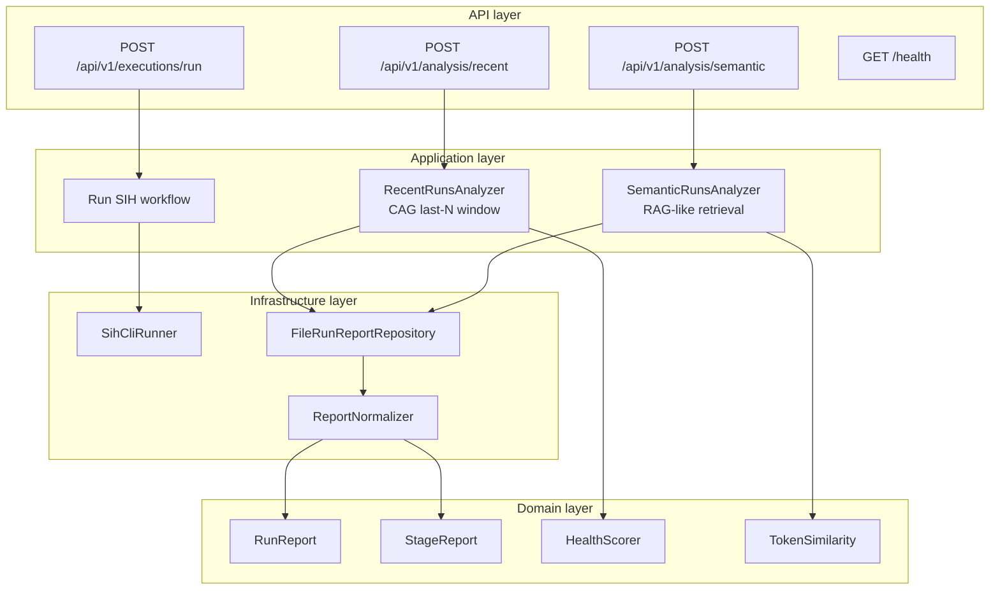
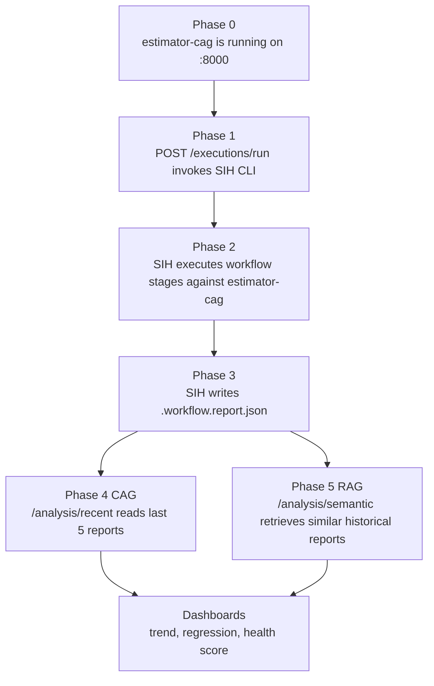
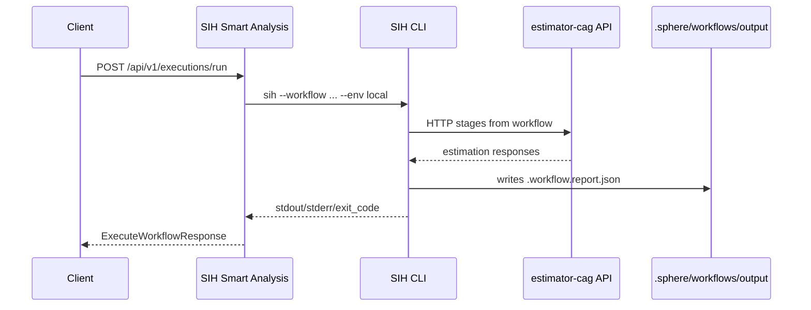
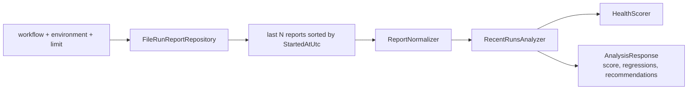
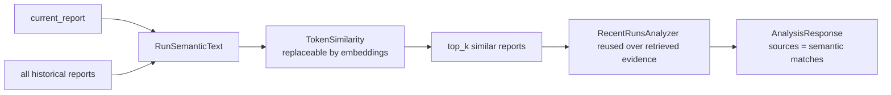

# SIH Smart Analysis

Execution intelligence service for SphereIntegrationHub reports.

This service is the second project in the repo. It connects the deterministic workflow layer with CAG/RAG analysis:

```text
SIH CLI -> SIH reports -> SIH Smart Analysis API -> CAG now / RAG later
```

The project is intentionally split in two learning phases:

- **Phase 1, CAG:** analyze the current execution against the last `N` executions, defaulting to 5. This gives a deterministic recent window without embeddings.
- **Phase 2, RAG:** retrieve semantically similar historical executions from the full report corpus, then reuse the same analysis model over the retrieved evidence.

## Architecture

```text
app/
  domain/           Pure execution model, scoring and semantic primitives
  application/      CAG and RAG use cases
  infrastructure/   File-based SIH report loading and normalization
  api/              FastAPI adapters
  schemas/          HTTP request and response contracts
```



## Phases



The current implementation intentionally keeps RAG local and simple. `SemanticRunsAnalyzer` uses token similarity over normalized report text. That adapter can later be replaced by embeddings and a vector store without changing the public endpoint contract.

## Endpoints

Number of functional endpoints: **3** under `/api/v1`.

Number of operational endpoints: **1** outside `/api/v1`.

| Method | Path | Phase | Description |
|--------|------|-------|-------------|
| `GET` | `/health` | Ops | Service healthcheck. |
| `POST` | `/api/v1/executions/run` | CLI/API | Executes a SIH workflow through the local `sih` CLI and generates reports. |
| `POST` | `/api/v1/analysis/recent` | CAG | Loads the last `N` reports for a workflow/environment and detects recent regressions. |
| `POST` | `/api/v1/analysis/semantic` | RAG | Receives a current report and retrieves semantically similar historical reports. |

### `POST /api/v1/executions/run`

Executes SIH from the API.



Request:

```json
{
  "workflow": "../.sphere/workflows/test-estimate-endpoint.workflow",
  "environment": "local",
  "catalog": "../.sphere/api.catalog",
  "varsfile": "../.sphere/workflows/test-estimate-endpoint.wfvars",
  "report_format": "both",
  "capture_http": "bodies",
  "refresh_cache": false,
  "mocked": false
}
```

Response:

```json
{
  "exit_code": 0,
  "succeeded": true,
  "stdout": "...",
  "stderr": ""
}
```

### `POST /api/v1/analysis/recent`

CAG phase. It does not use embeddings. It reads a deterministic recent window, defaulting to the last 5 reports.



Request:

```json
{
  "workflow": "test-estimate-endpoint",
  "environment": "local",
  "limit": 5
}
```

Response shape:

```json
{
  "mode": "recent-cag",
  "workflow": "test-estimate-endpoint",
  "environment": "local",
  "current_run_id": "01KQZ5B1Y4QS93HGT437Z0FPZM",
  "health_score": 94,
  "summary": "...",
  "failure_type": "none",
  "regressions": [],
  "recommendations": [],
  "sources": []
}
```

### `POST /api/v1/analysis/semantic`

RAG phase. Today it uses local token similarity. Later this can become embeddings + vector DB.



Request:

```json
{
  "current_report": {
    "ExecutionId": "01KQZ5B1Y4QS93HGT437Z0FPZM",
    "WorkflowName": "test-estimate-endpoint",
    "Environment": "local"
  },
  "top_k": 8
}
```

The real request should include the full report JSON.

## API Versioning

The API already uses `/api/v1`.

The CAG to RAG transition does **not** require `/api/v2` if:

- `AnalysisResponse` keeps the same fields.
- `sources` remains a list of report/run identifiers.
- The controller path stays semantic by capability, not by implementation detail.

That means these endpoints can remain stable:

```text
/api/v1/analysis/recent
/api/v1/analysis/semantic
```

Add `/api/v2` only if the contract changes incompatibly, for example:

- sources become rich objects instead of strings,
- the response becomes dashboard-first instead of analysis-first,
- the request accepts multiple workflows/environments with a different shape,
- streaming or async job execution replaces synchronous responses.

Recommended future-safe naming:

```text
/api/v1/analysis/recent      deterministic last-N window
/api/v1/analysis/semantic    relevance-based historical retrieval
/api/v1/executions/run       SIH CLI bridge
```

## Run

```bash
cd sih-smart-analysis
python -m venv .venv
source .venv/bin/activate
pip install -e ".[dev]"
uvicorn app.main:app --reload --port 8010
```

By default the service reads reports from the master repo SIH output folder:

```text
../.sphere/workflows/output
```

Override it when needed:

```bash
SIH_SMART_REPORTS_DIR=sample-reports uvicorn app.main:app --reload --port 8010
```

## Test

```bash
cd sih-smart-analysis
pip install -e ".[dev]"
pytest
```

## Example

Generate a fresh SIH report from the master pilot workflow:

```bash
curl -X POST http://localhost:8010/api/v1/executions/run \
  -H "Content-Type: application/json" \
  -d '{
    "workflow":"../.sphere/workflows/test-estimate-endpoint.workflow",
    "environment":"local",
    "catalog":"../.sphere/api.catalog",
    "varsfile":"../.sphere/workflows/test-estimate-endpoint.wfvars",
    "report_format":"both",
    "capture_http":"bodies"
  }'
```

Analyze the last five real SIH reports:

```bash
curl -X POST http://localhost:8010/api/v1/analysis/recent \
  -H "Content-Type: application/json" \
  -d '{"workflow":"test-estimate-endpoint","environment":"local","limit":5}'
```

```bash
python - <<'PY'
import json
from pathlib import Path

report = json.loads(Path("sample-reports/checkout-smoke/2026-05-05_v1.4.0_staging.json").read_text())
print(json.dumps({"current_report": report, "top_k": 8}))
PY
```
