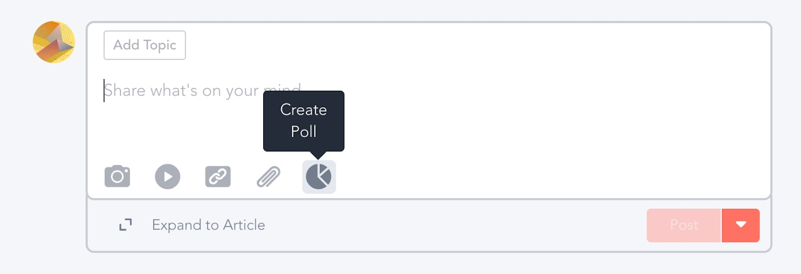

# ¿Cómo usar la plataforma? — 19 min
[

7 Mentors](https://training.lidr.co/posts/ai-engineering-202604-como-usar-la-plataforma-19-min/instructors)

⏳Tiempo estimado 19 min

## 🎉****Bienvenido/a AI Engineering

Estás a punto de empezar un programa técnico donde aprenderás a diseñar, construir y desplegar productos de inteligencia artificial en entornos reales.

Antes de empezar, es importante que entiendas cómo funciona la plataforma, cómo se organiza el contenido y cómo debes seguir el programa para aprovecharlo al máximo.

Este no es un curso para ver vídeos sin más. El programa está diseñado para que construyas proyectos, tomes decisiones técnicas y entiendas cómo se desarrollan productos de IA en entornos reales.

[Video](https://player.vimeo.com/video/1120750410?h=db5c249346)

## 👔Crea tu perfil

[Video](https://player.vimeo.com/video/1120751489?h=df4f2872e5)

#### 📸Añade tu foto

Añade una foto de perfil. En programas online es importante poner cara a las personas con las que vas a trabajar durante las próximas semanas.

Puedes hacerlo en la sección**Your Profile → Edit**.

#### 🗣Compártenos tu historia

Añade tu perfil de LinkedIn y escribe una breve descripción sobre ti, tu experiencia y por qué te interesa AI Engineering.

Esto ayudará a mentores, TAs y compañeros a conocerte mejor.

## 🤝Conoce a otros alumnos y mentores

[Video](https://player.vimeo.com/video/1120753643?h=f8b4cc9ff9)

Durante el programa trabajarás con otras personas que están en situaciones similares a la tuya. Te recomendamos revisar la sección de participantes para conocer:

- 

Mentores

- 

Equipo

- 

Otros alumnos

Gran parte del aprendizaje también ocurre hablando con otras personas que están construyendo cosas parecidas a las tuyas.

## 🚢Navega por el material del curso

[Video](https://player.vimeo.com/video/1120754444?h=6bbb99fad6)

En la sección[**Contenido**](https://training.lidr.co/spaces/22984593/content)encontrarás todo el material del programa organizado por módulos y lecciones.

Dentro de cada lección podrás encontrar:

- 

Vídeos

- 

Texto

- 

Ejercicios

- 

Recursos adicionales

Es importante que sigas el orden del contenido, ya que los módulos están pensados para construir conocimiento de forma progresiva.

Cuando completes una lección, marca**Mark as completed**para llevar seguimiento de tu progreso.

## 🚨Mantente actualizado de las novedades del curso.

[Video](https://player.vimeo.com/video/1120755759?h=a431e50db3)

En la sección[**Novedades**](https://training.lidr.co/spaces/22984593/feed)se publicará información importante durante el programa:

- 

Avisos

- 

Indicaciones para ejercicios

- 

Recursos adicionales

- 

Cambios

- 

Recordatorios de sesiones

- 

Información sobre proyectos

Te recomendamos revisar esta sección con frecuencia.

### ✍Participa en la comunidad

Puedes publicar:

- 

Preguntas

- 

Avances

- 

Artículos

- 

Recursos

- 

Encuestas

- 

Problemas técnicos

- 

Ideas

Pero tan importante como publicar es**comentar y responder a otros**.
Muchas dudas que tendrás probablemente ya las haya tenido otra persona.

## 📲Descarga la aplicación en tu móvil

[Video](https://player.vimeo.com/video/715018173?h=ffb08b8389)

Descarga la aplicación**Mighty Networks app**desde la la Apple App o Google Play Stores. Una vez ahí, busca por*Lidr | Training great tech leaders*, y loggeate de nuevo para acceder al contenido.

Ya has completado todos los pasos para crear tu perfil, y sabes dónde está la información.**Ahora sólo tienes que decir ¡Hola! a tus compañeros en WhatsApp.**Cuéntanos lo que te motiva a seguir aprendiendo con LIDR, e inicia la conversación con los otros para hacerles sentir como en casa.

## 🛠Soporte técnico

¿Comentarios, dudas o problemas técnicos?

[**Contáctanos por chat**](https://chat.whatsapp.com/CaxetE6S9FN2OrzAHb2euX)en horario de 9:00 AM a 18:00 PM CET y te ayudaremos, o si lo prefieres, escribe a tu TA a[**lia@lidr.co**](mailto:lia@lidr.co)
