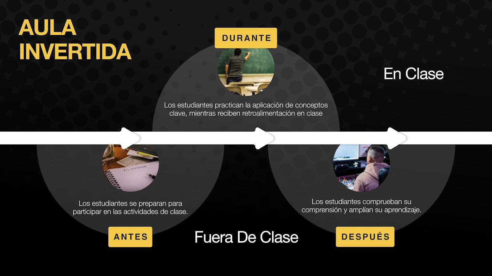

# 🎥 Presentación del programa 🤖 — 13 min

[Antonio Perez](https://training.lidr.co/members/36030888)

⏳Tiempo estimado: 13 min

Si estás aquí es porque probablemente ya has visto que algo está cambiando en la industria del software. Cada vez más empresas necesitan ingenieros que sepan construir productos con inteligencia artificial, pero el mercado todavía no tiene suficientes profesionales con ese perfil. Este programa nace precisamente para cubrir ese gap.

En este vídeo te explicamos en qué consiste el programa, qué vas a aprender, cómo vamos a trabajar y qué puedes esperar durante los próximos meses.

[Video](https://player.vimeo.com/video/1179851351?h=b6867164be)

## Cómo vamos a trabajar en este programa

Este programa no está diseñado como un curso tradicional donde ves vídeos y repites ejercicios paso a paso. Está diseñado para que aprendas a diseñar, construir y desplegar sistemas de inteligencia artificial como lo harías en una empresa tecnológica.

El objetivo no es solo que aprendas herramientas, sino que desarrolles criterio técnico, capacidad de diseño de sistemas y mentalidad de ingeniería.

Durante el programa trabajarás sobre un proyecto que irá evolucionando a lo largo de los módulos. Cada módulo añadirá nuevas piezas al sistema: arquitectura, datos, modelos, evaluación, agentes, despliegue y monitorización.

El objetivo final no es hacer ejercicios aislados, sino entender cómo se construye un producto de IA completo.

## Metodología: Flipped Classroom

El programa sigue el modelo de aprendizaje llamado**flipped classroom**o clase invertida.

En un modelo tradicional, el profesor explica la teoría en clase y los alumnos hacen ejercicios en casa.

En nuestro caso, el contenido base se estudia antes de la sesión, y el tiempo en directo se utiliza para trabajar sobre problemas reales, ejercicios, arquitectura, código y decisiones técnicas.

## **Cómo funciona:**

### Antes de la sesión

- 

Revisas vídeos y documentación

- 

Preparas el entorno

- 

Intentas los ejercicios

- 

Piensas posibles soluciones

### Durante la sesión

- 

Trabajamos sobre ejercicios

- 

Revisamos soluciones

- 

Tomamos decisiones de arquitectura

- 

Resolvemos dudas

- 

Avanzamos en el proyecto

- 

Discutimos problemas reales

### Después de la sesión

- 

Mejoras tu solución

- 

Continúas el proyecto

- 

Aplicas lo aprendido

- 

Preparas la siguiente sesión

La clave del programa es que**el aprendizaje ocurre principalmente cuando construyes cosas, no cuando ves vídeos**.

## Herramientas y forma de trabajo

Durante el programa trabajaremos principalmente con:

- 

Python

- 

APIs de modelos de IA

- 

Bases de datos

- 

Bases de datos vectoriales

- 

Frameworks para aplicaciones con IA

- 

Docker

- 

GitHub para gestión de código

- 

Herramientas de despliegue y monitorización

Para la entrega de ejercicios y proyectos utilizaremos**GitHub mediante forks y pull requests**. Si no estás familiarizado con este flujo de trabajo, te recomendamos revisar cómo funciona antes de empezar.

## Feedback y mejora continua

Al finalizar cada sesión en vivo te pediremos que completes una breve encuesta de**ROTI (Return On Time Invested)**.

Es una herramienta muy importante para nosotros porque nos permite saber:

- 

Si la sesión ha sido útil

- 

Si el ritmo es adecuado

- 

Si el contenido tiene sentido

- 

Qué deberíamos mejorar

[Video](https://player.vimeo.com/video/1080319644?h=a68a0c3a06)

Intentamos mejorar el programa continuamente en base a vuestro feedback, así que es una parte importante del programa. Si prefieres también puedes dejarnos tu feedback[aquí](https://lidr.typeform.com/feedb-aieng)

## Muy importante antes de seguir

Este programa no es un curso para ver vídeos pasivamente. Es un programa para construir, tomar decisiones, equivocarte, corregir y aprender como lo harías en un proyecto real.

Cuanto más te impliques, más aprenderás. Este programa funciona especialmente bien para la gente que participa, pregunta, comparte y construye de verdad.
