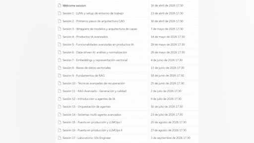
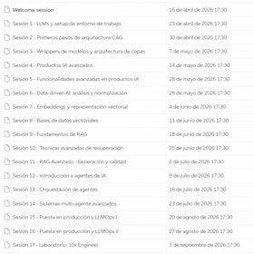

# 👋 Bienvenida y expectativas — 55 min

[Antonio Perez](https://training.lidr.co/members/36030888)

⏳Tiempo estimado: 4 min

¡Bienvenido/a!

Estamos muy contentos de tenerte en el programa AI Engineering. Antes de la sesión de bienvenida, es importante que revises el contenido de esta sección para entender cómo funciona el programa y qué se espera de ti durante las próximas semanas.

Antes de la sesión de bienvenida, debes:

💬Leer el mensaje de Expectativas.
🎥Ver el vídeo de Presentación del Programa.
👀Revisar los Enlaces Útiles.
🚦Entender el sistema de emojis y comunicación del programa.

### Sobre el programa AI Engineering

AI Engineering es un programa técnico orientado a diseñar, construir y desplegar productos de inteligencia artificial en entornos reales de producción.

No es un curso para aprender teoría sobre IA ni para usar herramientas de forma superficial. El objetivo del programa es que entiendas cómo se construyen sistemas con IA en empresas reales: arquitectura, datos, modelos, evaluación, despliegue, monitorización y optimización.

Durante el programa trabajarás sobre proyectos que irán evolucionando a lo largo de los módulos hasta construir un sistema completo.

### Dedicación y expectativas de trabajo

Este programa requiere trabajo continuo durante varias semanas.
No está pensado para hacerlo todo el fin de semana ni para solo asistir a las sesiones en vivo.

Como referencia:

- 

Dedicación mínima recomendada: 4–5 horas por semana

- 

Dedicación media: 6–8 horas por semana

- 

Algunas semanas con proyecto pueden requerir más tiempo

El progreso en el programa depende en gran parte del trabajo que hagas fuera de las sesiones en vivo.

### Cómo aprovechar el programa

Para aprovechar bien el programa te recomendamos:

- 

Reservar tiempo fijo cada semana para el programa

- 

Revisar el contenido antes de las sesiones en vivo

- 

Trabajar en los ejercicios y proyectos desde el principio

- 

Preguntar dudas cuando te bloquees

- 

Participar en la comunidad

- 

No intentar hacerlo todo al final del programa

Este programa está diseñado para aprender construyendo, no solo viendo contenido.

### Estructura general del programa

El programa está organizado en módulos que cubren el ciclo completo de construcción de productos de IA:

1. 

Fundamentos de productos con IA

1. 

Arquitecturas CAG

1. 

Data-driven AI y embeddings

1. 

Arquitecturas RAG

1. 

Sistemas multi-agente

1. 

Despliegue, evaluación y monitorización (LLMOps)

A lo largo del programa irás construyendo sistemas cada vez más complejos hasta llegar a un proyecto completo en producción.

- 

[💬 Expectativas — 9 min

- Visibility: Visible
- Unlocking: None
- Completion: Button
- Comments: On
- Thumbnail: Default
](https://training.lidr.co/posts/ai-engineering-202604-💬-expectativas-9-min)⏳ Tiempo estimado: 6 min Lee atentamente este mensaje, ya que establece las expectativas para el programa y deja...
- 

[🎥 Presentación del programa 🤖 — 13 min

- Visibility: Visible
- Unlocking: None
- Completion: Button
- Comments: On
- Thumbnail: Default
](https://training.lidr.co/posts/ai-engineering-202604-🎥-presentacion-del-programa-🤖-13-min)⏳ Tiempo estimado: 13 min Si estás aquí es porque probablemente ya has visto que algo está cambiando en la industria...
- 

[🚦 Sistema de Emojis — 1 min

- Visibility: Visible
- Unlocking: None
- Completion: Button
- Comments: On
- Thumbnail: Default
](https://training.lidr.co/posts/ai-engineering-202604-🚦-sistema-de-emojis-1-min)⏳ Tiempo estimado: 1 min Para ayudarte a identificar la importancia de cada contenido dentro del programa, utilizamos...
- 

[🗓️ Agenda — 3 min

- Visibility: Visible
- Unlocking: None
- Completion: Button
- Comments: On
- Thumbnail: Default
](https://training.lidr.co/posts/ai-engineering-202604-🗓️-agenda-3-min)En este espacio encontrarás el calendario del programa, con las fechas y temática de cada una de las sesiones en...
- 

[⚒️ Enlaces útiles y soporte — 1 min

- Visibility: Visible
- Unlocking: None
- Completion: Button
- Comments: On
- Thumbnail: Default
](https://training.lidr.co/posts/ai-engineering-202604-⚒️-enlaces-utiles-y-soporte-1-min)Tiempo estimado: 1 min Acceso a las sesiones en vivo Zoom – Sala de reuniones principal Esta es la sala donde se...
- 

[📜 Política de Gestión de Repositorios

- Visibility: Visible
- Unlocking: None
- Completion: Button
- Comments: On
- Thumbnail: Default
](https://training.lidr.co/posts/ai-engineering-202604-📜-politica-de-gestion-de-repositorios)1. Objetivo Establecer lineamientos claros para la gestión de repositorios de proyectos dentro del programa AI...
