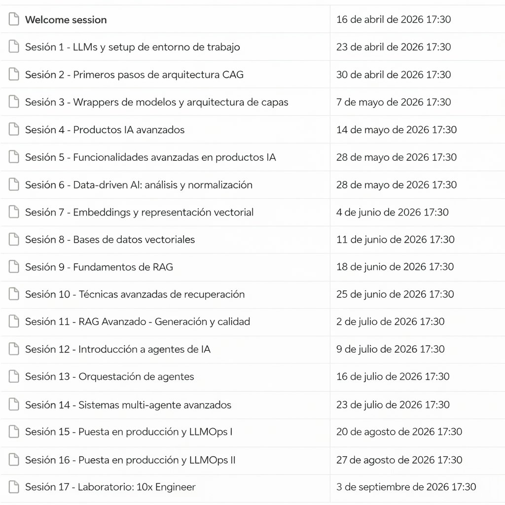

# 🗓️ Agenda — 3 min

[Antonio Perez](https://training.lidr.co/members/36030888)

En este espacio encontrarás el calendario del programa, con las fechas y temática de cada una de las sesiones en vivo.

Las sesiones en vivo son una parte fundamental del programa, ya que en ellas trabajaremos sobre ejercicios, proyectos, decisiones de arquitectura y resolución de dudas.

🗓Puedes añadir todas las sesiones a tu calendario[aquí](https://calendar.google.com/calendar/u/0?cid=Y18yNTBjYjY1OTZiOGQwZmNmODI0N2ZlN2UyMjU5ODQ3M2RlZDg3N2Q0NTI3OTRhYjk2ZWJjYjRjZjcyNzVkNzdlQGdyb3VwLmNhbGVuZGFyLmdvb2dsZS5jb20)

### Importante

- 

Todos los horarios están en hora de España (CET / CEST).

- 

Si vives en otro país, revisa la conversión horaria.

- 

Si no tienes acceso al calendario o a alguna invitación, contacta con el equipo de LIDR.

### Recomendación

Te recomendamos bloquear en tu agenda no solo las sesiones en vivo, sino también tiempo adicional durante la semana para:

- 

Revisar contenido

- 

Trabajar en ejercicios

- 

Avanzar en el proyecto

- 

Repasar conceptos

Este programa requiere trabajo continuo durante varias semanas, por lo que organizar tu tiempo desde el principio es muy importante.
