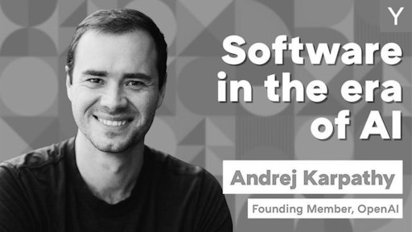
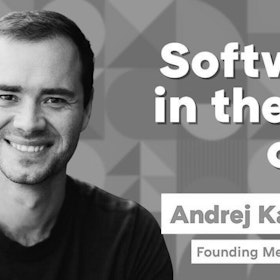

# Pre-curso: Introducción al rol de AI Engineer y panorama actual — 127 min

[Antonio Perez](https://training.lidr.co/members/36030888)

⏳Tiempo estimado: 1 min

En este pre-curso comenzaremos nuestro camino para convertirnos en AI Engineers: profesionales capaces de diseñar, construir y desplegar productos de inteligencia artificial en entornos reales.

El objetivo de este pre-curso no es que aprendas herramientas concretas, sino que entiendas el panorama actual de la inteligencia artificial, cómo está cambiando la industria del software y qué significa realmente construir productos con IA hoy en día.

Durante este módulo entenderás:

- 

Cómo ha cambiado el desarrollo de software con la llegada de los modelos fundacionales

- 

Qué tipos de productos con IA se están construyendo actualmente

- 

Qué arquitecturas existen para integrar modelos en sistemas reales

- 

Qué hace realmente un AI Engineer

- 

Qué stack tecnológico se utiliza hoy para construir productos con IA

- 

Qué tipo de proyectos vamos a desarrollar durante el programa

👉Para aprovechar mejor el programa, te recomendamos completar las siguientes lecciones antes de la primera sesión en vivo.

Estas lecciones te darán el contexto necesario para entender el resto del máster, ya que AI Engineering no trata solo de modelos, sino de sistemas completos, arquitectura, datos, evaluación, despliegue y operación en producción.

✍Reflexiona mientras ves el contenido:

- 

¿Cómo están incorporando IA los productos que usas?

- 

¿Qué partes de un producto con IA crees que son más complejas?

- 

¿Qué crees que diferencia un prototipo con IA de un sistema en producción?

Este será un tema importante en la primera sesión en vivo.

Con este pre-curso queremos que llegues al inicio del programa con una visión clara del panorama actual, del rol del AI Engineer y del tipo de sistemas que aprenderás a construir durante el máster.

### Obtén todos los recursos en las lecciones siguientes👇

- 

[🎥 Software 3.0 in the era of AI - Andrej Karpathy 🔴 — 50 min

- Visibility: Visible
- Unlocking: None
- Completion: Button
- Comments: On
- Thumbnail: Default
](https://training.lidr.co/posts/ai-engineering-202604-🎥-software-30-in-the-era-of-ai-andrej-karpathy-🔴-50-min)⏳ Tiempo estimado: 50 min Software en la Era de la IA El software está atravesando una transformación que no veíamos...
- 

[🎥 Primeros pasos para integrar IA en tus proyectos 🔴 — 40 min

- Visibility: Visible
- Unlocking: None
- Completion: Button
- Comments: On
- Thumbnail: Default
](https://training.lidr.co/posts/ai-engineering-202604-🎥-primeros-pasos-para-integrar-ia-en-tus-proyectos-🔴-40-min)⏳ Tiempo estimado: 40 min El software lleva décadas evolucionando, pero pocos cambios han generado tanta confusión...
- 

[🎥 El auge de la IA en productos de software 🔴 — 21 min

- Visibility: Visible
- Unlocking: None
- Completion: Button
- Comments: On
- Thumbnail: Default
](https://training.lidr.co/posts/ai-engineering-202604-🎥-el-auge-de-la-ia-en-productos-de-software-🔴-21-min)⏳ Tiempo estimado: 21 min Hace 3 años, ¿cuántos productos que usabas a diario tenían IA integrada? ¿Y hoy? Algo ha...
- 

[🎥 El rol de un AI Engineer 🔴 — 16 min

- Visibility: Visible
- Unlocking: None
- Completion: Button
- Comments: On
- Thumbnail: Default
](https://training.lidr.co/posts/ai-engineering-202604-🎥-el-rol-de-un-ai-engineer-🔴-16-min)⏳ Tiempo estimado: 16 min Hay mucha confusión con el término AI Engineer. Vamos a aclararlo No es programar con...
- 

[🆙 Evalúa el contenido de este Módulo

- Visibility: Visible
- Unlocking: None
- Completion: None
- Comments: On
- Thumbnail: Default
](https://training.lidr.co/posts/ai-engineering-202604-🆙-evalua-el-contenido-de-este-modulo)Evalúa del 1 al 5 el valor aportado por el contenido de este módulo. ⚠ Importante: Debido a una limitación técnica de...
