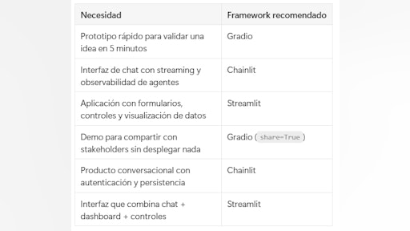
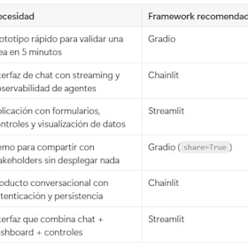
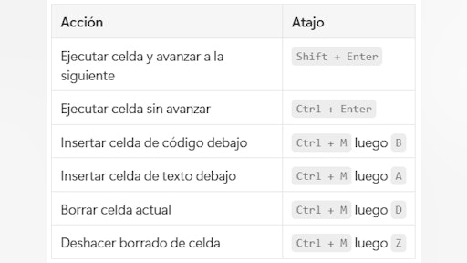
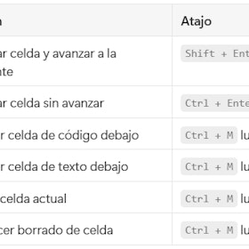

# Pre curso. Metodología y detalles operativos del programa — 41 min

[Antonio Perez](https://training.lidr.co/members/36030888)

⏳Tiempo estimado: 1 min

Antes de empezar a construir sistemas de inteligencia artificial, es importante entender**cómo vamos a trabajar durante el programa**y con qué entorno tecnológico lo haremos.

Este no es un curso basado en teoría ni en ejemplos aislados. Es un programa diseñado para replicar, lo máximo posible, cómo se construyen productos con IA en equipos de ingeniería reales.

A lo largo del máster:

- 

Trabajarás con un stack tecnológico alineado con el que se utiliza actualmente en empresas que desarrollan productos con IA

- 

Construirás servicios desacoplados, conectados vía API, siguiendo patrones de arquitectura reales

- 

Desarrollarás sobre un entorno común, reproducible y preparado para escalar a producción

- 

Aprenderás a interactuar con modelos de distintos proveedores y a tomar decisiones técnicas en función de coste, rendimiento y calidad

Este módulo tiene un objetivo claro: que entiendas el entorno en el que vas a trabajar y elimines cualquier fricción técnica antes de empezar.

Para ello, recorreremos cuatro piezas clave:

→ El stack tecnológico del programa y cómo se estructura un sistema de IA moderno
→ La configuración del entorno local para trabajar con contenedores y servicios reales
→ El uso de entornos gestionados como Google Colab para iteración rápida y experimentación
→ Los modelos y APIs que utilizaremos, y cómo elegir entre ellos según el caso de uso

No necesitas dominar nada de esto antes de empezar. Pero sí es importante que entiendas el contexto general: en AI Engineering, el modelo es solo una pieza más dentro de un sistema más amplio.

👉Antes de la primera sesión, asegúrate de:

- 

Tener Docker instalado y funcionando correctamente

- 

Poder levantar el entorno base del programa en local

- 

Haber explorado los conceptos básicos de los modelos y APIs que utilizaremos

Esto nos permitirá empezar directamente construyendo, sin bloqueos técnicos.

### Obtén los recursos en las siguientes lecciones👇

- 

[🗒️ Stack y entorno tecnológico🔴 — 12 min

- Visibility: Visible
- Unlocking: None
- Completion: Button
- Comments: On
- Thumbnail: Default
](https://training.lidr.co/posts/ai-engineering-202604-🗒️-stack-y-entorno-tecnologico🔴-12-min)⏳ Tiempo estimado: 12 min Stack Tecnológico del master A lo largo de este programa vas a construir productos reales...
- 

[📄 Configuración del entorno en local 🔴 — 13 min

- Visibility: Visible
- Unlocking: None
- Completion: Button
- Comments: On
- Thumbnail: Default
](https://training.lidr.co/posts/ai-engineering-202604-📄-configuracion-del-entorno-en-local-🔴-13-min)Tiempo estimado: 13 min Guía de Configuración del Entorno de Desarrollo Antes de arrancar con la primera sesión del...
- 

[📄 Introducción a Google colab 🔴 — 9 min

- Visibility: Visible
- Unlocking: None
- Completion: Button
- Comments: On
- Thumbnail: Default
](https://training.lidr.co/posts/ai-engineering-202604-📄-introduccion-a-google-colab-🔴-9-min)⌛Tiempo estimado: 9 min Qué es Google Colab Google Colab (Colaboratory) es un entorno de notebooks Jupyter que corre...
- 

[🗒️ Principales APIs y modelos que vamos a usar 🔴 — 12 min

- Visibility: Visible
- Unlocking: None
- Completion: Button
- Comments: On
- Thumbnail: Default
](https://training.lidr.co/posts/ai-engineering-202604-🗒️-principales-apis-y-modelos-que-vamos-a-usar-🔴-12-min)⏳ Tiempo estimado: 12 min Modelos de IA que Usaremos en el Programa A lo largo del programa trabajarás principalmente...
- 

[🆙 Evalúa el contenido de este Módulo

- Visibility: Visible
- Unlocking: None
- Completion: None
- Comments: On
- Thumbnail: Default
](https://training.lidr.co/posts/ai-engineering-202604-🆙-evalua-el-contenido-de-este-modulo-98724136)Evalúa del 1 al 5 el valor aportado por el contenido de este módulo. ⚠ Importante: Debido a una limitación técnica de...
