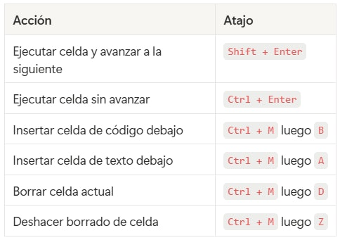

# 📄 Introducción a Google colab 🔴 — 9 min

[Antonio Perez](https://training.lidr.co/members/36030888)

⌛Tiempo estimado: 9 min

## Qué es Google Colab

Google Colab (Colaboratory) es un entorno de notebooks Jupyter que corre en el navegador sin instalar nada en tu máquina. Python viene preinstalado, junto con la mayoría de librerías habituales de data science. Funciona sobre la infraestructura de Google y se integra con Google Drive para guardar tus notebooks automáticamente.

Lo usamos en el programa como entorno estándar para los ejercicios pre-sesión porque elimina los problemas de configuración local — todo el mundo trabaja en el mismo entorno, independientemente de su sistema operativo.

**Requisitos:**Una cuenta de Google. Nada más.

## Crear y abrir un notebook

### Opción A: Desde el repositorio del programa

Los ejercicios del programa se distribuyen como archivos.ipynb. Para abrir uno en Colab:

1. 

Descarga el archivo.ipynbdel repositorio del programa

1. 

Ve a[colab.research.google.com](https://colab.research.google.com/)

1. 

En el diálogo de bienvenida, selecciona la pestaña**Subir**y arrastra el archivo

Alternativamente, si el repositorio está en GitHub, puedes abrir el notebook directamente sustituyendogithub.comporcolab.research.google.com/githuben la URL.

### Opción B: Crear un notebook nuevo

1. 

Ve a[colab.research.google.com](https://colab.research.google.com/)

1. 

Haz clic en**Nuevo cuaderno**

El notebook se guardará automáticamente en tu Google Drive, en la carpetaColab Notebooks.

## La interfaz: lo esencial

Un notebook de Colab tiene dos tipos de celdas:

**Celdas de código:**Donde escribes y ejecutas Python. Para ejecutar una celda, haz clic en el botón▶a la izquierda de la celda o pulsaShift + Enter. La salida aparece justo debajo.

**Celdas de texto:**Donde escribes documentación en formato Markdown. No se ejecutan — solo se renderizan visualmente.

### Atajos de teclado útiles

## Instalar librerías

Colab viene con muchas librerías preinstaladas (numpy, pandas, matplotlib, etc.), pero para trabajar con APIs de LLMs necesitarás instalar los SDKs de OpenAI o Anthropic. Esto se hace directamente desde una celda de código usandopipcon el prefijo!:

python
# Instala el SDK de OpenAI !pip install openai

python
# Instala el SDK de Anthropic !pip install anthropic

La instalación es temporal — se pierde cuando el entorno de ejecución se desconecta (tras un periodo de inactividad o al cerrar el navegador). Si vuelves al notebook más tarde, necesitarás ejecutar la celda de instalación de nuevo.

## Gestión segura de API keys con Secrets

Este es el punto más importante de esta guía. Nunca escribas tu API key directamente en el código del notebook — si compartes el notebook o lo subes a un repositorio, la key queda expuesta.

Colab tiene una funcionalidad llamada**Secrets**que permite almacenar claves de forma segura. Las keys se guardan en tu cuenta de Google, no en el notebook, por lo que no se comparten aunque compartas el archivo.

### Paso 1: Abrir el gestor de Secrets

En el panel lateral izquierdo del notebook, haz clic en el icono de**llave**(🔑). Se abrirá el panel de Secrets.

### Paso 2: Añadir tu API key

Haz clic en**Agregar nuevo secreto**(o**Add new secret**) e introduce:

- 

**Nombre:**OPENAI_API_KEY(oANTHROPIC_API_KEY, según tu proveedor)

- 

**Valor:**Tu API key completa (por ejemplo,sk-...para OpenAI osk-ant-...para Anthropic)

El nombre no se puede cambiar una vez creado — si te equivocas, borra el secret y crea uno nuevo.

### Paso 3: Habilitar el acceso desde el notebook

Cada secret tiene un toggle de**Acceso al notebook**. Actívalo para el notebook en el que estás trabajando. Si no lo activas, el código no podrá leer la key.

### Paso 4: Usar la key en tu código

python
import os from google.colab import userdata # Cargar la key desde Secrets y asignarla como variable de entorno os.environ["OPENAI_API_KEY"] = userdata.get("OPENAI_API_KEY") # A partir de aquí, el SDK de OpenAI la detecta automáticamente from openai import OpenAI client = OpenAI() # No necesitas pasar la key — la lee del entorno

Para Anthropic es exactamente igual:

python
import os from google.colab import userdata os.environ["ANTHROPIC_API_KEY"] = userdata.get("ANTHROPIC_API_KEY") from anthropic import Anthropic client = Anthropic() # Lee la key del entorno automáticamente
### Importante

- 

Los secrets son**personales**— solo tú los ves. Si compartes el notebook con un compañero, esa persona tendrá que configurar sus propios secrets con los mismos nombres.

- 

Los secrets son**globales**en tu cuenta de Colab: una vez creados, están disponibles en cualquier notebook (siempre que actives el toggle de acceso).

## Ejecución y ciclo de vida del entorno

### Runtime (entorno de ejecución)

Cuando ejecutas la primera celda de código, Colab asigna una máquina virtual con Python. Esta máquina:

- 

Se**desconecta automáticamente**tras ~90 minutos de inactividad (o ~12 horas de uso continuado en la versión gratuita)

- 

Al desconectarse,**se pierde todo**: librerías instaladas, variables en memoria, archivos temporales

- 

Para reconectar, simplemente ejecuta las celdas de nuevo desde el principio

### Orden de ejecución

Las celdas de un notebook se ejecutan en el orden en que tú las lances — no necesariamente de arriba abajo. Pero las dependencias sí importan: si una celda usa una variable definida en otra celda anterior, esa celda anterior tiene que haberse ejecutado primero en la sesión actual.

Si en algún momento el estado se vuelve confuso (variables que no cuadran, errores inesperados), puedes reiniciar el entorno desde el menú:**Entorno de ejecución → Reiniciar entorno de ejecución**, y volver a ejecutar las celdas desde el principio.

## Consejos prácticos

**Ejecuta las celdas en orden secuencial.**Aunque puedes saltar entre celdas, para los ejercicios del programa ejecuta siempre de arriba a abajo para evitar problemas de dependencias.

**No dejes la API key hardcodeada.**Usa siempre Secrets. Es un hábito profesional que debes incorporar desde el primer ejercicio.

**Si el entorno se desconecta, no pasa nada.**El notebook (el código y el texto) se guarda automáticamente en Google Drive. Solo se pierde el estado de ejecución — vuelve a ejecutar las celdas y estarás donde estabas.

**Versión gratuita vs. Pro.**La versión gratuita de Colab es más que suficiente para los ejercicios del programa. Las llamadas a APIs de LLMs no requieren GPU — solo una conexión a internet y unos segundos de CPU.
