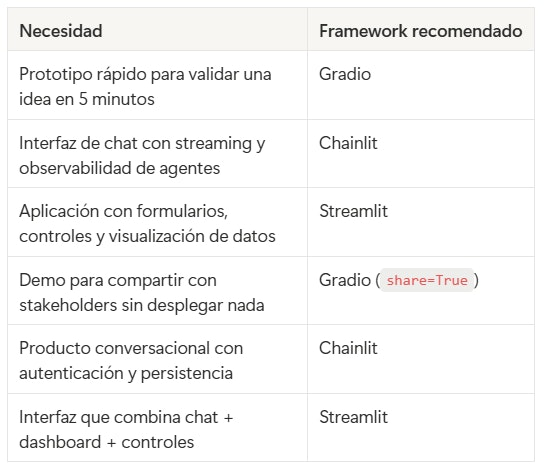

# 🗒️ Stack y entorno tecnológico🔴 — 12 min

[Antonio Perez](https://training.lidr.co/members/36030888)

⏳Tiempo estimado: 12 min

## Stack Tecnológico del master

A lo largo de este programa vas a construir productos reales con inteligencia artificial. Para ello, hemos seleccionado un conjunto de herramientas que refleja lo que encontrarás en equipos de ingeniería profesionales: tecnologías maduras, bien documentadas y con comunidades activas.

Este documento te presenta las piezas fundamentales del stack. No necesitas dominarlas antes de empezar — las iremos introduciendo progresivamente sesión a sesión — pero sí conviene que las conozcas de antemano para que nada te pille por sorpresa.

## Python y FastAPI: el motor de los servicios de IA

Todo el backend de inteligencia artificial que construiremos en el programa está escrito en**Python 3.11+**. Python es el lenguaje dominante en el ecosistema de IA y machine learning. Los SDKs oficiales de OpenAI, Anthropic y prácticamente cualquier proveedor de modelos están diseñados con Python como referencia.

Sobre Python, utilizaremos**FastAPI**como framework para construir los servicios que exponen las capacidades de IA. FastAPI combina tres cualidades que lo hacen ideal para este tipo de proyectos:

- 

**Rendimiento asíncrono nativo**, fundamental cuando tus servicios pasan la mayor parte del tiempo esperando respuestas de APIs externas (como las de los LLMs).

- 

**Validación automática con Pydantic**, que nos permite definir contratos claros para las entradas y salidas de nuestros endpoints — y más adelante, para validar las respuestas de los propios modelos.

- 

**Documentación OpenAPI generada automáticamente**, lo que facilita que cualquier frontend pueda consumir los servicios sin fricciones.

La combinación de FastAPI con**Uvicorn**como servidor ASGI nos da un entorno de desarrollo ágil y un rendimiento más que suficiente para producción.

## Gestión de dependencias: uv

Para gestionar paquetes y entornos virtuales utilizaremos**uv**. Es significativamente más rápido a la hora de resolver dependencias e instalar paquetes, y su experiencia de uso es muy similar a la de herramientas que ya conoces.

Si vienes de otros lenguajes, piensa enuvcomo el equivalente abundleren Ruby onpmen JavaScript: un solo comando para crear entornos, instalar dependencias y mantener un lockfile reproducible.

## Docker: un entorno común para todos

Para eliminar por completo el clásico "en mi máquina funciona", todo el programa se ejecuta sobre**Docker y Docker Compose**.

Con un único comando —docker-compose up— levantarás todos los servicios necesarios: el backend en FastAPI, la base de datos PostgreSQL con soporte vectorial, y el frontend. Esto garantiza que todos trabajamos con exactamente el mismo entorno desde el primer día, y además te introduce de forma natural en las prácticas de containerización que formalizaremos en la sesión de puesta en producción.

## Frontend y lógica de negocio: tú eliges

### Interfaces para Aplicaciones de IA: Streamlit, Gradio y Chainlit - El problema que resuelven

Como ingeniero de software, sabes construir interfaces web. Pero cuando estás iterando sobre un prototipo de IA — probando prompts, ajustando parámetros, validando respuestas del modelo — lo último que quieres es montar un proyecto React con webpack, tailwind y un build pipeline para poder ver resultados en un navegador.

Los frameworks de frontend para IA resuelven exactamente esto: te permiten crear interfaces web funcionales escribiendo solo Python, sin tocar HTML, CSS ni JavaScript. No sustituyen a un frontend real en producción, pero eliminan la fricción entre "tengo un script que llama a una API" y "tengo algo que puedo mostrar, probar y compartir".

En el programa trabajaremos con tres de ellos. Cada uno tiene un enfoque diferente.

### Streamlit

**Qué es:**Un framework open source de Python para crear aplicaciones web interactivas. Es el más popular y el más versátil de los tres.

**Para qué es bueno:**Aplicaciones que combinan chat con visualización de datos, dashboards, formularios con múltiples controles, aplicaciones multipágina. Es el más flexible cuando necesitas ir más allá de una simple interfaz de chat.

**Ejemplo mínimo de chat con un LLM:**

python
import streamlit as st from openai import OpenAI st.title("Software Estimator") if "messages" not in st.session_state: st.session_state.messages = [] for msg in st.session_state.messages: with st.chat_message(msg["role"]): st.markdown(msg["content"]) if prompt := st.chat_input("Paste the meeting transcription"): st.session_state.messages.append({"role": "user", "content": prompt}) with st.chat_message("assistant"): response = st.write_stream( OpenAI().chat.completions.create( model="gpt-4o-mini", messages=st.session_state.messages, stream=True, ) ) st.session_state.messages.append({"role": "assistant", "content": response})

**Puntos fuertes:**Ecosistema maduro con cientos de componentes, buen soporte de streaming nativo (SSE), gestión de estado const.session_state, despliegue gratuito en Streamlit Community Cloud, sidebar para controles y parámetros.

**Limitaciones:**No está pensado para aplicaciones de alta concurrencia. Para cargas de trabajo pesadas conviene separar la lógica en un backend (FastAPI) y usar Streamlit solo como capa de presentación — que es exactamente el patrón que usaremos en el programa.

## Gradio

**Qué es:**Un framework open source de Hugging Face diseñado para crear demos de modelos de ML con el mínimo código posible.

**Para qué es bueno:**Demos rápidas, prototipos para mostrar a stakeholders, experimentación con modelos. Es imbatible cuando necesitas tener algo funcional en 5 minutos para validar una idea.

**Ejemplo mínimo:**

python
import gradio as gr from openai import OpenAI client = OpenAI() def generate_estimation(transcription): response = client.chat.completions.create( model="gpt-4o-mini", messages=[ {"role": "system", "content": "You are a software estimation expert."}, {"role": "user", "content": transcription}, ], ) return response.choices[0].message.content gr.Interface( fn=generate_estimation, inputs=gr.Textbox(label="Transcription", lines=10), outputs=gr.Textbox(label="Estimation"), title="Software Estimator", ).launch()

**Puntos fuertes:**Setup en líneas de código, widgets especializados para multimedia (audio, imagen, vídeo) que los otros no tienen, compartición instantánea conshare=True(genera una URL pública temporal), integración nativa con Hugging Face Spaces para despliegue.

**Limitaciones:**Menos flexible para interfaces complejas (multipágina, sidebars, layouts customizados). El streaming es menos fluido que en Streamlit (polling vs. SSE). Mejor para demos que para aplicaciones de producción.

## Chainlit

**Qué es:**Un framework open source diseñado específicamente para aplicaciones conversacionales con LLMs. No es un framework genérico — está construido desde cero para chatbots y agentes de IA.

**Para qué es bueno:**Aplicaciones donde la interfaz principal es un chat con el modelo. Si tu producto es una conversación (un asistente, un agente, un chatbot), Chainlit ofrece la mejor experiencia sin configuración adicional.

**Ejemplo mínimo:**

python
import chainlit as cl from openai import AsyncOpenAI client = AsyncOpenAI() @cl.on_message async def main(message: cl.Message): response = await client.chat.completions.create( model="gpt-4o-mini", messages=[ {"role": "system", "content": "You are a software estimation expert."}, {"role": "user", "content": message.content}, ], stream=True, ) msg = cl.Message(content="") async for chunk in response: token = chunk.choices[0].delta.content or "" await msg.stream_token(token) await msg.send()

**Puntos fuertes:**Streaming nativo y fluido (async desde el diseño), visualización de pasos intermedios de agentes (tool calls, razonamiento), autenticación integrada (Okta, Azure AD, Google), historial de conversaciones persistente, soporte multimodal (PDFs, imágenes). Integración directa con LangChain, LlamaIndex y OpenAI.

**Limitaciones:**Enfocado exclusivamente en interfaces de chat — si necesitas dashboards, formularios complejos o visualización de datos, no es la herramienta adecuada. La comunidad es más pequeña que la de Streamlit, además hay menos ejemplos y documentación disponible.

### Cuándo usar cada uno

### Lo que usaremos en el programa

En el ejercicio pre-sesión de la Sesión 03 trabajaremos con**Streamlit**para construir la primera interfaz web del proyecto de estimación de software. La elección no es casual: Streamlit ofrece el equilibrio adecuado entre facilidad de setup y flexibilidad para evolucionar la interfaz a medida que el proyecto crece (formularios en la Sesión 04, visualización de resultados, controles de parámetros).

Dicho esto, la arquitectura del proyecto separa claramente el backend (FastAPI) de la interfaz. El servicio de IA es una API REST independiente que puede ser consumida por cualquier frontend — Streamlit, Chainlit, React o la aplicación en Rails. Esta separación es deliberada: en producción, el frontend raramente será uno de estos frameworks de prototipado. Pero para iterar rápido durante el desarrollo, son herramientas que conviene dominar.

### Lo que viene después

A medida que avancemos en el programa iremos incorporando herramientas adicionales: SDKs de proveedores de LLMs, librerías de embeddings, extensiones de base de datos vectorial, frameworks de agentes, herramientas de observabilidad y evaluación. Cada una se presentará en su contexto, cuando la necesites para resolver un problema concreto.

Por ahora, asegúrate de tener Docker instalado y funcionando en tu máquina. Todo lo demás lo iremos montando juntos.
