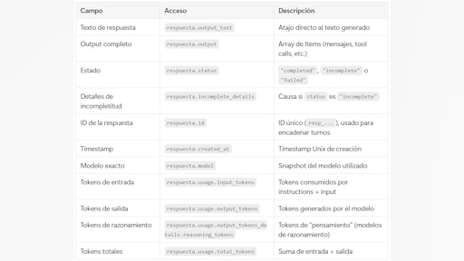
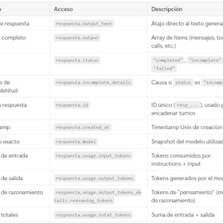
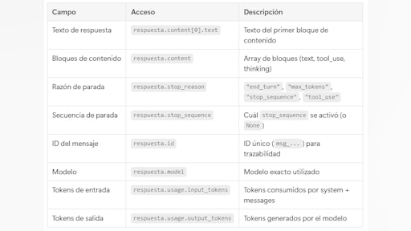
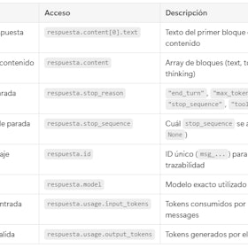
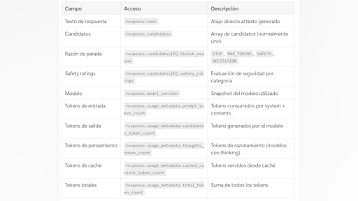
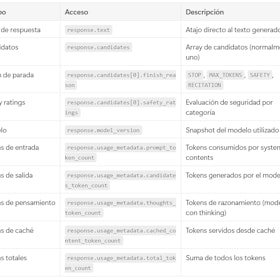
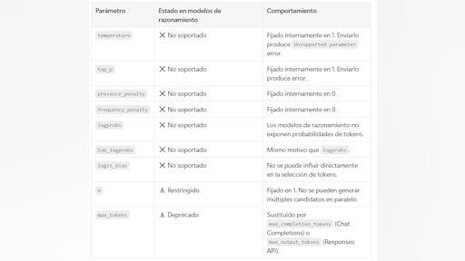
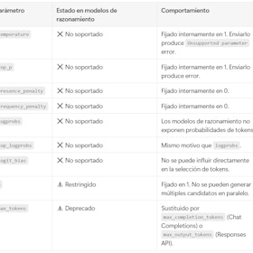
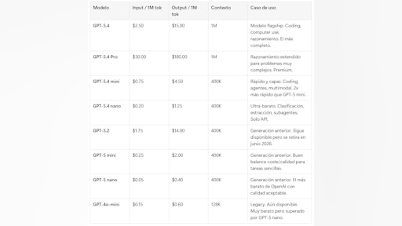
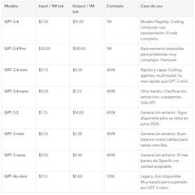

# Sesión 1: LLMs y setup de entorno de trabajo — 146 min

[Antonio Perez](https://training.lidr.co/members/36030888)

⏳Tiempo estimado: 1 min

¡Hola!

Esta sesión marca el punto de partida del programa y define cómo vas a trabajar durante las próximas semanas.

Aquí no solo vas a conectar con un modelo, sino a entender cómo se construyen sistemas reales con LLMs: cómo se comunican, qué decisiones técnicas hay detrás y qué implica llevar esto a un entorno profesional.

El foco no está en “usar IA”, sino en empezar a pensar como un ingeniero que construye productos con IA.

En esta primera sesión vamos a sentar las bases sobre las que se va a construir todo el programa.

El objetivo es que des tu primer paso como AI Engineer:**hacer una llamada real a un modelo de lenguaje (LLM) desde código**.

A diferencia de usar herramientas como ChatGPT, aquí vas a empezar a trabajar como en un entorno profesional:

integrando modelos directamente vía API y controlando su comportamiento desde tu propio código.

🎥*A continuación, el mentor te explica cómo enfocar esta sesión.*

[Video](https://player.vimeo.com/video/1179866931?h=e62058118e)

## Qué vas a aprender en esta sesión

### 1. Comunicación con LLMs vía API

- 

Importación de librerías cliente (OpenAI SDK, Anthropic SDK)

- 

Anatomía de una llamada API completa:

- 

System prompt: rol, instrucciones, restricciones

- 

User message y estructura de mensajes

- 

Parámetros de configuración

- 

Estructura de la respuesta:

- 

Contenido del mensaje

- 

Metadatos (modelo, timestamps)

- 

Uso de tokens (entrada/salida) y su impacto en coste

- 

Manejo de errores comunes

### 2. Ecosistema de proveedores

- 

Comparativa de proveedores principales (OpenAI, Anthropic, Google, Mistral, open source)

- 

Criterios de selección según caso de uso: coste, latencia, calidad, contexto disponible

- 

Agregadores y routers de modelos

### 3. Análisis de casos reales

- 

Ejemplos de productos existentes que utilizan LLMs

- 

Desglose de su arquitectura a alto nivel

- 

Identificación de bloques reutilizables

Durante esta sesión construirás tu primer punto de contacto real con modelos de lenguaje y entenderás qué está ocurriendo en cada parte de la integración.

Este conocimiento es clave: a partir de aquí, el modelo deja de ser una caja negra y pasa a ser una pieza controlable dentro de un sistema más grande.

### Contenidos obligatorios🔴

🗒Estructura de una llamada al API de OpenAI
🗒Estructura de una llamada al API de Anthropic
🗒Estructura de una llamada al API de Gemini
🗒Parámetros en modelos de razonamiento
🗒Tokenización: conceptos avanzados
🗒Comparación de modelos 2026

### Ejercicios prácticos✍

✍Crear tu cuenta en Anthropic y OpenAI
✍Respuesta de modelo vía API

Para finalizar, añade tu opinión sobre el contenido de este módulo:
🆙Evalúa el contenido de este Módulo

### 
❗Obtén los recursos completos en las siguientes lecciones👇

- 

[✍️ Ejercicio - Crear tu cuenta en Anthropic y OpenAI

- Visibility: Visible
- Unlocking: None
- Completion: Button
- Comments: On
- Thumbnail: Default
](https://training.lidr.co/posts/ai-engineering-202604-✍️-ejercicio-crear-tu-cuenta-en-anthropic-y-openai)Alta en las APIs de OpenAI y Anthropic ⚠ Completa este ejercicio antes de abordar el ejercicio de código (parte 2)....
- 

[✍️ Ejercicio - Respuesta de modelo via API

- Visibility: Visible
- Unlocking: None
- Completion: Button
- Comments: On
- Thumbnail: Default
](https://training.lidr.co/posts/ai-engineering-202604-✍️-ejercicio-respuesta-de-modelo-via-api)Tu primera llamada a un LLM vía API Objetivo Realizar tu primera integración real con un LLM desde código Python:...
- 

[✍️ Ejercicio - Tener google colab inicializado con las claves de api de openAI o anthropic y una llamada

- Visibility: Visible
- Unlocking: None
- Completion: Button
- Comments: On
- Thumbnail: Default
](https://training.lidr.co/posts/ai-engineering-202604-✍️-ejercicio-tener-google-colab-inicializado-con-las-claves-de-api-de-openai-o-anthropic-y-una-llamada)Tu primera llamada a un LLM vía API Objetivo Conectar con la API de un LLM desde código Python y obtener una...
- 

[🗒️ Estructura de una llamada al API de OpenAI 🔴 — 25 min

- Visibility: Visible
- Unlocking: None
- Completion: Button
- Comments: On
- Thumbnail: Default
](https://training.lidr.co/posts/ai-engineering-202604-🗒️-estructura-de-una-llamada-al-api-de-openai-🔴-25-min)⏳ Tiempo estimado: 25 min Contexto: dos APIs, una recomendación OpenAI ofrece actualmente dos APIs para generar...
- 

[🗒️ Estructura de una llamada al API de Anthropic 🔴 — 25 min

- Visibility: Visible
- Unlocking: None
- Completion: Button
- Comments: On
- Thumbnail: Default
](https://training.lidr.co/posts/ai-engineering-202604-🗒️-estructura-de-una-llamada-al-api-de-anthropic-🔴-25-min)⏳ Tiempo estimado: 25 min Contexto: la Messages API Anthropic ofrece una única API para generar texto: la Messages...
- 

[🗒️ Estructura de una llamada al API de Gemini 🔴 — 24 min

- Visibility: Visible
- Unlocking: None
- Completion: Button
- Comments: On
- Thumbnail: Default
](https://training.lidr.co/posts/ai-engineering-202604-🗒️-estructura-de-una-llamada-al-api-de-gemini-🔴-24-min)⏳ Tiempo estimado: 24 min Contexto: el SDK de Google Gen AI Google ofrece acceso a sus modelos Gemini a través de la...
- 

[🗒️ Parámetros en modelos de razonamiento 🔴 — 12 min

- Visibility: Visible
- Unlocking: None
- Completion: Button
- Comments: On
- Thumbnail: Default
](https://training.lidr.co/posts/ai-engineering-202604-🗒️-parametros-en-modelos-de-razonamiento-🔴-12-min)⏳ Tiempo estimado: 12 min Por qué los modelos de razonamiento son diferentes Los modelos de razonamiento (OpenAI...
- 

[🗒️ Tokenización: conceptos avanzados 🔴 — 39 min

- Visibility: Visible
- Unlocking: None
- Completion: Button
- Comments: On
- Thumbnail: Default
](https://training.lidr.co/posts/ai-engineering-202604-🗒️-tokenizacion-conceptos-avanzados-🔴-39-min)⏳ Tiempo estimado: 39 min El problema que resuelve la tokenización Los modelos de lenguaje no leen texto. No ven...
- 

[🗒️ Comparación de modelos 2026 🔴 — 17 min

- Visibility: Visible
- Unlocking: None
- Completion: Button
- Comments: On
- Thumbnail: Default
](https://training.lidr.co/posts/ai-engineering-202604-🗒️-comparacion-de-modelos-2026-🔴-17-min)⏳ Tiempo estimado: 17 min ⚠️ Los precios y modelos en el mercado de LLMs cambian con frecuencia. Este documento...
- 

[🆙 Evalúa el contenido de este Módulo

- Visibility: Visible
- Unlocking: None
- Completion: None
- Comments: On
- Thumbnail: Default
](https://training.lidr.co/posts/ai-engineering-202604-🆙-evalua-el-contenido-de-este-modulo-98724179)Evalúa del 1 al 5 el valor aportado por el contenido de este módulo. ⚠ Importante: Debido a una limitación técnica de...
