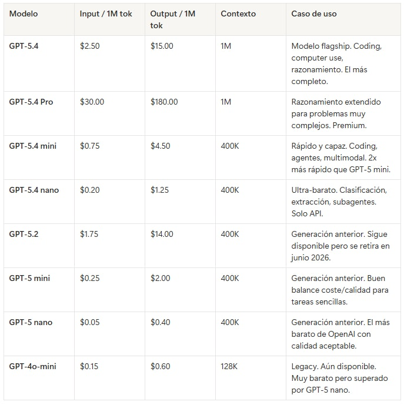
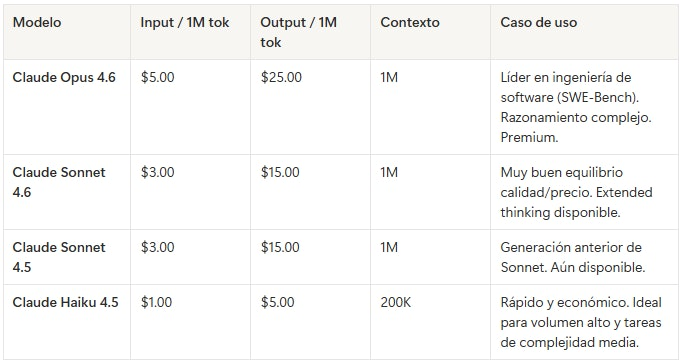
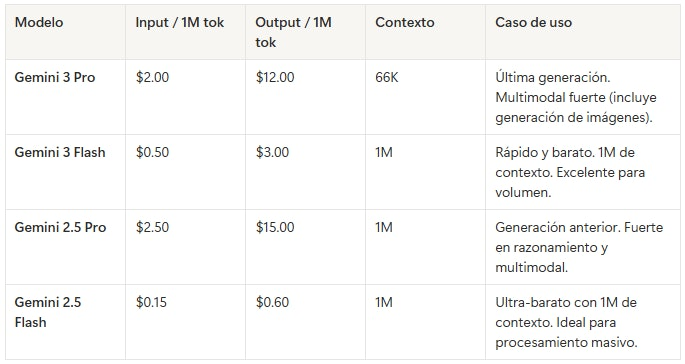
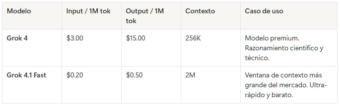
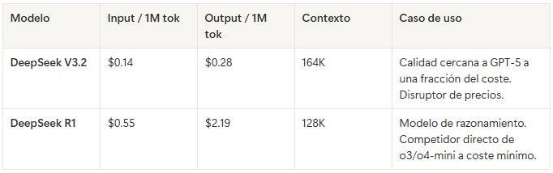
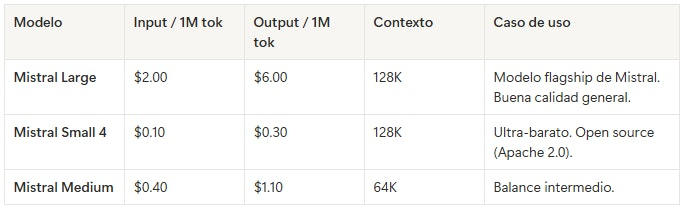
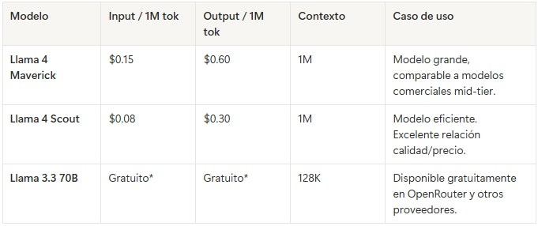
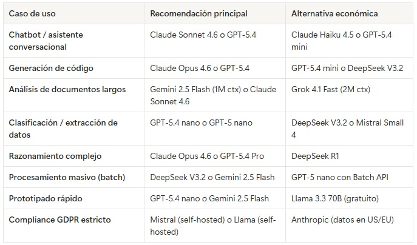
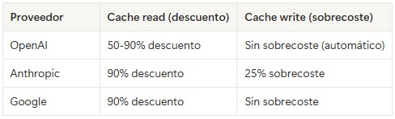

# 🗒️ Comparación de modelos 2026 🔴 — 17 min

[Antonio Perez](https://training.lidr.co/members/36030888)

⏳Tiempo estimado: 17 min

⚠️ Los precios y modelos en el mercado de LLMs cambian con frecuencia. Este documento refleja el estado del mercado a 1 de abril de 2026. Consulta siempre las páginas oficiales de precios antes de tomar decisiones que afecten a producción.

## 1. Panorama de proveedores

El mercado de LLMs comerciales está dominado por cinco proveedores principales, cada uno con una estrategia diferenciada. Además, existe un ecosistema creciente de modelos open source y agregadores que permiten acceder a múltiples proveedores desde una sola interfaz.

### Los cinco grandes

**OpenAI**— El líder en amplitud de catálogo. Su familia GPT-5.4 (lanzada en marzo 2026) cubre desde modelos ultra-baratos (Nano) hasta modelos premium con razonamiento avanzado (Pro). Pionero en computer use y herramientas integradas (web search, code interpreter). La empresa con mayor ecosistema de desarrolladores y documentación.

**Anthropic**— Posicionado en calidad y seguridad. Su familia Claude (Haiku 4.5, Sonnet 4.6, Opus 4.6) ofrece tres tiers claros. Opus 4.6 lidera benchmarks de ingeniería de software (SWE-Bench Verified). Ventana de contexto de hasta 1M de tokens en Opus y Sonnet. Fuerte en prompt caching (hasta 90% de descuento en cache hits).

**Google**— Ventaja en integración con su ecosistema (Workspace, Cloud, Vertex AI). Su familia Gemini abarca desde Flash (ultra-barato) hasta Pro (competidor premium). Soporte nativo multimodal fuerte (texto, imagen, audio, vídeo). Precios agresivos en los tiers de entrada.

**xAI (Grok)**— La propuesta de Elon Musk. Grok 4 compite en el segmento premium y Grok 4.1 Fast ofrece la ventana de contexto más grande del mercado (2M tokens). Precios competitivos y acceso a datos en tiempo real de la plataforma X. Nicho más fuerte en razonamiento científico.

**DeepSeek**— El disruptor chino de precios. DeepSeek V3.2 ofrece calidad comparable a modelos que cuestan 50-100x más. Precios extremadamente bajos ($0.14-$0.28/MTok). Modelo open source disponible. La contrapartida: los datos pasan por servidores en China, lo que puede ser un problema para ciertos casos de uso por compliance.

### Otros proveedores relevantes

**Mistral**(Francia) — Modelos open source con licencia Apache 2.0. Mistral Small y Medium ofrecen excelente relación calidad/precio para deployments donde el control total de los datos es requisito.

**Meta (Llama)**— Modelos open source de referencia. Llama 4 Scout y Maverick disponibles gratuitamente. Requieren infraestructura propia para ejecutarlos, o acceso vía proveedores de hosting como Together AI, Fireworks, o Amazon Bedrock.

**Cohere**— Especializado en enterprise RAG y búsqueda semántica. Command R+ con soporte nativo para retrieval. Fuerte en multilingual.

## 2. Modelos principales por proveedor

### OpenAI

**Nota:**Los precios se duplican para requests que superen 272K tokens de contexto en GPT-5.4 y GPT-5.4 Pro. Batch API disponible con 50% de descuento en todos los modelos. Cached inputs con hasta 90% de descuento.

**API:**Responses API (recomendada) + Chat Completions API (soportada indefinidamente).

### Anthropic (Claude)

**Nota:**Prompt caching con descuento del 90% en cache reads (solo 10% del precio base de input). Cache writes cuestan 1.25x del precio base. Batch API disponible con 50% de descuento.

**API:**Messages API (única interfaz).

### Google (Gemini)

**Nota:**Google ofrece context caching con 90% de descuento en cache reads. Integración nativa con Google Cloud (Vertex AI), Workspace, y AI Studio. Tres superficies de producto diferentes (AI Studio, Vertex AI, Gemini API) que pueden generar confusión.

**API:**Gemini API (compatible con formato OpenAI vía adaptadores).

### xAI (Grok)

**API:**Compatible con formato OpenAI.

### DeepSeek

**Nota:**Precios extraordinariamente bajos. Modelo open source disponible para self-hosting. Consideraciones de compliance: datos procesados en servidores en China.

### Mistral

**Nota:**Modelos open source con licencia permisiva. Ideales para self-hosting con control total de datos. Empresa europea (Francia), relevante para cumplimiento GDPR.

### Meta (Llama) — Open Source

- 

Los precios indicados son vía proveedores de hosting (Together AI, Fireworks, OpenRouter). Self-hosting es gratuito pero requiere infraestructura GPU.

## 3. Comparativa por caso de uso

### ¿Qué modelo elegir?

## 4. Conceptos clave de pricing

### Tokens: la unidad de medida

Los LLMs facturan por**tokens**, no por palabras ni caracteres. Un token equivale aproximadamente a 4 caracteres en inglés, o unas 0.75 palabras. En español, la proporción es ligeramente peor (más tokens por palabra) debido a las tildes, la ñ y las palabras más largas.

Regla práctica: 1.000 tokens ≈ 750 palabras en inglés ≈ 600 palabras en español.

### Input vs. Output: la asimetría de precios

Los tokens de**salida**(lo que genera el modelo) son siempre más caros que los de**entrada**(lo que tú envías), típicamente entre 3x y 10x más caros. Esto es porque cada token de salida requiere una pasada completa del modelo, mientras que los tokens de entrada se procesan en paralelo.

Implicación práctica: optimizar la longitud de las respuestas del modelo tiene un impacto mayor en coste que optimizar la longitud de tus prompts.

### Prompt caching

Todos los proveedores principales ofrecen alguna forma de caching. Cuando envías el mismo system prompt o contexto repetidamente, el proveedor puede reutilizar los cálculos internos de esos tokens y cobrarte mucho menos:

El caching es especialmente relevante en arquitecturas CAG y RAG donde el system prompt y el contexto base se repiten en cada llamada.

### Batch API

Todos los proveedores principales ofrecen una**Batch API**que procesa requests de forma asíncrona (normalmente en menos de 24 horas) con un 50% de descuento. Ideal para procesamiento masivo que no requiere respuesta en tiempo real: análisis de documentos, generación de contenido, clasificación de datos.

## 5. Agregadores y routers

Para proyectos que usen múltiples proveedores (como haremos en el programa), existen herramientas que unifican el acceso:

### OpenRouter

Plataforma SaaS que da acceso a 500+ modelos de todos los proveedores a través de una sola API y un solo sistema de billing. Cobra un 5.5% sobre los precios base. No requiere cuentas separadas en cada proveedor. Ideal para prototipado y proyectos que necesitan probar múltiples modelos rápidamente. Incluye modelos gratuitos (Llama 3.3, Gemma 3, DeepSeek R1).

### LiteLLM

Librería open source que unifica la interfaz de 100+ proveedores en un formato compatible con OpenAI. Se ejecuta en tu infraestructura (self-hosted). Sin markup de precio. Soporta load balancing, fallback automático, y tracking de costes por equipo. Más control pero más setup. Ideal para producción.

Ambas herramientas las exploraremos en el programa cuando construyamos la capa de abstracción de proveedores.

## 6. Tendencias del mercado

**Los precios caen rápidamente.**El coste de los LLMs ha bajado aproximadamente un 80% entre principios de 2025 y principios de 2026. Lo que hoy cuesta $0.15/MTok hace un año costaba $0.60/MTok. Esta tendencia probablemente continuará.

**Multi-modelo es el estándar.**Las arquitecturas de producción cada vez más usan múltiples modelos: un modelo barato para tareas simples (clasificación, routing), un modelo mid-tier para la mayoría del trabajo, y un modelo premium para casos difíciles. Esto puede reducir costes entre un 60% y un 80% frente a usar siempre el modelo premium.

**El contexto crece.**Las ventanas de contexto han pasado de 4K tokens (GPT-3.5, 2023) a 1-2M tokens (GPT-5.4, Gemini, Grok 4.1 Fast en 2026). Esto habilita arquitecturas CAG más potentes y reduce la necesidad de chunking agresivo en RAG.

**Open source cierra la brecha.**Modelos como Llama 4, DeepSeek V3.2 y Qwen 3 compiten en calidad con modelos comerciales que cuestan 10-50x más. Para empresas con capacidad de infraestructura GPU, el self-hosting es cada vez más viable.

## Referencias de precios oficiales

- 

OpenAI[openai.com/api/pricing](https://openai.com/api/pricing/)

- 

Anthropic[docs.anthropic.com/en/docs/about-claude/models](https://docs.anthropic.com/en/docs/about-claude/models)

- 

Google Gemini[ai.google.dev/gemini-api/docs/pricing](https://ai.google.dev/gemini-api/docs/pricing)

- 

xAI (Grok)[docs.x.ai/docs/models](https://docs.x.ai/docs/models)

- 

DeepSeek[platform.deepseek.com/api-docs/pricing](https://platform.deepseek.com/api-docs/pricing)

- 

Mistral[docs.mistral.ai/getting-started/pricing](https://docs.mistral.ai/getting-started/pricing/)

- 

OpenRouter[openrouter.ai/models](https://openrouter.ai/models)
