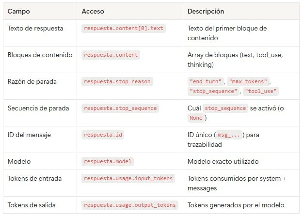
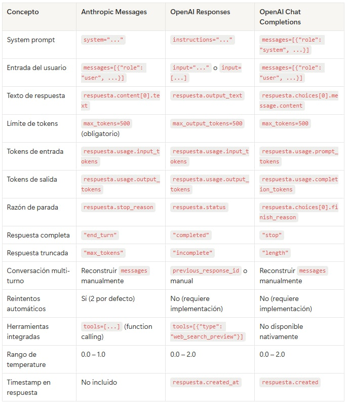

# 🗒️ Estructura de una llamada al API de Anthropic 🔴 — 25 min

[Antonio Perez](https://training.lidr.co/members/36030888)

⏳Tiempo estimado: 25 min

## Contexto: la Messages API

Anthropic ofrece una única API para generar texto: la**Messages API**(client.messages.create). A diferencia de OpenAI, que mantiene dos APIs en paralelo (Responses y Chat Completions), Anthropic ha consolidado toda su funcionalidad en esta interfaz desde su lanzamiento.

La Messages API sigue un patrón similar al de Chat Completions de OpenAI: envías un array de mensajes con roles y recibes una respuesta estructurada. Sin embargo, tiene diferencias importantes en cómo gestiona el system prompt (parámetro separado, como la Responses API de OpenAI), en la estructura del objeto de respuesta, y en algunos parámetros exclusivos comomax_tokens(obligatorio en Anthropic, opcional en OpenAI).

## 1. La llamada completa

Estos son todos los elementos que vamos a desglosar en esta guía:

python
from anthropic import Anthropic client = Anthropic() # Reads ANTHROPIC_API_KEY from environment response = client.messages.create( model="claude-haiku-4-5-20251001", system="You are a software project estimation expert. You respond in a direct and technical manner.", messages=[ {"role": "user", "content": "What factors should I consider when estimating a database migration project?"} ], max_tokens=500, temperature=0.7 ) # Response content print(response.content[0].text)

Observa las diferencias clave respecto a OpenAI: el system prompt va en un parámetrosystemdedicado (no dentro del array demessages),max_tokenses**obligatorio**(Anthropic no asume un valor por defecto), y accedes al texto de la respuesta concontent[0].texten lugar deoutput_textochoices[0].message.content.

Vamos a desmontar cada pieza.

## 2. System prompt: rol, instrucciones y restricciones

El parámetrosystemdefine cómo se comportará Claude durante toda la interacción. Funciona conceptualmente igual que lasinstructionsde la Responses API de OpenAI: es un parámetro de primer nivel, separado de los mensajes de la conversación.

python
response = client.messages.create( model="claude-haiku-4-5-20251001", system="""You are a senior software project estimation consultant with 20 years of experience. Rules: - Always respond in Spanish - Use technical terminology without simplifying - When providing an estimate, always include a range (optimistic/pessimistic) - If you lack sufficient information to estimate, ask before guessing - Write in prose, no unnecessary bullet points""", messages=[ {"role": "user", "content": "How long would it take to migrate a Rails monolith to microservices?"} ], max_tokens=1000 )
### Componentes típicos del system prompt

**Rol:**Quién es el modelo. "You are a senior software project estimation consultant." Esto establece el nivel de conocimiento y el marco de referencia para todas las respuestas.

**Instrucciones operativas:**Qué debe hacer y cómo. "Always respond in Spanish", "use technical terminology", "include an estimation range". Son las reglas que el modelo intentará seguir en cada respuesta.

**Restricciones:**Qué no debe hacer. "Do not make up data", "no bullet points", "ask before guessing". Las restricciones son tan importantes como las instrucciones — definen los límites del comportamiento.

### System prompt como string o como array

El parámetrosystemacepta un string simple o un array de bloques de contenido. El array es útil cuando quieres combinar texto con cache control (una funcionalidad avanzada que veremos en sesiones posteriores):

python
# Simple format (what we'll use normally) system="You are a technical assistant." # Advanced format with blocks (for prompt caching) system=[ { "type": "text", "text": "You are a technical assistant.", "cache_control": {"type": "ephemeral"} } ]

Para los ejercicios del programa, el formato string simple es suficiente.

### Por qué la separación importa

Igual que con OpenAI, en un producto real elsystemprompt lo define el desarrollador (es fijo o semi-fijo), mientras que losmessagesvienen del usuario final (son variables). Esta separación es la base de la arquitectura CAG que construiremos: el usuario no necesita saber que hay un prompt detrás.

## 3. Messages: estructura de la conversación

El parámetromessageses un array de mensajes que representan la conversación. Cada mensaje tiene unroley uncontent.

### Roles disponibles

python
messages=[ # USER: user messages {"role": "user", "content": "What is a REST API?"}, # ASSISTANT: previous model responses (for multi-turn context) {"role": "assistant", "content": "A REST API is an interface that enables..."}, # USER: next user message {"role": "user", "content": "What is the difference with GraphQL?"} ]

user— Mensajes del usuario humano. Es lo que el modelo responde.

assistant— Respuestas previas del modelo. Se incluyen para dar contexto en conversaciones de varios turnos.

A diferencia de OpenAI, Anthropic**no tiene un role de system dentro del array de messages**. Las instrucciones del sistema van siempre en el parámetrosystemseparado.

### Regla de alternancia

Anthropic requiere que los mensajes**alternen estrictamente**entreuseryassistant. El primer mensaje debe ser siempre deuser. No puedes poner dos mensajes consecutivos del mismo rol:

python
# ❌ WRONG: two consecutive user messages messages=[ {"role": "user", "content": "Hello"}, {"role": "user", "content": "How are you?"} # Error: same consecutive role ] # ✅ CORRECT: alternating user → assistant → user messages=[ {"role": "user", "content": "Hello"}, {"role": "assistant", "content": "Hi! How can I help you?"}, {"role": "user", "content": "How are you?"} ]

Si necesitas enviar múltiples piezas de información del usuario en un solo turno, combínalas en un solo mensaje o usa content blocks:

python
# Multiple pieces of information in a single message messages=[ {"role": "user", "content": [ {"type": "text", "text": "Analyze this requirement:"}, {"type": "text", "text": "The system must support 10,000 concurrent users..."} ]} ]
### Conversación multi-turno

La Messages API es**stateless**: no mantiene estado entre llamadas. Cada llamada es independiente. Para simular una conversación continua, incluyes todo el historial de mensajes en cada llamada:

python
# First call response_1 = client.messages.create( model="claude-haiku-4-5-20251001", system="You are a technical assistant.", messages=[ {"role": "user", "content": "What is a REST API?"} ], max_tokens=1000 ) # Second call: include full history response_2 = client.messages.create( model="claude-haiku-4-5-20251001", system="You are a technical assistant.", messages=[ {"role": "user", "content": "What is a REST API?"}, {"role": "assistant", "content": response_1.content[0].text}, {"role": "user", "content": "What is the difference with GraphQL?"} ], max_tokens=1000 )

A diferencia de la Responses API de OpenAI, Anthropic no ofrece un equivalente aprevious_response_id— la gestión del historial de conversación es siempre manual. Esto te da control total sobre qué contexto envías, pero requiere que gestiones el array de mensajes en tu código.

Esto tiene una implicación directa en coste: cada turno de conversación envía**todo el historial**como tokens de entrada. A medida que la conversación crece, el coste por llamada aumenta. Anthropic mitiga esto con su sistema de**prompt caching**, que reduce significativamente el coste de tokens de entrada repetidos entre llamadas (hasta un 90% de descuento en cache hits).

## 4. Parámetros de configuración

Además demodel,systemymessages, hay varios parámetros que controlan el comportamiento de la generación:

### Los esenciales

python
response = client.messages.create( model="claude-haiku-4-5-20251001", # Which model to use system="...", # System prompt (optional but recommended) messages=[...], # The conversation (required) max_tokens=1000, # Output token limit (REQUIRED) temperature=0.7, # Creativity (0.0 = deterministic, 1.0 = maximum) )

model— Determina qué modelo se usa. En el programa usamosclaude-haiku-4-5-20251001para ejercicios por su relación calidad/precio. Los identificadores de modelo en Anthropic incluyen la fecha del snapshot (a diferencia de OpenAI donde el alias y el snapshot pueden diferir).

max_tokens— Límite máximo de tokens que el modelo puede generar.**Es obligatorio en Anthropic**(a diferencia de OpenAI donde es opcional). Si la respuesta natural del modelo supera este límite, se corta y elstop_reasonserá"max_tokens"en lugar de"end_turn".

temperature— Controla la aleatoriedad de la respuesta. El rango en Anthropic es de0.0a1.0(no llega a2.0como en OpenAI). Para tareas de análisis, valores entre0.0y0.3. Para tareas creativas,0.7a1.0.

### Otros parámetros útiles

python
response = client.messages.create( model="claude-haiku-4-5-20251001", system="...", messages=[...], max_tokens=1000, temperature=0.3, top_p=1.0, # Alternative to temperature (do not use both at once) top_k=40, # Limit to top K most probable tokens (Anthropic exclusive) stop_sequences=["---", "\\n\\n\\n"], # Sequences that stop generation )

top_p— Alternativa atemperaturepara controlar aleatoriedad. Usa uno u otro, nunca ambos a la vez.

top_k— Exclusivo de Anthropic. Limita la selección a los K tokens más probables antes de aplicar temperature o top_p. Contop_k=1, el modelo siempre elige el token más probable (equivalente atemperature=0).

stop_sequences— Lista de strings que, si el modelo los genera, detienen la generación inmediatamente. El string de parada no se incluye en la respuesta. Útil para controlar el formato de salida.

### Parámetros de pensamiento extendido

Para modelos que soportan extended thinking (Claude Sonnet 4.6, Opus 4.6), puedes habilitar el razonamiento explícito:

python
response = client.messages.create( model="claude-sonnet-4-6-20250514", system="...", messages=[...], max_tokens=16000, thinking={ "type": "enabled", "budget_tokens": 10000 # Maximum tokens for the thinking process } )

Con extended thinking activado, la respuesta incluirá bloques de tipothinkingademás de los bloques de tipotext. Los tokens de pensamiento se facturan como tokens de salida.

## 5. Estructura de la respuesta

La respuesta de la Messages API es un objeto con varios niveles de información:

python
response = client.messages.create( model="claude-haiku-4-5-20251001", system="You are a software estimation expert.", messages=[ {"role": "user", "content": "What is a story point?"} ], max_tokens=1000 ) # Inspect the full response object print(response.model_dump_json(indent=2))

La estructura del objeto devuelto:
Message( id='msg_01XFDUDYJgAACzvnptvVoYEL', type='message', role='assistant', model='claude-haiku-4-5-20251001', content=[ TextBlock( type='text', text='A story point is a unit of measure...' ) ], stop_reason='end_turn', stop_sequence=None, usage=Usage( input_tokens=28, output_tokens=145 ) )
### 5.1. Contenido del mensaje

python
# Access the response text print(response.content[0].text)

El campocontentes un**array de bloques**, no un string directo. En la mayoría de los casos, la respuesta contiene un solo bloque de tipotext. Sin embargo, cuando el modelo usa herramientas (tool use) o extended thinking, la respuesta puede contener múltiples bloques de tipos diferentes:

python
# Iterate over all content blocks for block in response.content: if block.type == "text": print(block.text) elif block.type == "tool_use": print(f"Tool call: {block.name}({block.input})") elif block.type == "thinking": print(f"Thinking: {block.thinking}")

El campostop_reasonindica por qué el modelo dejó de generar:

- 

"end_turn"— El modelo terminó su respuesta de forma natural. Es el caso esperado.

- 

"max_tokens"— Se alcanzó el límite demax_tokens. La respuesta está incompleta. Necesitas aumentarmax_tokenso dividir la tarea.

- 

"stop_sequence"— El modelo generó una de las secuencias definidas enstop_sequences. El campostop_sequenceindica cuál.

- 

"tool_use"— El modelo quiere usar una herramienta. La respuesta contiene un bloquetool_usecon los argumentos de la llamada.

python
# Verify the response is complete if response.stop_reason == "max_tokens": print("⚠️ Response truncated — consider increasing max_tokens") elif response.stop_reason == "end_turn": print("✅ Response completed successfully")
### 5.2. Metadatos

python
# Unique message ID (useful for traceability and debugging) print(f"ID: {response.id}") # Model used print(f"Model: {response.model}") # Object type (always "message") print(f"Type: {response.type}") # Role (always "assistant" in responses) print(f"Role: {response.role}")

A diferencia de OpenAI, Anthropic**no devuelve un timestamp**en el objeto de respuesta. Si necesitas registrar el momento de la llamada, debes hacerlo en tu código.

El campomodeldevuelve exactamente el mismo string que pasaste como parámetro (por ejemplo,claude-haiku-4-5-20251001). En Anthropic, los identificadores de modelo ya incluyen la fecha del snapshot, por lo que no hay ambigüedad entre alias y snapshot.

### 5.3. Uso de tokens y coste

python
# Tokens consumed print(f"Input tokens: {response.usage.input_tokens}") print(f"Output tokens: {response.usage.output_tokens}")

**Tokens de entrada (**input_tokens**):**Incluye todo lo que envías — system prompt, historial de mensajes y el último mensaje del usuario. En conversaciones largas, este número crece turno a turno.

**Tokens de salida (**output_tokens**):**Los tokens generados por el modelo en su respuesta. Son más caros que los de entrada (5x en la mayoría de modelos de Anthropic).

Observa que Anthropic**no devuelve un campo**total_tokens— si lo necesitas, lo calculas tú:

python
total_tokens = response.usage.input_tokens + response.usage.output_tokens

Si usas prompt caching, la respuesta incluye campos adicionales enusage:

python
# Only present when using prompt caching print(f"Cache creation tokens: {response.usage.cache_creation_input_tokens}") print(f"Cache read tokens: {response.usage.cache_read_input_tokens}")

**Cálculo de coste:**

python
# claude-haiku-4-5 pricing (check docs.anthropic.com for updated rates) INPUT_PRICE = 1.00 # USD per 1M input tokens OUTPUT_PRICE = 5.00 # USD per 1M output tokens input_cost = (response.usage.input_tokens / 1_000_000) * INPUT_PRICE output_cost = (response.usage.output_tokens / 1_000_000) * OUTPUT_PRICE total_cost = input_cost + output_cost print(f"Input cost: ${input_cost:.6f}") print(f"Output cost: ${output_cost:.6f}") print(f"Total cost: ${total_cost:.6f}")

Para una llamada típica con un system prompt corto y una respuesta de 200 tokens usandoclaude-haiku-4-5, el coste ronda los $0.001-$0.002. Algo más caro quegpt-4o-minide OpenAI, pero sigue siendo fracciones de centavo.

### 5.4. Tabla de referencia rápida

## 6. Manejo de errores comunes

El SDK de Anthropic lanza excepciones tipadas similares a las de OpenAI. Además, el SDK reintenta automáticamente (2 veces por defecto) ciertos errores transitorios: errores de conexión, 429 (rate limit), 409 (conflicto) y errores 5xx.

### Patrón básico de manejo de errores

python
from anthropic import ( Anthropic, AuthenticationError, RateLimitError, APIConnectionError, BadRequestError, InternalServerError, APIStatusError, ) client = Anthropic() try: response = client.messages.create( model="claude-haiku-4-5-20251001", messages=[ {"role": "user", "content": "Hello"} ], max_tokens=100 ) print(response.content[0].text) except AuthenticationError: print("❌ Invalid or missing API key. Check your ANTHROPIC_API_KEY.") except RateLimitError: print("⏳ Rate limit reached. Wait a few seconds and retry.") except BadRequestError as e: print(f"❌ Malformed request: {e.message}") except APIConnectionError: print("🌐 Could not connect to the API. Check your internet connection.") except InternalServerError: print("🔧 Anthropic internal server error. Retry in a few seconds.")
### Errores más frecuentes y su causa

AuthenticationError**(401)**— La API key no es válida, ha expirado, o no está configurada. Verifica que la variable de entornoANTHROPIC_API_KEYestá definida y contiene una key activa (empieza porsk-ant-).

RateLimitError**(429)**— Has superado el límite de requests por minuto o de tokens por minuto. También aparece cuando no tienes crédito suficiente. En Anthropic, los rate limits dependen de tu**tier de uso**, que sube automáticamente a medida que acumulas gasto.

BadRequestError**(400)**— La request tiene algún problema. Las causas más comunes en Anthropic son: olvidar el parámetromax_tokens(obligatorio), pasar mensajes que no alternan entreuseryassistant, o usar un modelo inexistente.

APIConnectionError— No se puede conectar con los servidores de Anthropic. Problema de red o caída temporal.

InternalServerError**(500/529)**— Error en el lado de Anthropic. El código 529 indica que la API está sobrecargada. El SDK reintenta automáticamente estos errores.

### Reintentos automáticos del SDK

El SDK de Anthropic incluye**reintentos automáticos**con backoff exponencial para errores transitorios. Por defecto reintenta 2 veces. Puedes configurar esto al crear el cliente:

python
# Change the number of automatic retries client = Anthropic(max_retries=5) # Disable automatic retries client = Anthropic(max_retries=0)

Dado que el SDK ya gestiona reintentos, no necesitas implementar tu propio patrón de reintento para la mayoría de casos. Si necesitas lógica personalizada (por ejemplo, fallback a otro proveedor), puedes desactivar los reintentos del SDK y gestionar todo tú mismo — algo que haremos en la Sesión 03.

## 7. Ejemplo completo: función reutilizable

Reuniendo todos los conceptos, aquí tienes una función que encapsula una llamada completa con manejo de errores e inspección de metadatos:

python
from anthropic import ( Anthropic, AuthenticationError, RateLimitError, APIConnectionError, BadRequestError, InternalServerError, ) client = Anthropic() # claude-haiku-4-5 pricing (check periodically) PRICING = { "claude-haiku-4-5-20251001": {"input": 1.00, "output": 5.00}, } def query_claude(message, system_prompt=None, model="claude-haiku-4-5-20251001", temperature=0.3): """ Make a call to the Anthropic Messages API and return the response along with relevant metadata. """ try: kwargs = { "model": model, "messages": [{"role": "user", "content": message}], "max_tokens": 1000, "temperature": temperature, } if system_prompt: kwargs["system"] = system_prompt response = client.messages.create(**kwargs) # Check if the response was truncated if response.stop_reason == "max_tokens": print("⚠️ Response truncated") # Calculate cost prices = PRICING.get(model, {"input": 0, "output": 0}) cost = ( (response.usage.input_tokens / 1_000_000) * prices["input"] + (response.usage.output_tokens / 1_000_000) * prices["output"] ) return { "content": response.content[0].text, "model": response.model, "id": response.id, "input_tokens": response.usage.input_tokens, "output_tokens": response.usage.output_tokens, "stop_reason": response.stop_reason, "cost_usd": cost, } except AuthenticationError: return {"error": "Invalid or missing API key"} except RateLimitError: return {"error": "Rate limit reached or insufficient credit"} except BadRequestError as e: return {"error": f"Invalid request: {e.message}"} except (APIConnectionError, InternalServerError): return {"error": "Connection or server error"} # Usage result = query_claude( message="How long would a PostgreSQL to Aurora migration take?", system_prompt="You are a software estimation consultant. Be concise." ) if "error" in result: print(f"Error: {result['error']}") else: print(result["content"]) print(f"\\n--- Metadata ---") print(f"Model: {result['model']}") print(f"ID: {result['id']}") print(f"Tokens: {result['input_tokens']} input + {result['output_tokens']} output") print(f"Stop reason: {result['stop_reason']}") print(f"Cost: ${result['cost_usd']:.6f}")
## 8. Equivalencia con OpenAI

Para referencia, esta tabla muestra cómo se traducen los conceptos entre Anthropic y las dos APIs de OpenAI:

## Diferencias clave a recordar

Cuando trabajes con ambos proveedores en paralelo, estas son las diferencias que más te afectarán:

1. 

max_tokens**es obligatorio en Anthropic**, opcional en OpenAI.

1. 

**Los mensajes deben alternar**user→assistant→useren Anthropic. OpenAI es más flexible.

1. 

**No hay**output_text**helper**en Anthropic — siempre accedes concontent[0].text.

1. 

**No hay timestamp**en la respuesta de Anthropic.

1. 

**El SDK de Anthropic reintenta automáticamente**; el de OpenAI no.

1. 

**El rango de**temperaturellega hasta 1.0 en Anthropic, hasta 2.0 en OpenAI.

## Referencias

- 

Documentación de Messages API:[docs.anthropic.com/en/api/messages](https://docs.anthropic.com/en/api/messages)

- 

Guía de uso de la API:[docs.anthropic.com/en/api/prompt-validation](https://docs.anthropic.com/en/api/prompt-validation)

- 

SDK Python:[github.com/anthropics/anthropic-sdk-python](https://github.com/anthropics/anthropic-sdk-python)

- 

Modelos y precios:[docs.anthropic.com/en/docs/about-claude/models](https://docs.anthropic.com/en/docs/about-claude/models)

- 

Prompt caching:[docs.anthropic.com/en/docs/build-with-claude/prompt-caching](https://docs.anthropic.com/en/docs/build-with-claude/prompt-caching)
