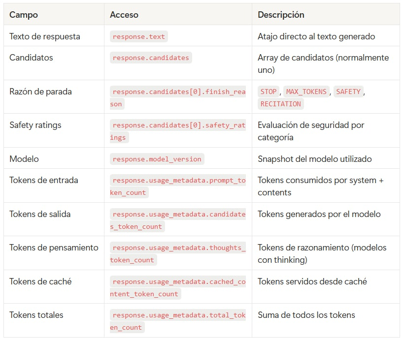
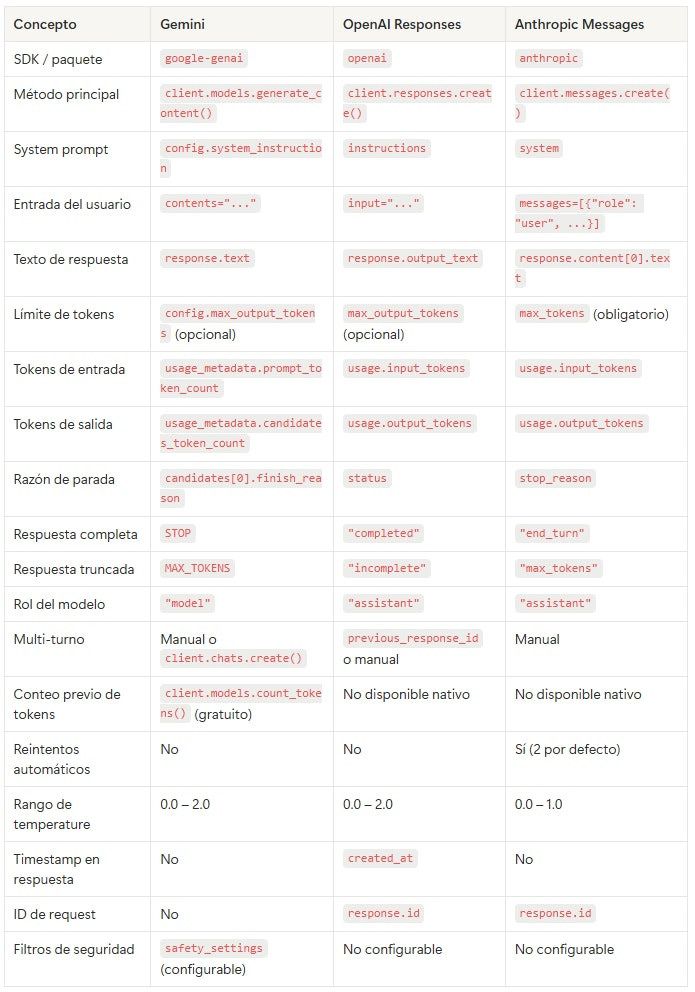

# 🗒️ Estructura de una llamada al API de Gemini 🔴 — 24 min

[Antonio Perez](https://training.lidr.co/members/36030888)

⏳Tiempo estimado: 24 min

## Contexto: el SDK de Google Gen AI

Google ofrece acceso a sus modelos Gemini a través de la**Google Gen AI SDK**(google-genai), un SDK unificado que funciona tanto con la Gemini Developer API (acceso directo con API key) como con Vertex AI (acceso vía Google Cloud). En el programa usamos la Gemini Developer API por su simplicidad de setup — solo necesitas una API key, sin configuración de proyecto en Google Cloud.

La interfaz principal esclient.models.generate_content(), que sigue un patrón similar al de los otros proveedores: envías contenido y configuración, y recibes una respuesta con el texto generado y metadatos de uso.

Una diferencia importante: el SDK anterior (google-generativeai) está**deprecado**. Todo el código en esta guía usa el SDK actualgoogle-genai, que es el estándar desde 2025.

## 1. La llamada completa

Estos son todos los elementos que vamos a desglosar en esta guía:

python
from google import genai from google.genai import types client = genai.Client() # Reads GEMINI_API_KEY from environment response = client.models.generate_content( model="gemini-2.5-flash", contents="What factors should I consider when estimating a database migration project?", config=types.GenerateContentConfig( system_instruction="You are an expert in software project estimation. Respond in a direct and technical manner.", temperature=0.7, max_output_tokens=500 ) ) # Response text print(response.text)

Observa las diferencias clave respecto a OpenAI y Anthropic: el system prompt va dentro de un objetoconfig(no como parámetro de primer nivel), la entrada del usuario va encontents(puede ser un string o un array de objetosContent), y accedes al texto de la respuesta conresponse.text. Toda la configuración del modelo (temperature, max tokens, system instruction) se agrupa en un único objetoGenerateContentConfig.

Vamos a desmontar cada pieza.

## 2. System instruction: rol, instrucciones y restricciones

El camposystem_instructiondentro del objetoconfigcumple la función del system prompt. Define cómo se comportará el modelo durante toda la interacción. Acepta un string simple o una lista de strings.

python
from google import genai from google.genai import types client = genai.Client() response = client.models.generate_content( model="gemini-2.5-flash", contents="How long would it take to migrate a Rails monolith to microservices?", config=types.GenerateContentConfig( system_instruction="""You are a principal software architect with 15+ years of experience in distributed systems and payment infrastructure. You have led multiple monolith-to-microservices migrations at fintech companies. Rules: - Always respond in Spanish - Use technical terminology without simplifying - When providing an estimate, always include a range (optimistic/pessimistic) - If you lack sufficient information to estimate, ask before guessing - Write in prose, no bullet points or numbered lists - Maximum 250 words""", temperature=0.3, max_output_tokens=400 ) ) print(response.text)
### System instruction como lista

A diferencia de OpenAI y Anthropic, Gemini acepta una**lista de strings**como system instruction. Cada string se trata como una instrucción independiente. Esto puede ser útil para modularizar las instrucciones:

python
config=types.GenerateContentConfig( system_instruction=[ "You are a senior software architect.", "Your audience is developers with 5+ years of experience.", "Always respond in Spanish, maximum 200 words, in prose.", "If the question is too vague, ask for clarification.", ] )
### Por qué la separación importa

Igual que con OpenAI y Anthropic, en un producto real elsystem_instructionlo define el desarrollador (es fijo o semi-fijo), mientras quecontentsviene del usuario final (es variable). El usuario nunca ve ni modifica las instrucciones del sistema.

## 3. Contents: estructura de mensajes

El parámetrocontentsacepta varios formatos: un string simple, una lista mixta, o un array de objetosContentcon roles.

### Formato simple: string directo

Para interacciones de un solo turno:

python
response = client.models.generate_content( model="gemini-2.5-flash", contents="What is a REST API?" )
### Formato completo: array de Content con roles

Para conversaciones multi-turno, usas objetosContentcon roles:

python
from google.genai import types response = client.models.generate_content( model="gemini-2.5-flash", contents=[ types.Content( role="user", parts=[types.Part(text="What is a REST API?")] ), types.Content( role="model", parts=[types.Part(text="A REST API is an architectural style for building web services...")] ), types.Content( role="user", parts=[types.Part(text="What is the difference with GraphQL?")] ), ], config=types.GenerateContentConfig( system_instruction="You are a technical assistant.", max_output_tokens=500 ) )
### Roles disponibles

user— Mensajes del usuario humano. Es lo que el modelo responde.

model— Respuestas previas del modelo (equivalente alassistantde OpenAI y Anthropic). Se incluyen para dar contexto en conversaciones multi-turno.

A diferencia de OpenAI y Anthropic que usanassistant, Gemini usamodelcomo nombre del rol para las respuestas del modelo. Si usasassistant, obtendrás un error.

### Conversación multi-turno

La API de Gemini es**stateless**: no mantiene estado entre llamadas. Tienes dos opciones:

**Opción A: Reconstruir el historial manualmente**

python
# First call response_1 = client.models.generate_content( model="gemini-2.5-flash", contents="What is Docker?", config=types.GenerateContentConfig( system_instruction="You are a technical assistant. Respond in 2 sentences max.", max_output_tokens=200 ) ) # Second call: include full history response_2 = client.models.generate_content( model="gemini-2.5-flash", contents=[ types.Content(role="user", parts=[types.Part(text="What is Docker?")]), types.Content(role="model", parts=[types.Part(text=response_1.text)]), types.Content(role="user", parts=[types.Part(text="And Kubernetes?")]), ], config=types.GenerateContentConfig( system_instruction="You are a technical assistant. Respond in 2 sentences max.", max_output_tokens=200 ) )

**Opción B: Usar el helper de chat del SDK**

El SDK de Gemini ofrece un helperclient.chats.create()que gestiona el historial automáticamente:

python
chat = client.chats.create( model="gemini-2.5-flash", config=types.GenerateContentConfig( system_instruction="You are a technical assistant. Respond in 2 sentences max.", max_output_tokens=200 ) ) response_1 = chat.send_message("What is Docker?") print(response_1.text) # The chat object maintains history internally response_2 = chat.send_message("And Kubernetes?") print(response_2.text) # You can inspect the history print(chat.get_history())

El helper de chat es una conveniencia del SDK — internamente sigue enviando el historial completo en cada llamada, con el mismo impacto en tokens y coste.

## 4. Parámetros de configuración

Toda la configuración del modelo se agrupa en un objetoGenerateContentConfig. A diferencia de OpenAI y Anthropic donde los parámetros van como argumentos separados, en Gemini van dentro deconfig:

### Los esenciales

python
config=types.GenerateContentConfig( system_instruction="...", # System prompt temperature=0.7, # Creativity (0.0 - 2.0) max_output_tokens=500, # Maximum output length )

system_instruction— El system prompt. String simple o lista de strings. Opcional.

temperature— Controla la aleatoriedad. Rango de0.0a2.0(igual que OpenAI, más amplio que Anthropic que llega a1.0). Para tareas de análisis,0.0-0.3. Para tareas creativas,0.7-1.0.

max_output_tokens— Límite máximo de tokens de salida. Opcional en Gemini (a diferencia de Anthropic donde es obligatorio). Si no se especifica, el modelo decide cuánto generar.

### Otros parámetros útiles

python
config=types.GenerateContentConfig( system_instruction="...", temperature=0.3, max_output_tokens=1000, top_p=0.95, # Alternative to temperature (use one, not both) top_k=20, # Limit to top K most probable tokens candidate_count=1, # Number of alternative responses stop_sequences=["---", "\\n\\n\\n"],# Sequences that stop generation presence_penalty=0.0, # Penalize topic repetition (-2.0 to 2.0) frequency_penalty=0.0, # Penalize token repetition (-2.0 to 2.0) seed=42, # For reproducible outputs (same seed = same output) safety_settings=[ # Content safety filters types.SafetySetting( category="HARM_CATEGORY_HATE_SPEECH", threshold="BLOCK_ONLY_HIGH" ) ] )

top_k— Limita la selección a los K tokens más probables. Contop_k=1, el modelo siempre elige el token más probable. Disponible en Gemini y Anthropic, no en OpenAI.

seed— Para resultados reproducibles. Si usas el mismo seed con el mismo input, obtendrás la misma respuesta. Útil para testing.

safety_settings— Gemini incluye filtros de seguridad de contenido por defecto, que pueden bloquear respuestas. Se pueden ajustar por categoría. Si el modelo rechaza generar contenido, revisa estos settings.

### Thinking (razonamiento extendido)

Para modelos que soportan thinking (Gemini 2.5 Flash, Gemini 2.5 Pro, Gemini 3 Pro), el razonamiento está habilitado por defecto. Puedes controlarlo:

python
config=types.GenerateContentConfig( thinking_config=types.ThinkingConfig( thinking_budget=5000 # Maximum tokens for the thinking process ) )

Los tokens de pensamiento se facturan como tokens de salida. Si la velocidad importa más que la calidad de razonamiento, puedes reducir el budget o desactivarlo.

## 5. Estructura de la respuesta

La respuesta de la API es un objetoGenerateContentResponse:

python
response = client.models.generate_content( model="gemini-2.5-flash", contents="What is a story point?", config=types.GenerateContentConfig( system_instruction="You are a software estimation expert.", max_output_tokens=500 ) ) # Inspect the full response print(response)

La estructura simplificada:
GenerateContentResponse( candidates=[ Candidate( content=Content( parts=[ Part(text='A story point is a unit of measure...') ], role='model' ), finish_reason=<FinishReason.STOP>, safety_ratings=[...], avg_logprobs=-0.123 ) ], model_version='gemini-2.5-flash-001', usage_metadata=GenerateContentResponseUsageMetadata( prompt_token_count=15, candidates_token_count=142, total_token_count=157, thoughts_token_count=0, cached_content_token_count=0 ) )
### 5.1. Contenido del mensaje

python
# Quick access to the response text (SDK helper) print(response.text) # Full access to the candidate structure for candidate in response.candidates: for part in candidate.content.parts: print(part.text)

El helperresponse.textes el atajo directo al texto del primer candidato, equivalente aloutput_textde OpenAI ocontent[0].textde Anthropic.

candidateses un array porque el parámetrocandidate_countpermite generar múltiples respuestas. Concandidate_count=1(por defecto), siempre hay un solo candidato.

El campofinish_reasonindica por qué el modelo dejó de generar:

- 

STOP— El modelo terminó de forma natural. Caso esperado.

- 

MAX_TOKENS— Se alcanzó el límite demax_output_tokens. Respuesta incompleta.

- 

SAFETY— El contenido fue bloqueado por los filtros de seguridad. El camposafety_ratingsindica qué categoría lo bloqueó.

- 

RECITATION— La respuesta fue bloqueada por posible violación de copyright.

python
# Check the finish reason finish_reason = response.candidates[0].finish_reason if finish_reason.name == "MAX_TOKENS": print("⚠️ Response truncated — consider increasing max_output_tokens") elif finish_reason.name == "SAFETY": print("⚠️ Response blocked by safety filters") print(response.candidates[0].safety_ratings) elif finish_reason.name == "STOP": print("✅ Response completed successfully")
### 5.2. Metadatos

python
# Model version used print(f"Model: {response.model_version}")

A diferencia de OpenAI, Gemini**no devuelve un ID único de request**ni un timestamp en el objeto de respuesta. Si necesitas trazabilidad, debes generar tu propio ID y registrar el momento de la llamada en tu código.

El campomodel_versiondevuelve el snapshot exacto del modelo (por ejemplo,gemini-2.5-flash-001).

### 5.3. Uso de tokens y coste

python
# Token usage usage = response.usage_metadata print(f"Input tokens: {usage.prompt_token_count}") print(f"Output tokens: {usage.candidates_token_count}") print(f"Thinking tokens: {usage.thoughts_token_count}") print(f"Cached tokens: {usage.cached_content_token_count}") print(f"Total tokens: {usage.total_token_count}")

prompt_token_count— Tokens de entrada (system instruction + contenido del usuario + historial). Equivalente ainput_tokensen OpenAI/Anthropic.

candidates_token_count— Tokens de salida (respuesta del modelo). Equivalente aoutput_tokensen OpenAI/Anthropic.

thoughts_token_count— Tokens consumidos por el proceso de razonamiento en modelos con thinking habilitado. Se facturan como tokens de salida.

cached_content_token_count— Tokens servidos desde caché. Se facturan a tarifa reducida.

total_token_count— Suma de todos los tokens.

**Cálculo de coste:**

python
# Gemini 2.5 Flash pricing (check <https://ai.google.dev/gemini-api/docs/pricing>) INPUT_PRICE = 0.15 # USD per 1M input tokens OUTPUT_PRICE = 0.60 # USD per 1M output tokens (non-thinking) THINKING_PRICE = 3.50 # USD per 1M thinking tokens input_cost = (usage.prompt_token_count / 1_000_000) * INPUT_PRICE output_cost = (usage.candidates_token_count / 1_000_000) * OUTPUT_PRICE thinking_cost = (usage.thoughts_token_count / 1_000_000) * THINKING_PRICE total_cost = input_cost + output_cost + thinking_cost print(f"Input cost: ${input_cost:.6f}") print(f"Output cost: ${output_cost:.6f}") print(f"Thinking cost: ${thinking_cost:.6f}") print(f"Total cost: ${total_cost:.6f}")

Gemini 2.5 Flash es uno de los modelos más baratos del mercado con calidad competitiva. Para una llamada típica sin thinking, el coste es comparable al degpt-4o-mini.

### Conteo de tokens antes de la llamada

Gemini ofrece un endpoint dedicado para contar tokens**antes**de enviar la request (sin coste):

python
# Count tokens before making the actual call (free, no charge) token_count = client.models.count_tokens( model="gemini-2.5-flash", contents="Your text here..." ) print(f"This request will consume {token_count.total_tokens} input tokens")

Ni OpenAI ni Anthropic ofrecen esto como endpoint nativo — es una ventaja exclusiva de Gemini para control de costes previo a la llamada.

### 5.4. Tabla de referencia rápida

## 6. Manejo de errores comunes

El SDK de Gemini lanza excepciones del módulogoogle.genai.errors:

### Patrón básico de manejo de errores

python
from google import genai from google.genai import types from google.genai.errors import APIError, ClientError client = genai.Client() try: response = client.models.generate_content( model="gemini-2.5-flash", contents="Hello", config=types.GenerateContentConfig(max_output_tokens=100) ) print(response.text) except ClientError as e: print(f"❌ Client error (bad request): {e}") except APIError as e: if e.code == 401: print("❌ Invalid or missing API key. Check your GEMINI_API_KEY.") elif e.code == 429: print("⏳ Rate limit reached. Wait a few seconds and retry.") elif e.code == 500 or e.code == 503: print("🔧 Google server error. Retry in a few seconds.") else: print(f"❌ API error ({e.code}): {e.message}")
### Errores más frecuentes y su causa

401 Unauthorized— API key no válida o no configurada. Verifica queGEMINI_API_KEYoGOOGLE_API_KEYestá definida correctamente.

429 Resource Exhausted— Has superado el rate limit. Gemini mide tres dimensiones: RPM (requests por minuto), TPM (tokens por minuto) y RPD (requests por día). El free tier es muy restrictivo (10-15 RPM). Habilitar billing en Google AI Studio aumenta los límites drásticamente.

400 Bad Request— Request mal formada. Causas comunes: modelo inexistente, usarrole="assistant"en lugar derole="model", ocontentsvacío.

SAFETY block— No es un error HTTP sino unfinish_reasonen la respuesta. El modelo generó contenido pero fue bloqueado por los filtros de seguridad. Puedes ajustar lossafety_settingsen el config, pero ten en cuenta las implicaciones.

500/503 Server Error— Error del lado de Google. Reintenta después de unos segundos.

### Reintentos automáticos

A diferencia de Anthropic (que reintenta automáticamente), el SDK de Gemini**no incluye reintentos automáticos**por defecto. Debes implementarlos tú:

python
import time from google.genai.errors import APIError def generate_with_retry(client, contents, config, max_retries=3): for attempt in range(max_retries): try: return client.models.generate_content( model="gemini-2.5-flash", contents=contents, config=config ) except APIError as e: if e.code in (429, 500, 503) and attempt < max_retries - 1: wait = 2 ** attempt print(f"⏳ Transient error ({e.code}). Retrying in {wait}s...") time.sleep(wait) else: raise
## 7. Ejemplo completo: función reutilizable

Reuniendo todos los conceptos:

python
from google import genai from google.genai import types from google.genai.errors import APIError, ClientError client = genai.Client() # Gemini 2.5 Flash pricing (check periodically) PRICING = { "gemini-2.5-flash": {"input": 0.15, "output": 0.60, "thinking": 3.50}, } def query_gemini( message, system_instruction=None, model="gemini-2.5-flash", temperature=0.3 ): """ Make a call to the Gemini API and return the response along with relevant metadata. """ try: config_params = { "temperature": temperature, "max_output_tokens": 1000, } if system_instruction: config_params["system_instruction"] = system_instruction response = client.models.generate_content( model=model, contents=message, config=types.GenerateContentConfig(**config_params) ) # Check that the response was not blocked finish_reason = response.candidates[0].finish_reason.name if finish_reason == "SAFETY": return {"error": "Response blocked by safety filters"} # Calculate cost usage = response.usage_metadata prices = PRICING.get(model, {"input": 0, "output": 0, "thinking": 0}) cost = ( (usage.prompt_token_count / 1_000_000) * prices["input"] + (usage.candidates_token_count / 1_000_000) * prices["output"] + (usage.thoughts_token_count / 1_000_000) * prices["thinking"] ) return { "content": response.text, "model": response.model_version, "input_tokens": usage.prompt_token_count, "output_tokens": usage.candidates_token_count, "thinking_tokens": usage.thoughts_token_count, "finish_reason": finish_reason, "cost_usd": cost, } except ClientError as e: return {"error": f"Bad request: {e}"} except APIError as e: if e.code == 429: return {"error": "Rate limit reached or insufficient quota"} return {"error": f"API error ({e.code}): {e.message}"} # Usage result = query_gemini( message="How long would a PostgreSQL to Aurora migration take?", system_instruction="You are a software estimation consultant. Be concise." ) if "error" in result: print(f"Error: {result['error']}") else: print(result["content"]) print(f"\\n--- Metadata ---") print(f"Model: {result['model']}") print(f"Tokens: {result['input_tokens']} input + {result['output_tokens']} output + {result['thinking_tokens']} thinking") print(f"Finish reason: {result['finish_reason']}") print(f"Cost: ${result['cost_usd']:.6f}")
## 8. Equivalencia con OpenAI y Anthropic

Para referencia, esta tabla muestra cómo se traducen los conceptos entre los tres proveedores:

## Diferencias clave a recordar

Cuando trabajes con Gemini junto a OpenAI y Anthropic, estas son las diferencias que más te afectarán:

1. 

**El rol del modelo es**"model"**, no**"assistant"— usar"assistant"produce un error.

1. 

**Toda la configuración va dentro de**GenerateContentConfig— no como argumentos separados del método.

1. 

**No hay ID de request ni timestamp**en la respuesta — debes generar los tuyos para trazabilidad.

1. 

**Los filtros de seguridad pueden bloquear respuestas**sin error HTTP — revisafinish_reasonysafety_ratings.

1. 

count_tokens()**es gratuito y exclusivo de Gemini**— úsalo para estimar costes antes de enviar requests costosas.

1. 

**El SDK no incluye reintentos automáticos**— implementa tu propia lógica de retry.

1. 

**Thinking está habilitado por defecto**en Gemini 2.5+ — consume tokens extra que se facturan como output.

## Referencias

- 

Documentación de la API:[ai.google.dev/gemini-api/docs](https://ai.google.dev/gemini-api/docs)

- 

Generación de contenido:[ai.google.dev/api/generate-content](https://ai.google.dev/api/generate-content)

- 

Conteo de tokens:[ai.google.dev/gemini-api/docs/tokens](https://ai.google.dev/gemini-api/docs/tokens)

- 

SDK Python:[github.com/googleapis/python-genai](https://github.com/googleapis/python-genai)

- 

Precios:[ai.google.dev/gemini-api/docs/pricing](https://ai.google.dev/gemini-api/docs/pricing)

- 

Obtener APIkey:[aistudio.google.com/apikey](https://aistudio.google.com/apikey)
