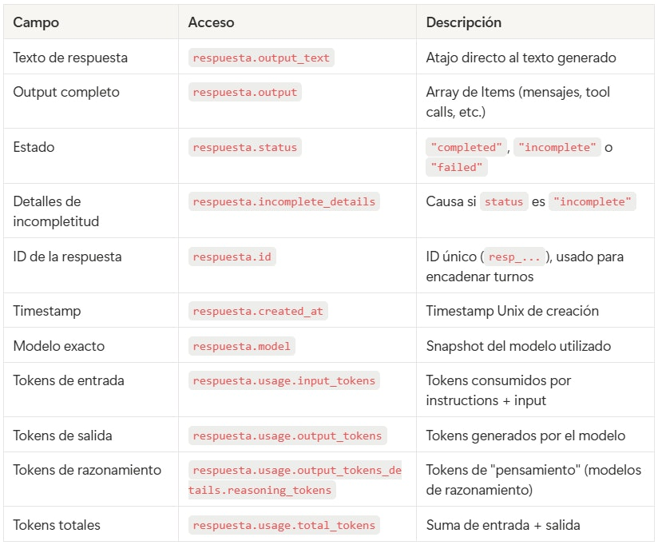
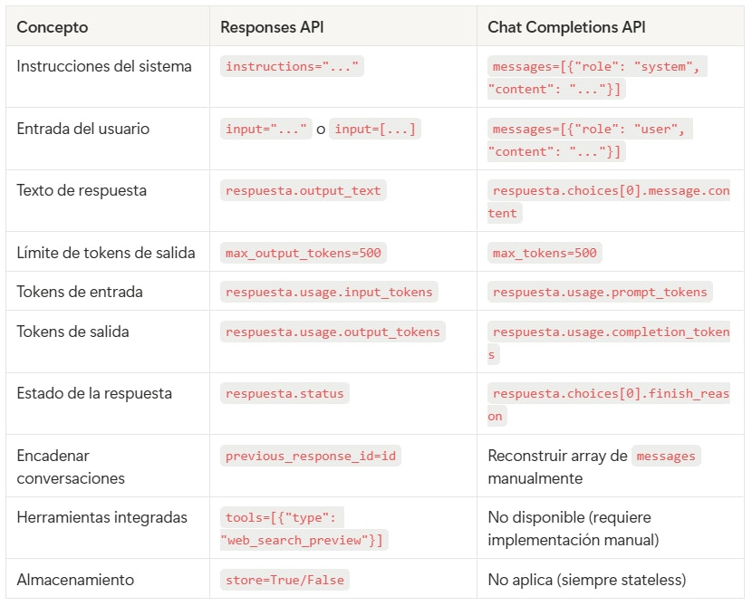

# 🗒️ Estructura de una llamada al API de OpenAI 🔴 — 25 min

[Antonio Perez](https://training.lidr.co/members/36030888)

⏳Tiempo estimado: 25 min

## Contexto: dos APIs, una recomendación

OpenAI ofrece actualmente dos APIs para generar texto:

**Responses API**(client.responses.create) — La API más reciente y recomendada por OpenAI para todos los proyectos nuevos. Lanzada en marzo de 2025, unifica las capacidades de las anteriores APIs (Chat Completions y Assistants) en una interfaz más limpia. Incluye soporte nativo para herramientas integradas (búsqueda web, búsqueda en archivos, ejecución de código), gestión de estado entre turnos, y mejor rendimiento con modelos de razonamiento.

**Chat Completions API**(client.chat.completions.create) — La API anterior, soportada indefinidamente pero ya no es la recomendada para nuevos desarrollos. Su estructura demessagescon roles (system,user,assistant) es el patrón que comparten la mayoría de proveedores alternativos (Anthropic, Google, Mistral), por lo que sigue siendo relevante entenderla. La veremos cuando trabajemos con abstracción de proveedores en sesiones posteriores.

**En este programa usamos la Responses API como API principal.**Los ejemplos y ejercicios siguen su estructura. Cuando trabajemos con otros proveedores o con agregadores como LiteLLM, veremos la interfaz de Chat Completions.

## 1. La llamada completa

Una llamada a la Responses API tiene una estructura más directa que su predecesora. Estos son todos los elementos que vamos a desglosar en esta guía:
from openai import OpenAI client = OpenAI() # Reads OPENAI_API_KEY from environment response = client.responses.create( model="gpt-4o-mini", instructions="You are a software project estimation expert. You respond in a direct and technical manner.", input="What factors should I consider when estimating a database migration project?", temperature=0.7, max_output_tokens=500 ) # Response content print(response.output_text)

Observa las diferencias clave respecto a Chat Completions: las instrucciones del sistema van en un parámetroinstructionsdedicado (no como un mensaje más), la entrada del usuario va eninput(puede ser un string directo o un array de mensajes), y accedes al texto de la respuesta conoutput_texten lugar de navegar porchoices[0].message.content.

Vamos a desmontar cada pieza.

## 2. Instructions: rol, instrucciones y restricciones

El parámetroinstructionscumple la función del system prompt: define**cómo se comportará el modelo**durante toda la interacción. La diferencia con Chat Completions es que ahora es un parámetro de primer nivel, separado de los mensajes de la conversación.
response = client.responses.create( model="gpt-4o-mini", instructions="""You are a senior software project estimation consultant with 20 years of experience. Rules: - Always respond in Spanish - Use technical terminology without simplifying - When providing an estimate, always include a range (optimistic/pessimistic) - If you lack sufficient information to estimate, ask before guessing - Write in prose, no unnecessary bullet points""", input="How long would it take to migrate a Rails monolith to microservices?" )
### Componentes típicos de las instructions

**Rol:**Quién es el modelo. "You are a senior software project estimation consultant." Esto establece el nivel de conocimiento y el marco de referencia para todas las respuestas.

**Instrucciones operativas:**Qué debe hacer y cómo. "Always respond in Spanish", "use technical terminology", "include an estimation range". Son las reglas que el modelo intentará seguir en cada respuesta.

**Restricciones:**Qué no debe hacer. "Do not make up data", "no bullet points", "ask before guessing". Las restricciones son tan importantes como las instrucciones — definen los límites del comportamiento.

### Por qué la separación importa

En un producto real, lasinstructionslas define el desarrollador (son fijas o semi-fijas), mientras que elinputviene del usuario final (es variable). Esta separación es la base de la arquitectura que construiremos en las sesiones de CAG: el usuario no necesita saber que hay un prompt detrás — solo pide lo que necesita, y el sistema se encarga de dar contexto al modelo.

## 3. Input: estructura de mensajes

El parámetroinputacepta dos formatos: un string simple o un array de mensajes con roles.

### Formato simple: string directo

Para interacciones de un solo turno, puedes pasar la pregunta como un string:
response = client.responses.create( model="gpt-4o-mini", instructions="You are a technical assistant.", input="What is a REST API?" )
### Formato completo: array de mensajes

Para conversaciones multi-turno o cuando necesitas más control, usas un array de mensajes con roles:
response = client.responses.create( model="gpt-4o-mini", instructions="You are a technical assistant.", input=[ {"role": "user", "content": "What is a REST API?"}, {"role": "assistant", "content": "A REST API is an interface that enables communication between systems using the HTTP protocol..."}, {"role": "user", "content": "What is the difference with GraphQL?"} ] )

user— Mensajes del usuario humano. Es lo que el modelo responde.

assistant— Respuestas previas del modelo. Se incluyen para dar contexto en conversaciones de varios turnos.

developer— Instrucciones del desarrollador intercaladas en la conversación (equivalente al antiguo rolesystemde Chat Completions, pero integrado en el flujo de mensajes). Lasinstructionsde primer nivel tienen prioridad sobre estas.

### Conversación multi-turno

El modelo no mantiene estado entre llamadas. Cada llamada a la API es independiente. Tienes dos opciones para gestionar el contexto de una conversación:

**Opción A: Manualmente con el array de input**

Igual que en Chat Completions — incluyes todo el historial en cada llamada:
# First call response_1 = client.responses.create( model="gpt-4o-mini", instructions="You are a technical assistant.", input="What is a REST API?" ) # Second call: include history manually response_2 = client.responses.create( model="gpt-4o-mini", instructions="You are a technical assistant.", input=[ {"role": "user", "content": "What is a REST API?"}, {"role": "assistant", "content": response_1.output_text}, {"role": "user", "content": "What is the difference with GraphQL?"} ] )

**Opción B: Con**previous_response_id**(exclusivo de Responses API)**

La Responses API permite encadenar respuestas automáticamente pasando el ID de la respuesta anterior. OpenAI gestiona el contexto por ti:
# First call response_1 = client.responses.create( model="gpt-4o-mini", instructions="You are a technical assistant.", input="What is a REST API?", store=True # Required for OpenAI to store the response ) # Second call: context is recovered automatically response_2 = client.responses.create( model="gpt-4o-mini", instructions="You are a technical assistant.", input="What is the difference with GraphQL?", previous_response_id=response_1.id, store=True )

Conprevious_response_id, no necesitas reconstruir el historial manualmente. OpenAI recupera el contexto completo de la conversación anterior. Esto simplifica el código y mejora la utilización de caché (menos tokens de entrada repetidos, lo que reduce coste).

La contrapartida es que estás almacenando datos en los servidores de OpenAI (constore=True). Para proyectos con requisitos de privacidad estrictos, la opción manual puede ser preferible.

## 4. Parámetros de configuración

Además demodel,instructionseinput, hay varios parámetros que controlan el comportamiento de la generación:

### Los esenciales
response = client.responses.create( model="gpt-4o-mini", # Which model to use instructions="...", # System instructions input="...", # User input temperature=0.7, # Creativity (0.0 = deterministic, 2.0 = highly random) max_output_tokens=500, # Maximum output token limit store=False # Whether OpenAI stores the response (default: True) )

model— Determina qué modelo se usa. Cada modelo tiene capacidades, velocidad y precio diferentes. En el programa usamosgpt-4o-minipor su relación calidad/precio para ejercicios.

temperature— Controla la aleatoriedad de la respuesta. Con0.0, el modelo siempre elige el token más probable (determinista). Con valores altos, las respuestas son más variadas y creativas. Para tareas de análisis y estimación, valores entre0.0y0.3suelen funcionar mejor. Para tareas creativas,0.7a1.0.

max_output_tokens— Límite máximo de tokens que el modelo puede generar. Si la respuesta natural del modelo supera este límite, se corta abruptamente (el campostatusserá"incomplete"yincomplete_detailsindicará la causa). No confundir con el número de tokens que el modelo usará — solo define el techo.

store— Controla si OpenAI almacena la respuesta en sus servidores. Necesario para usarprevious_response_iden conversaciones multi-turno. Por defecto esTrue. Ponlo aFalsesi trabajas con datos sensibles o tienes requisitos de privacidad.

### Otros parámetros útiles
response = client.responses.create( model="gpt-4o-mini", instructions="...", input="...", temperature=0.3, max_output_tokens=1000, top_p=1.0, # Alternative to temperature (do not use both at once) reasoning={ # Reasoning control (only for reasoning-capable models) "effort": "medium" # "low", "medium" or "high" }, tools=[ # Built-in tools (web search, file search, etc.) {"type": "web_search_preview"} ] )

top_p— Alternativa atemperaturepara controlar aleatoriedad. Usa uno u otro, nunca ambos a la vez.top_p=0.1significa que el modelo solo considera los tokens que acumulan el 10% de probabilidad más alta.

reasoning— Exclusivo de modelos con capacidad de razonamiento (como o3, o4-mini). Permite controlar cuánto "piensa" el modelo antes de responder. Más esfuerzo de razonamiento consume más tokens pero produce mejores resultados en tareas complejas.

tools— La Responses API integra herramientas de forma nativa: búsqueda web (web_search_preview), búsqueda en archivos (file_search), ejecución de código (code_interpreter), y uso de computador (computer_use). Esto es una ventaja significativa sobre Chat Completions. Las exploraremos en sesiones posteriores.

## 5. Estructura de la respuesta

La respuesta de la Responses API es un objeto con varios niveles de información. Vamos a inspeccionarlo:
response = client.responses.create( model="gpt-4o-mini", instructions="You are a software estimation expert.", input="What is a story point?" ) # Inspect the full response object print(response.model_dump_json(indent=2))

La estructura simplificada del objeto devuelto:
Response( id='resp_abc123def456', created_at=1711234567.0, model='gpt-4o-mini-2024-07-18', object='response', status='completed', output=[ ResponseOutputMessage( id='msg_abc789', type='message', role='assistant', content=[ ResponseOutputText( type='output_text', text='A story point is a unit of measure...', annotations=[] ) ] ) ], output_text='A story point is a unit of measure...', usage=ResponseUsage( input_tokens=28, output_tokens=145, total_tokens=173, output_tokens_details=OutputTokensDetails(reasoning_tokens=0) ), incomplete_details=None, instructions='You are a software estimation expert.', temperature=1.0, max_output_tokens=None, previous_response_id=None, tools=[] )
### 5.1. Contenido del mensaje
# Quick access to the text (SDK helper) print(response.output_text) # Full access to the output structure (needed for tools, tool calls, etc.) for item in response.output: if item.type == "message": for block in item.content: if block.type == "output_text": print(block.text)

La Responses API proporcionaoutput_textcomo un atajo directo al texto de la respuesta — no necesitas navegar porchoices[0].message.contentcomo en Chat Completions. Para casos más complejos donde el modelo usa herramientas o genera múltiples tipos de output, puedes iterar sobreoutputque es un array de Items tipados.

El campostatusindica el estado de la respuesta:

- 

"completed"— El modelo terminó de forma natural. Es el caso esperado.

- 

"incomplete"— La respuesta fue interrumpida. El campoincomplete_detailsindica la causa (normalmente que se alcanzómax_output_tokens).

- 

"failed"— Hubo un error durante la generación. El campoerrorcontiene los detalles.

# Verify the response is complete if response.status == "incomplete": print(f"⚠️ Incomplete response: {response.incomplete_details}") elif response.status == "failed": print(f"❌ Error: {response.error}")
### 5.2. Metadatos
# Unique response ID (useful for traceability and for previous_response_id) print(f"ID: {response.id}") # Timestamp of when the response was created import datetime timestamp = datetime.datetime.fromtimestamp(response.created_at) print(f"Created: {timestamp}") # Exact model used (may differ from requested if using an alias) print(f"Model: {response.model}")

El campomodeldevuelve el**snapshot exacto**del modelo usado, no el alias. Si pides"gpt-4o-mini", podrías recibir"gpt-4o-mini-2024-07-18". Esto es relevante porque OpenAI actualiza los modelos periódicamente y el comportamiento puede cambiar entre snapshots.

El campoid(que empieza porresp_) tiene doble uso: sirve como identificador para trazabilidad y logs, y además es el valor que pasas aprevious_response_idpara encadenar conversaciones.

### 5.3. Uso de tokens y coste
# Tokens consumed print(f"Input tokens: {response.usage.input_tokens}") print(f"Output tokens: {response.usage.output_tokens}") print(f"Total tokens: {response.usage.total_tokens}") # Output token details (if the model used reasoning) print(f"Reasoning tokens: {response.usage.output_tokens_details.reasoning_tokens}")

**Tokens de entrada (**input_tokens**):**Incluye todo lo que envías — instructions, historial de mensajes y la última entrada del usuario. En conversaciones largas, este número crece turno a turno.

**Tokens de salida (**output_tokens**):**Los tokens generados por el modelo en su respuesta. Son más caros que los de entrada (entre 2x y 5x según el modelo).

**Tokens de razonamiento (**reasoning_tokens**):**Si usas modelos con capacidad de razonamiento (o3, o4-mini), este campo indica cuántos tokens se usaron en el proceso de "pensamiento" interno del modelo. Estos tokens se facturan como tokens de salida aunque no aparezcan en la respuesta visible.

**Cálculo de coste:**
# gpt-4o-mini pricing (check <https://openai.com/api/pricing> for updated rates) INPUT_PRICE = 0.15 # USD per 1M input tokens OUTPUT_PRICE = 0.60 # USD per 1M output tokens input_cost = (response.usage.input_tokens / 1_000_000) * INPUT_PRICE output_cost = (response.usage.output_tokens / 1_000_000) * OUTPUT_PRICE total_cost = input_cost + output_cost print(f"Input cost: ${input_cost:.6f}") print(f"Output cost: ${output_cost:.6f}") print(f"Total cost: ${total_cost:.6f}")

Para una llamada típica con instructions cortas y una respuesta de 200 tokens usandogpt-4o-mini, el coste ronda los $0.0001-$0.0005 (fracciones de centavo). El coste individual es despreciable, pero a escala (miles de usuarios, conversaciones largas) se convierte en un factor de diseño.

Además, la Responses API tiene mejor utilización de caché que Chat Completions (entre un 40% y un 80% de mejora según OpenAI), lo que reduce el coste de tokens de entrada en llamadas repetitivas o conversaciones con contexto compartido.

### 5.4. Tabla de referencia rápida

## 6. Manejo de errores comunes

La API puede fallar por diversas razones. El SDK de OpenAI lanza excepciones tipadas que permiten manejar cada caso de forma específica.

### Patrón básico de manejo de errores
from openai import ( OpenAI, AuthenticationError, RateLimitError, APIConnectionError, BadRequestError, InternalServerError, ) client = OpenAI() try: response = client.responses.create( model="gpt-4o-mini", input="Hello" ) print(response.output_text) except AuthenticationError: print("❌ Invalid or missing API key. Check your OPENAI_API_KEY.") except RateLimitError: print("⏳ Rate limit reached. Wait a few seconds and retry.") except BadRequestError as e: print(f"❌ Malformed request: {e.message}") except APIConnectionError: print("🌐 Could not connect to the API. Check your internet connection.") except InternalServerError: print("🔧 OpenAI internal server error. Retry in a few seconds.")
### Errores más frecuentes y su causa

AuthenticationError**(401)**— La API key no es válida, ha expirado, o no está configurada. Es el error más común cuando empiezas. Verifica que la variable de entornoOPENAI_API_KEYestá definida y contiene una key activa.

RateLimitError**(429)**— Has superado el límite de llamadas por minuto o de tokens por minuto. También aparece cuando no tienes crédito suficiente en tu cuenta (el mensaje de error especifica la causa). La solución es esperar unos segundos y reintentar, o añadir crédito si es un problema de saldo.

BadRequestError**(400)**— La request tiene algún problema: un nombre de modelo incorrecto, mensajes mal formados, o un valor de parámetro fuera de rango. Lee el mensaje de error — suele ser bastante descriptivo.

APIConnectionError— No se puede establecer conexión con los servidores de OpenAI. Puede ser un problema de red local, un firewall, o una caída temporal del servicio.

InternalServerError**(500)**— Error en el lado de OpenAI. No es tu culpa. Reintenta después de unos segundos.

### Patrón de reintento

Para errores transitorios (rate limit, errores de servidor, timeouts), un patrón de reintento con espera exponencial es la práctica estándar:
import time def call_with_retry(client, input_text, instructions=None, max_retries=3): for attempt in range(max_retries): try: return client.responses.create( model="gpt-4o-mini", instructions=instructions, input=input_text ) except (RateLimitError, InternalServerError, APIConnectionError) as e: if attempt == max_retries - 1: raise # Last attempt, propagate the error wait = 2 ** attempt # 1s, 2s, 4s... print(f"⏳ Transient error. Retrying in {wait}s... ({e})") time.sleep(wait)

Este patrón lo evolucionaremos en la Sesión 03 cuando construyamos la capa de abstracción de proveedores con estrategias de fallback.

## 7. Ejemplo completo: función reutilizable

Reuniendo todos los conceptos, aquí tienes una función que encapsula una llamada completa con manejo de errores e inspección de metadatos:
from openai import ( OpenAI, AuthenticationError, RateLimitError, APIConnectionError, BadRequestError, InternalServerError, ) client = OpenAI() # gpt-4o-mini pricing (check periodically) PRICING = { "gpt-4o-mini": {"input": 0.15, "output": 0.60}, } def query_openai(message, instructions=None, model="gpt-4o-mini", temperature=0.3): """ Make a call to the OpenAI Responses API and return the response along with relevant metadata. """ try: response = client.responses.create( model=model, instructions=instructions, input=message, temperature=temperature, max_output_tokens=1000, store=False ) # Verify the response is complete if response.status != "completed": return {"error": f"Response not completed: {response.status}"} # Calculate cost prices = PRICING.get(model, {"input": 0, "output": 0}) cost = ( (response.usage.input_tokens / 1_000_000) * prices["input"] + (response.usage.output_tokens / 1_000_000) * prices["output"] ) return { "content": response.output_text, "model": response.model, "id": response.id, "input_tokens": response.usage.input_tokens, "output_tokens": response.usage.output_tokens, "status": response.status, "cost_usd": cost, } except AuthenticationError: return {"error": "Invalid or missing API key"} except RateLimitError: return {"error": "Rate limit reached or insufficient credit"} except BadRequestError as e: return {"error": f"Invalid request: {e.message}"} except (APIConnectionError, InternalServerError): return {"error": "Connection or server error"} # Usage result = query_openai( message="How long would a PostgreSQL to Aurora migration take?", instructions="You are a software estimation consultant. Be concise." ) if "error" in result: print(f"Error: {result['error']}") else: print(result["content"]) print(f"\\n--- Metadata ---") print(f"Model: {result['model']}") print(f"ID: {result['id']}") print(f"Tokens: {result['input_tokens']} input + {result['output_tokens']} output") print(f"Status: {result['status']}") print(f"Cost: ${result['cost_usd']:.6f}")
## 8. Equivalencia con Chat Completions

Para referencia, esta tabla muestra cómo se traducen los conceptos entre ambas APIs. Será útil cuando trabajemos con otros proveedores que siguen la interfaz de Chat Completions:

## Referencias

- 

Documentación de Responses API:[platform.openai.com/docs/guides/responses](https://platform.openai.com/docs/guides/responses-vs-chat-completions)

- 

Guía de migración:[platform.openai.com/docs/guides/migrate-to-responses](https://platform.openai.com/docs/guides/migrate-to-responses)

- 

Referencia completa de la API:[developers.openai.com/api/reference](https://developers.openai.com/api/reference/resources/responses/methods/create)

- 

Precios actualizados:[openai.com/api/pricing](https://openai.com/api/pricing)

- 

SDK Python:[github.com/openai/openai-python](https://github.com/openai/openai-python)
