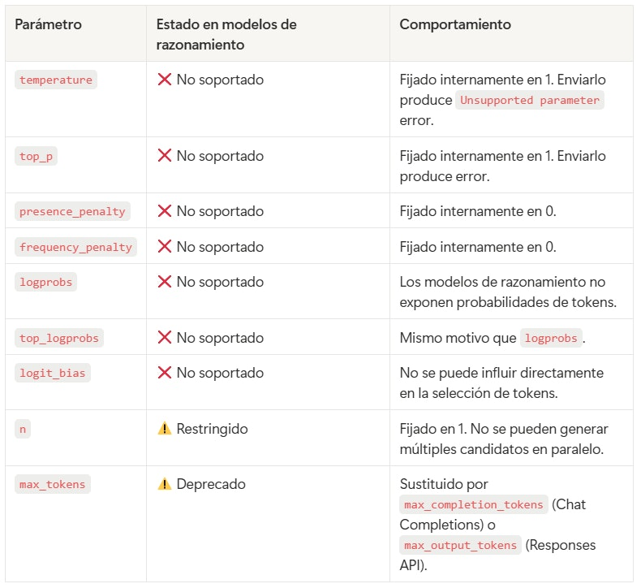
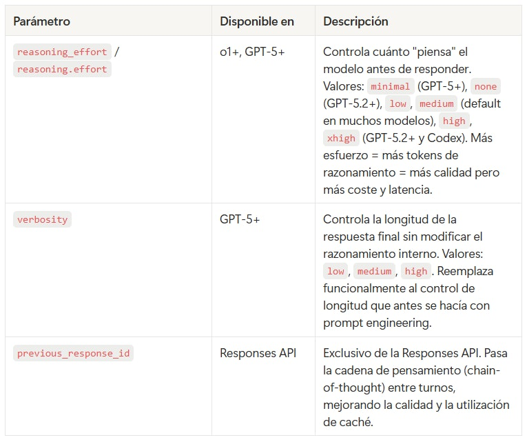
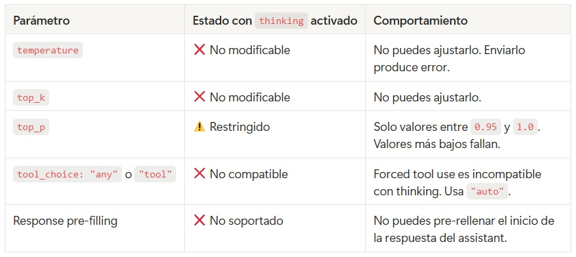
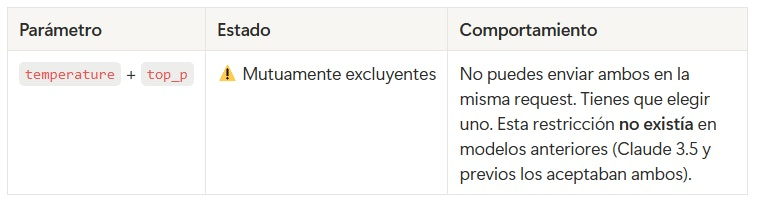
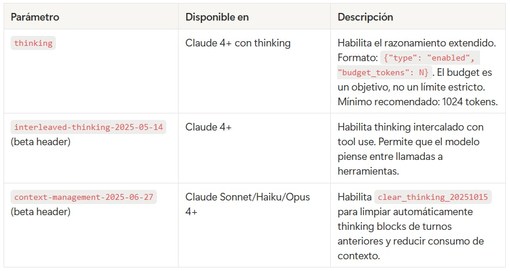
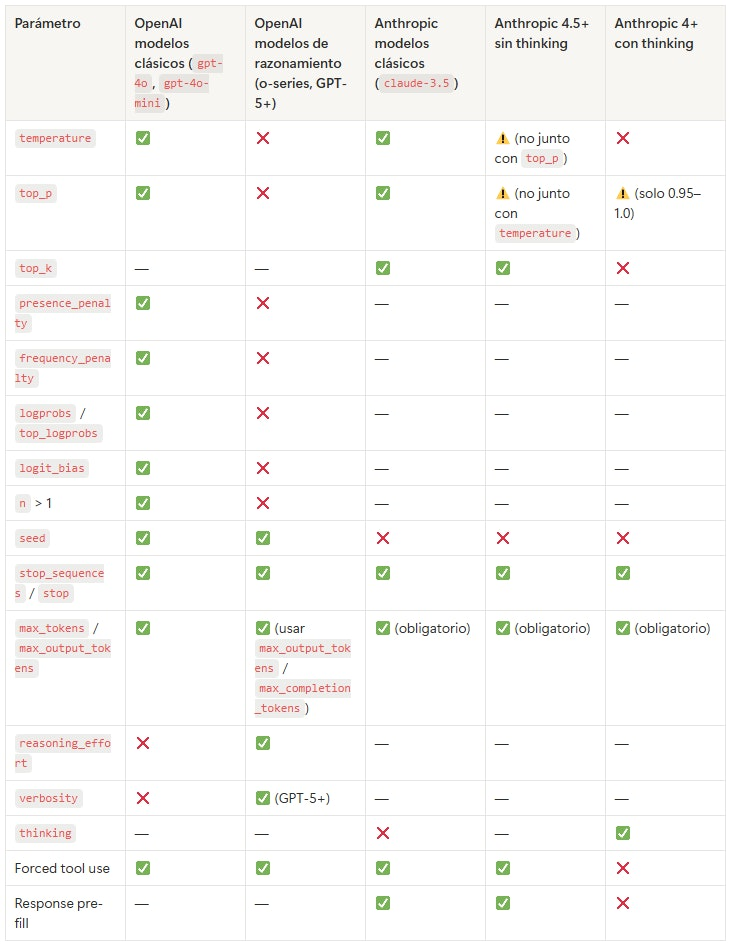

# 🗒️ Parámetros en modelos de razonamiento 🔴 — 12 min

[Antonio Perez](https://training.lidr.co/members/36030888)

⏳Tiempo estimado: 12 min

## Por qué los modelos de razonamiento son diferentes

Los modelos de razonamiento (OpenAI GPT-5 series, o3, o4-mini; Anthropic Claude 4/4.5/4.6 con extended thinking) no generan respuestas en una sola pasada de muestreo. Internamente ejecutan un proceso de**pensamiento multi-paso**: generan cadenas de razonamiento, las evalúan, descartan algunas ramas, y solo entonces producen la respuesta final.

Este proceso está calibrado por el proveedor para maximizar calidad y seguridad. Exponer parámetros tradicionales comotemperatureotop_prompería esa calibración — si el usuario fijasetemperature=0, todas las ramas de razonamiento colapsarían en una sola ruta greedy, anulando el beneficio del enfoque multi-paso. Por eso los proveedores han**bloqueado**varios parámetros de muestreo en estos modelos, y han introducido**nuevos parámetros**(comoreasoning_effort,verbosity,thinking) para dar al desarrollador otra vía de control.

Este documento resume qué parámetros han quedado obsoletos o restringidos en cada familia de modelos, y cuáles son los nuevos parámetros que los reemplazan.

## OpenAI: modelos de razonamiento

### Modelos afectados

- 

Familia**o-series**:o1,o1-mini,o3,o3-mini,o3-pro,o4-mini

- 

Familia**GPT-5**:gpt-5,gpt-5-mini,gpt-5-nano,gpt-5.1,gpt-5.2,gpt-5.3,gpt-5.4y sus variantes

- 

Familia**Codex**:gpt-5-codex,gpt-5.2-codex,gpt-5.3-codex

### Parámetros bloqueados o restringidos

### Nuevos parámetros introducidos

### Cambio adicional: system messages → developer messages

En modelos o-series, los mensajes conrole: "system"se tratan internamente comorole: "developer". El SDK lo gestiona transparentemente, pero no debes usar ambos roles en la misma request.

### Ejemplo de migración
from openai import OpenAI client = OpenAI() # ❌ ANTIGUO estilo — falla con modelos de razonamiento response = client.responses.create( model="gpt-5-mini", instructions="You are a technical analyst.", input="Should we use microservices?", temperature=0.3, # ❌ Not supported top_p=0.9, # ❌ Not supported max_output_tokens=500 ) # Error: Unsupported parameter: 'temperature' is not supported with this model. # ✅ NUEVO estilo — correcto para modelos de razonamiento response = client.responses.create( model="gpt-5-mini", instructions="You are a technical analyst.", input="Should we use microservices?", reasoning={"effort": "medium"}, # ✅ New: controls reasoning depth text={"verbosity": "low"}, # ✅ New: controls answer length max_output_tokens=500 )
## Anthropic: modelos con extended thinking

### Modelos afectados

- 

**Claude Opus 4, 4.1, 4.5, 4.6**

- 

**Claude Sonnet 4, 4.5, 4.6**

- 

**Claude Haiku 4.5**

Las restricciones aplican**cuando se activa**thinkingen la request. Sin thinking activado, estos modelos aceptan los parámetros tradicionales (con las excepciones que se indican abajo).

### Parámetros bloqueados o restringidos con extended thinking

### Restricciones adicionales en modelos 4.5+ (incluso SIN thinking)

Claude Sonnet 4.5 y Claude Haiku 4.5 (y posteriores) introdujeron una nueva regla que aplica**siempre**, no solo con thinking:

Esto significa que código que funcionaba con Claude 3.5 Sonnet puede romperse al migrar a Claude 4.5/4.6 si especificabas ambos parámetros simultáneamente.

### Nuevos parámetros introducidos

### Ejemplo de migración
from anthropic import Anthropic client = Anthropic() # ❌ ANTIGUO estilo — falla con Claude 4.5+ response = client.messages.create( model="claude-sonnet-4-6-20250514", messages=[{"role": "user", "content": "Should we use microservices?"}], max_tokens=500, temperature=0.3, top_p=0.9 # ❌ Cannot specify both temperature and top_p in 4.5+ ) # Error: temperature and top_p cannot both be specified for this model. # ✅ NUEVO estilo — pick one response = client.messages.create( model="claude-sonnet-4-6-20250514", messages=[{"role": "user", "content": "Should we use microservices?"}], max_tokens=500, temperature=0.3 # ✅ Pick one of temperature or top_p ) # ✅ Con extended thinking habilitado response = client.messages.create( model="claude-sonnet-4-6-20250514", messages=[{"role": "user", "content": "Design a distributed rate limiter."}], max_tokens=16000, thinking={ "type": "enabled", "budget_tokens": 10000 # ✅ New: controls thinking depth } # Note: no temperature, no top_k, no pre-filling )
## Tabla resumen: ¿qué sigue funcionando y qué no?

**Leyenda:**✅soportado ·❌no soportado ·⚠con restricciones · — no aplicable a ese proveedor

## Implicaciones prácticas para el programa

### 1. Si estás construyendo sobre modelos no-razonamiento, sigue todo igual

Para los ejercicios del programa usamosgpt-4o-miniyclaude-haiku-4-5-20251001. El Haiku 4.5 sí tiene la restricción de no poder combinartemperatureytop_p, pero como en el notebook solo usamostemperature, no nos afecta. Todos los parámetros que aprendiste en el Bloque 3 del notebook funcionan con estos modelos.

### 2. Si migras a un modelo de razonamiento, revisa tu código

Si en el futuro tu producto necesita la potencia de un modelo de razonamiento:

- 

**OpenAI (GPT-5, o3, o4-mini):**eliminatemperature,top_p,frequency_penalty,presence_penalty,logprobs,logit_bias. Sustitúyelos porreasoning_effortyverbosity.

- 

**Anthropic con thinking:**eliminatemperatureytop_k. Si necesitastop_p, úsalo solo en rango0.95-1.0. No uses forced tool use ni pre-filling.

### 3. El "coste del razonamiento" se factura como tokens de salida

Tanto losreasoning_tokensde OpenAI como losthinking_tokensde Anthropic se**facturan al precio de tokens de salida**, aunque no aparezcan en la respuesta visible. Un modelo de razonamiento conreasoning_effort: "high"puede consumir 10x más tokens de salida que el mismo modelo conreasoning_effort: "minimal"para la misma pregunta.

### 4. Regla mnemotécnica

**Los modelos de razonamiento quitan el control del muestreo y te dan control sobre el razonamiento.**

Pierdestemperature,top_p,presence_penalty, etc. Ganasreasoning_effortyverbosity(OpenAI) othinking.budget_tokens(Anthropic). Es un intercambio deliberado: el proveedor se reserva el control fino del muestreo porque lo necesita para orquestar el proceso multi-paso, y a cambio te da palancas de más alto nivel.

## Referencias

- 

OpenAI reasoning models documentation:[platform.openai.com/docs/guides/reasoning](https://platform.openai.com/docs/guides/reasoning)

- 

OpenAI GPT-5 prompting guide:[cookbook.openai.com/examples/gpt-5/gpt-5_prompting_guide](https://cookbook.openai.com/examples/gpt-5/gpt-5_prompting_guide)

- 

Azure reasoning models compatibility:[learn.microsoft.com/en-us/azure/foundry/openai/how-to/reasoning](https://learn.microsoft.com/en-us/azure/foundry/openai/how-to/reasoning)

- 

Anthropic extended thinking docs:[console.anthropic.com/docs/en/build-with-claude/extended-thinking](https://console.anthropic.com/docs/en/build-with-claude/extended-thinking)

- 

Anthropic Messages API reference:[docs.anthropic.com/en/api/messages](https://docs.anthropic.com/en/api/messages)
