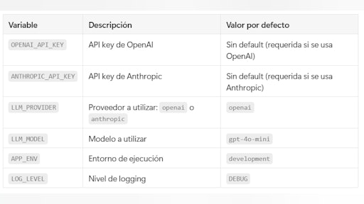
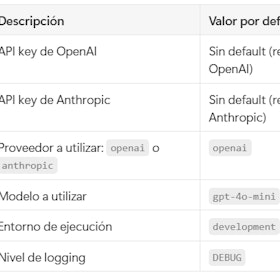
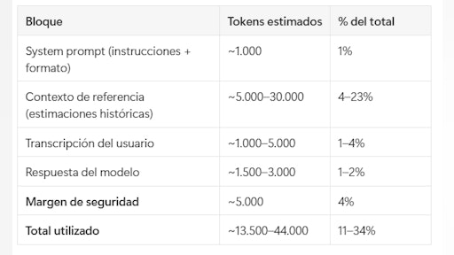
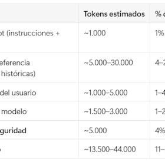

# Sesión 2: Primeros pasos de arquitectura CAG — 95 min

[Antonio Perez](https://training.lidr.co/members/36030888)

⏳Tiempo estimado: 1 min

¡Hola!

En esta sesión empiezas a construir tu primer sistema real basado en LLMs.

Durante la sesión comenzarás a desarrollar el proyecto que te acompañará a lo largo del programa: un sistema capaz de generar estimaciones de software a partir de transcripciones reales.

Para ello, trabajarás con una arquitectura CAG (Cache Augmented Generation), entendiendo cómo inyectar contexto directamente en el modelo y cómo estructurar el sistema para que responda de forma útil y consistente.

Además, profundizarás en los elementos clave que determinan el comportamiento del sistema: cómo se gestiona el contexto, cómo influyen los parámetros del modelo y qué decisiones afectan al coste, la latencia y la calidad de las respuestas.

Este es el punto en el que dejas de pensar en “usar un modelo” y empiezas a pensar en “diseñar un sistema”.

Contenidos obligatorios🔴
🎥Introducción de la sesión
🗒Fundamentos de arquitectura CAG
🗒Arquitectura de proyecto con LLMs vía API
🗒Gestión de contexto y tokens
🗒Parámetros del modelo y comportamiento
🗒Arquitectura de conversación
🗒Gestión de claves, rate limiting y errores
🗒Costes y optimización

Ejercicios prácticos✍
✍Scaffolding del proyecto con FastAPI

Para finalizar, añade tu opinión sobre el contenido de este módulo:
🆙Evalúa el contenido de este Módulo

### 
❗Obtén los recursos completos en las siguientes lecciones👇

- 

[🎥 Video introductorio de la sesión 🔴— 4 min

- Visibility: Visible
- Unlocking: None
- Completion: Button
- Comments: On
- Thumbnail: Default
](https://training.lidr.co/posts/ai-engineering-202604-🎥-video-introductorio-de-la-sesion-🔴-4-min)⏳ Tiempo estimado: 4 min En la sesión anterior hiciste tu primera llamada a un LLM. Ahora toca la pregunta de verdad:...
- 

[✍️ Ejercicio - Scaffolding del proyecto FastAPI 🔴

- Visibility: Visible
- Unlocking: None
- Completion: Button
- Comments: On
- Thumbnail: Default
](https://training.lidr.co/posts/ai-engineering-202604-✍️-ejercicio-scaffolding-del-proyecto-fastapi-🔴)Objetivo Construir la estructura base del Proyecto 1: una aplicación FastAPI con un endpoint que reciba el texto de...
- 

[📄 Qué es CAG (Cache augmented generation) 🔴— 19 min

- Visibility: Visible
- Unlocking: None
- Completion: Button
- Comments: On
- Thumbnail: Default
](https://training.lidr.co/posts/ai-engineering-202604-📄-que-es-cag-cache-augmented-generation-🔴-19-min)⏳ Tiempo estimado: 19 min El punto de partida: ¿cómo "sabe cosas" un LLM? Antes de hablar de CAG, necesitamos...
- 

[📄 Don´t do RAG when CAG is all you need (paper) 🔴— 1 min

- Visibility: Visible
- Unlocking: None
- Completion: Button
- Comments: On
- Thumbnail: Default
](https://training.lidr.co/posts/ai-engineering-202604-📄-dont-do-rag-when-cag-is-all-you-need-paper-🔴-1-min)⏳ Tiempo estimado: 1 min Aquí tenéis como complemento el paper fundacional de CAG presentado por Chan et al. en la...
- 

[📄 Arquitectura escalable en proyectos IA generativa 🔴— 20 min

- Visibility: Visible
- Unlocking: None
- Completion: Button
- Comments: On
- Thumbnail: Default
](https://training.lidr.co/posts/ai-engineering-202604-📄-arquitectura-escalable-en-proyectos-ia-generativa-🔴-20-min)⏳ Tiempo estimado: 20 min ¿Por qué FastAPI para proyectos con IA? Si vienes de frameworks como Rails, Django o...
- 

[📄 Gestión efectiva de contexto en arquitectura CAG 🔴— 27 min

- Visibility: Visible
- Unlocking: None
- Completion: Button
- Comments: On
- Thumbnail: Default
](https://training.lidr.co/posts/ai-engineering-202604-📄-gestion-efectiva-de-contexto-en-arquitectura-cag-🔴-27-min)⏳ Tiempo estimado: 27 min El contexto como recurso finito En el artículo anterior sobre la estructura FastAPI del...
- 

[📄 Arquitectura de conversaciones con modelos🔴— 24 min

- Visibility: Visible
- Unlocking: None
- Completion: Button
- Comments: On
- Thumbnail: Default
](https://training.lidr.co/posts/ai-engineering-202604-📄-arquitectura-de-conversaciones-con-modelos🔴-24-min)⏳ Tiempo estimado: 24 min La interfaz real con un LLM: un array de mensajes Cuando usas ChatGPT o Claude desde el...
- 

[🆙 Evalúa el contenido de este Módulo

- Visibility: Visible
- Unlocking: None
- Completion: None
- Comments: On
- Thumbnail: Default
](https://training.lidr.co/posts/ai-engineering-202604-🆙-evalua-el-contenido-de-este-modulo-98724195)Evalúa del 1 al 5 el valor aportado por el contenido de este módulo. ⚠ Importante: Debido a una limitación técnica de...
