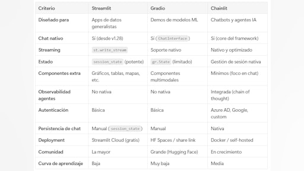
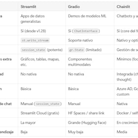

# Sesión 3: Patrones de diseño para wrappers de modelos — 89 min

[Antonio Perez](https://training.lidr.co/members/36030888)

⏳Tiempo estimado: 1 min

¡Hola!

En la sesión anterior construiste un sistema funcional basado en CAG. Tenías un endpoint que respondía, entendías cómo gestionar el contexto y empezabas a tomar decisiones de arquitectura.

Ahora toca dar el siguiente paso.

En esta sesión vas a transformar ese prototipo en algo que empieza a parecer un producto real.

Porque en el mundo real, no basta con que “funcione”. Tiene que ser robusto, eficiente, observable y usable por otros.

Durante la sesión trabajarás sobre varias capas clave que aparecen en cualquier sistema con LLMs en producción: abstraer proveedores para evitar dependencias rígidas, optimizar el rendimiento evitando llamadas innecesarias, mejorar la experiencia del usuario con respuestas en tiempo real y entender qué está pasando en cada llamada al modelo.

Además, añadirás una interfaz conversacional que elimina la necesidad de herramientas técnicas como Postman o curl, acercando tu sistema a un entorno de uso real.

Este es el punto en el que tu sistema deja de ser un experimento técnico y empieza a comportarse como un producto.

**Contenidos obligatorios**🔴
🎥Introducción: De prototipo a producto
🗒Interfaces conversacionales, frameworks y librerías
🗒Abstracción de proveedores y estrategias de fallback
🗒Cacheo inteligente de respuestas
🗒Streaming y manejo de respuestas largas
🗒Observabilidad, logging y trazabilidad

**Ejercicios prácticos**✍
✍Interfaz conversacional con Streamlit para el Proyecto 1

Para finalizar, añade tu opinión sobre el contenido de este módulo:
🆙Evalúa el contenido de este Módulo

### 
❗Obtén los recursos completos en las siguientes lecciones👇

- 

[🎥 Introducción: De prototipo a producto: wrappers, streaming y trazabilidad 🔴 — 3 min

- Visibility: Visible
- Unlocking: None
- Completion: Button
- Comments: On
- Thumbnail: Default
](https://training.lidr.co/posts/ai-engineering-202604-🎥-introduccion-de-prototipo-a-producto-wrappers-streaming-y-trazabilidad-🔴-3-min)⏳ Tiempo estimado: 3 min En la sesión 02 dejamos el Proyecto 1 con un endpoint CAG funcional. En esta sesión lo...
- 

[✍️ Ejercicio - Wrapper de interfaz conversacional 🔴

- Visibility: Visible
- Unlocking: None
- Completion: Button
- Comments: On
- Thumbnail: Default
](https://training.lidr.co/posts/ai-engineering-202604-✍️-ejercicio-wrapper-de-interfaz-conversacional-🔴)Interfaz conversacional con Streamlit para el Proyecto 1 Objetivo Añadir una interfaz conversacional web al Proyecto...
- 

[📄 Interfaces conversacionales, frameworks y librerías 🔴— 13 min

- Visibility: Visible
- Unlocking: None
- Completion: Button
- Comments: On
- Thumbnail: Default
](https://training.lidr.co/posts/ai-engineering-202604-📄-interfaces-conversacionales-frameworks-y-librerias-🔴-13-min)⏳ Tiempo estimado: 13 min El problema que resuelven estos frameworks Tienes un endpoint que recibe texto y devuelve...
- 

[📄 Abstracción de proveedores y estrategias de fallback 🔴 — 20 min

- Visibility: Visible
- Unlocking: None
- Completion: Button
- Comments: On
- Thumbnail: Default
](https://training.lidr.co/posts/ai-engineering-202604-📄-abstraccion-de-proveedores-y-estrategias-de-fallback-🔴-20-min)⏳ Tiempo estimado: 20 min El problema: acoplamiento a un proveedor En la sesión 02 montamos un endpoint FastAPI que...
- 

[📄 Cacheo inteligente de respuestas de LLMs 🔴 — 19 min

- Visibility: Visible
- Unlocking: None
- Completion: Button
- Comments: On
- Thumbnail: Default
](https://training.lidr.co/posts/ai-engineering-202604-📄-cacheo-inteligente-de-respuestas-de-llms-🔴-19-min)⏳ Tiempo estimado: 19 min Por qué cachear respuestas de un LLM En el Proyecto 1, nuestro estimador de software recibe...
- 

[📄 Streaming y manejo de respuestas largas 🔴 — 18 min

- Visibility: Visible
- Unlocking: None
- Completion: Button
- Comments: On
- Thumbnail: Default
](https://training.lidr.co/posts/ai-engineering-202604-📄-streaming-y-manejo-de-respuestas-largas-🔴-18-min)⏳ Tiempo estimado: 18 min El problema de la respuesta monolítica Cuando nuestro estimador de software del Proyecto 1...
- 

[📄 Observabilidad, logging y trazabilidad 🔴 — 16 min

- Visibility: Visible
- Unlocking: None
- Completion: Button
- Comments: On
- Thumbnail: Default
](https://training.lidr.co/posts/ai-engineering-202604-📄-observabilidad-logging-y-trazabilidad-🔴-16-min)⏳ Tiempo estimado: 16 min Por qué el logging estándar no es suficiente Si vienes de desarrollo web, tienes un hábito...
- 

[🆙 Evalúa el contenido y el ejercicio de este Módulo

- Visibility: Visible
- Unlocking: None
- Completion: None
- Comments: On
- Thumbnail: Default
](https://training.lidr.co/posts/ai-engineering-202604-🆙-evalua-el-contenido-y-el-ejercicio-de-este-modulo-98724212)Evalúa del 1 al 5 el valor aportado por el contenido de este módulo. ⚠ Importante: Debido a una limitación técnica de...
