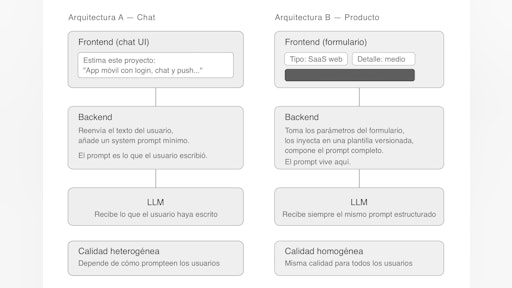
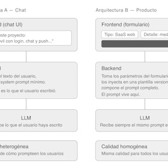
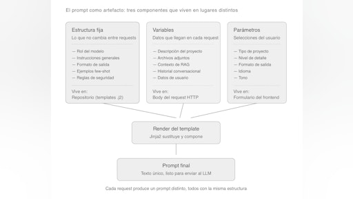
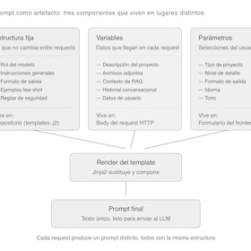
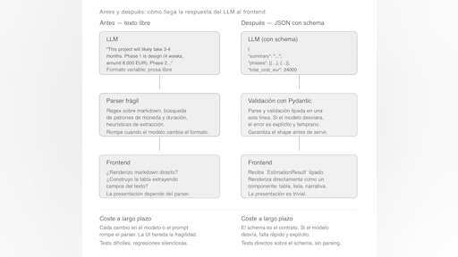
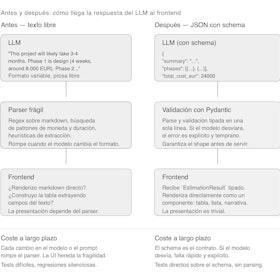
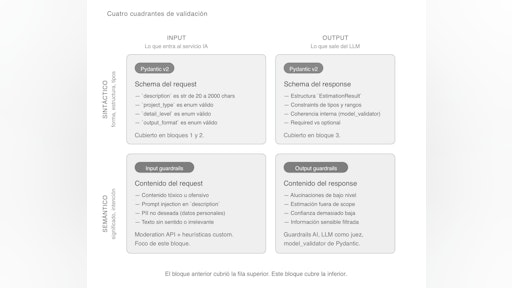
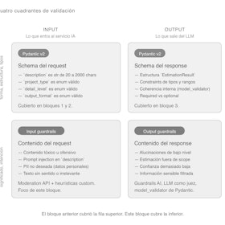
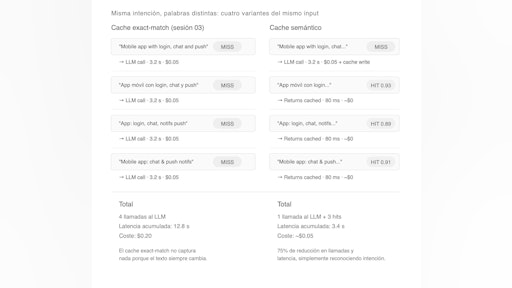
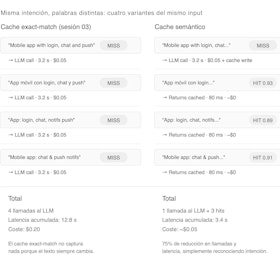

# Sesión 4: Productos IA avanzados — 117 min

[Antonio Perez](https://training.lidr.co/members/36030888)

⏳Tiempo estimado: 1 min

En la sesión anterior llevaste tu sistema un paso más allá: dejaste atrás el prototipo y empezaste a construir algo que se comporta como un producto.

Tenías una arquitectura más sólida, mejor experiencia de usuario y empezabas a controlar lo que ocurría dentro del sistema.

Pero aún hay una decisión clave que probablemente no has cuestionado.

El uso del chat.

En esta sesión vamos a romper esa inercia.

Porque aunque el chat es el punto de partida más habitual cuando se trabaja con LLMs, en muchos casos**no es la mejor interfaz para un producto**. De hecho, puede convertirse en un límite: delega en el usuario algo que deberías controlar tú — el prompting — y hace que la calidad del resultado dependa de factores externos.

Aquí es donde empieza el cambio real.

Vas a transformar tu sistema para que deje de depender de cómo escribe el usuario y pase a funcionar a partir de**parámetros estructurados, decisiones de diseño y lógica de producto**.

Durante la sesión trabajarás sobre varios principios clave que diferencian una demo de un sistema listo para producción:

- 

Diseñar interfaces que guían al usuario en lugar de exigirle que sepa qué pedir

- 

Tratar los prompts como código: versionados, testeables y mantenibles

- 

Separar entrada, lógica y generación para controlar el comportamiento del sistema

- 

Entender cómo se construyen productos de IA con consistencia y previsibilidad

Además, empezarás a implementar una arquitectura donde el modelo deja de ser el protagonista y pasa a ser una pieza dentro de un sistema más amplio.

Este es el punto en el que dejas de construir con IA…
y empiezas a construir**producto con IA**.

### **Contenidos obligatorios**🔴

🎥Introducción: Productos IA avanzados
📄De interfaz conversacional a interfaz de producto
📄Plantillas de prompts y prompting desde backend
📄Extracción de datos estructurados
📄Guardrails y validación de outputs
📄Cacheo semántico de respuestas

### **Ejercicio práctico**✍

✍De chat a interfaz de producto

### **Importante**

Este módulo concentra varias de las decisiones más relevantes de todo el programa.

No se trata de implementar todo perfecto desde el inicio, sino de empezar a pensar como alguien que construye sistemas reales:

- 

Controlar la calidad del output

- 

Reducir la variabilidad

- 

Diseñar para usuarios, no para modelos

Si algo no te encaja del todo, es normal.
Lo importante es llegar con una primera versión sobre la que trabajar en directo.

Para finalizar, añade tu opinión sobre el contenido y el ejercicio de este módulo:
🆙Evalúa el contenido y el ejercicio de este Módulo

### 
❗Obtén los recursos completos en las siguientes lecciones👇

- 

[🎥 Introducción: Productos IA avanzados 🔴 — 3 min

- Visibility: Visible
- Unlocking: None
- Completion: Button
- Comments: On
- Thumbnail: Default
](https://training.lidr.co/posts/ai-engineering-202604-🎥-introduccion-productos-ia-avanzados-🔴-3-min)⏳ Tiempo estimado: 3 min Casi todos los productos con IA que llegan a producción comparten una misma decisión...
- 

[✍️ Ejercicio - del chat a la interfaz de producto 🔴

- Visibility: Visible
- Unlocking: None
- Completion: Button
- Comments: On
- Thumbnail: Default
](https://training.lidr.co/posts/ai-engineering-202604-✍️-ejercicio-del-chat-a-la-interfaz-de-producto-🔴)El estimator que dejamos al final de la sesión 03 es funcional pero tiene dos problemas que nacen de la misma...
- 

[📄De interfaz conversacional a interfaz de producto 🔴 — 19 min

- Visibility: Visible
- Unlocking: None
- Completion: Button
- Comments: On
- Thumbnail: Default
](https://training.lidr.co/posts/ai-engineering-202604-📄de-interfaz-conversacional-a-interfaz-de-producto-🔴-19-min)⏳ Tiempo estimado: 19 min En la sesión 03 dejamos el estimator como una aplicación de chat. El usuario abre la web,...
- 

[📄 Plantillas de prompts y prompting desde backend 🔴 — 22 min

- Visibility: Visible
- Unlocking: None
- Completion: Button
- Comments: On
- Thumbnail: Default
](https://training.lidr.co/posts/ai-engineering-202604-📄-plantillas-de-prompts-y-prompting-desde-backend-🔴-22-min)⏳ Tiempo estimado: 22 min En el bloque 1 dejamos el estimator con un formulario en el frontend que produce un...
- 

[📄 Extracción de datos estructurados 🔴 — 22 min

- Visibility: Visible
- Unlocking: None
- Completion: Button
- Comments: On
- Thumbnail: Default
](https://training.lidr.co/posts/ai-engineering-202604-📄-extraccion-de-datos-estructurados-🔴-22-min)⏳ Tiempo estimado: 22 min El ejercicio previo te deja con un estimator que ya no es un chat: tienes un formulario en...
- 

[📄Guardrails y validación de outputs — 26 min🔴

- Visibility: Visible
- Unlocking: None
- Completion: Button
- Comments: On
- Thumbnail: Default
](https://training.lidr.co/posts/ai-engineering-202604-📄guardrails-y-validacion-de-outputs-26-min🔴)⏳ Tiempo estimado: 26 min El bloque anterior dejó el estimator con una garantía importante: la respuesta del LLM...
- 

[📄 Cacheo semántico de respuestas— 25 min🔴

- Visibility: Visible
- Unlocking: None
- Completion: Button
- Comments: On
- Thumbnail: Default
](https://training.lidr.co/posts/ai-engineering-202604-📄-cacheo-semantico-de-respuestas-25-min🔴)⏳ Tiempo estimado: 25 min Llegas a este bloque con un estimator que es ya un producto serio. El formulario produce...
- 

[🆙 Evalúa el contenido de este Módulo

- Visibility: Visible
- Unlocking: None
- Completion: None
- Comments: On
- Thumbnail: Default
](https://training.lidr.co/posts/ai-engineering-202604-🆙-evalua-el-contenido-de-este-modulo-98724234)Evalúa del 1 al 5 el valor aportado por el contenido de este módulo. ⚠ Importante: Debido a una limitación técnica de...
