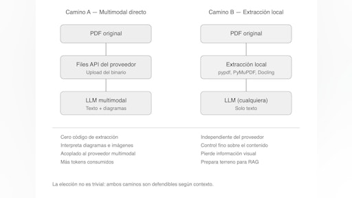
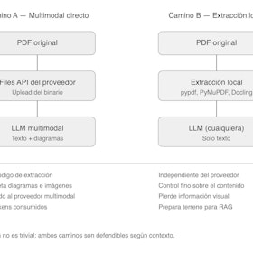
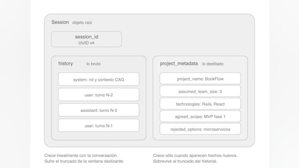
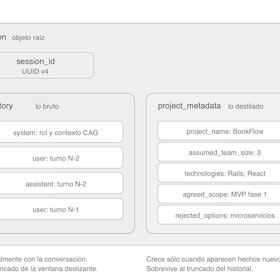
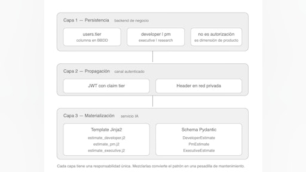
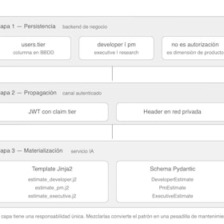
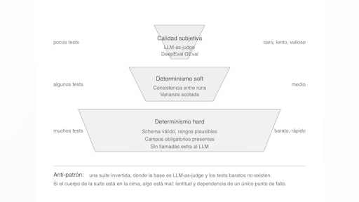
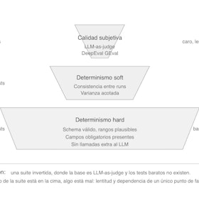
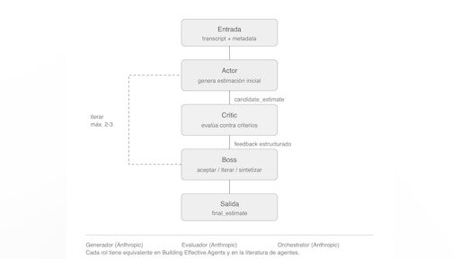
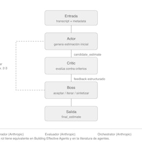

# Sesión 5: Funcionalidades avanzadas — 125 min

[Antonio Perez](https://training.lidr.co/members/36030888)

⏳Tiempo estimado: 4 min

En la sesión anterior diste un salto importante: pasaste de construir interfaces basadas en chat a diseñar sistemas donde tú controlas el comportamiento.

Definiste estructuras, separaste responsabilidades y empezaste a tratar los prompts como parte del código. Tu sistema dejó de depender del usuario… y empezó a comportarse como un producto.

Pero todavía hay algo que no está resuelto.

Aunque ahora tienes más control, tu sistema sigue siendo esencialmente estático: responde bien dentro de un contexto limitado, en una única interacción, y bajo condiciones bastante controladas.

El problema es que eso no es lo que ocurre en producción.

Los usuarios no hacen una única petición.
El contexto no está cerrado.
La información relevante no vive solo en el prompt.

Y, sobre todo, la calidad deja de ser evidente.

Aquí es donde empieza realmente la diferencia entre algo que funciona… y algo que escala.

[Video](https://player.vimeo.com/video/1192274612?h=df65781fdf)

La diferencia entre un prototipo que impresiona en una reunión y un sistema que aguanta usuarios reales no está en el modelo. Está en cuatro piezas que casi nadie te enseña a la vez: cómo enriquecer el contexto con información del mundo real, cómo gestionar la memoria sin que se descontrole, cómo adaptar la salida a cada perfil de usuario y cómo evaluar la calidad cuando el output ya no se puede comparar con un valor esperado.

En este vídeo se presenta la quinta sesión del programa, donde cerramos el módulo de arquitectura CAG con esas cuatro piezas — más un patrón de orquestación que rompe el techo de calidad de cualquier sistema de generación.

**Lo que vas a descubrir:**

- 

→ Por qué un sistema sin contexto dinámico, memoria explícita ni adaptación por perfil se queda en demo, y cómo se aborda cada uno con código que cabe en un servicio FastAPI

- 

→ Cuál es la disciplina mínima de testing y evaluación que separa un equipo que itera con confianza de uno que tiene miedo a tocar los prompts

- 

→ Cómo el patrón actor-critic-boss compone tres roles diferenciados para producir respuestas significativamente más sólidas, sin frameworks adicionales y con anclaje sólido en la literatura

### 

Para finalizar, añade tu opinión sobre el contenido y el ejercicio de este módulo:
🆙Evalúa el contenido y el ejercicio de este Módulo

### 
❗Obtén los recursos completos en las siguientes lecciones👇

- 

[✍️ Ejercicio - memoria conversacional y contexto enriquecido🔴

- Visibility: Visible
- Unlocking: None
- Completion: Button
- Comments: On
- Thumbnail: Default
](https://training.lidr.co/posts/ai-engineering-202604-✍️-ejercicio-memoria-conversacional-y-contexto-enriquecido🔴)Hasta la sesión 04 hemos tratado al estimator como un sistema transaccional: una transcripción entra, una estimación...
- 

[📄 Integración de contexto dinámico desde fuentes externas 🔴 — 27 min

- Visibility: Visible
- Unlocking: None
- Completion: Button
- Comments: On
- Thumbnail: Default
](https://training.lidr.co/posts/ai-engineering-202604-📄-integracion-de-contexto-dinamico-desde-fuentes-externas-🔴-27-min)⏳ Tiempo estimado: 27 min Hasta ahora, el estimator ha funcionado con un contrato cerrado: el cliente envía una...
- 

[📄 Memoria conversacional vs historial: estrategias para sistemas CAG 🔴 — 26 min

- Visibility: Visible
- Unlocking: None
- Completion: Button
- Comments: On
- Thumbnail: Default
](https://training.lidr.co/posts/ai-engineering-202604-📄-memoria-conversacional-vs-historial-estrategias-para-sistemas-cag-🔴-26-min)⌛Tiempo estimado: 26 min En la sesión 02 trabajamos la arquitectura de conversaciones: el array de mensajes que viaja...
- 

[📄 Prompts adaptativos por perfil de usuario: el patrón "tier” 🔴 — 26 min

- Visibility: Visible
- Unlocking: None
- Completion: Button
- Comments: On
- Thumbnail: Default
](https://training.lidr.co/posts/ai-engineering-202604-📄-prompts-adaptativos-por-perfil-de-usuario-el-patron-tier-🔴-26-min)⏳ Tiempo estimado: 26 min Hay un patrón recurrente cuando un equipo de ingeniería senior se enfrenta por primera vez...
- 

[📄 Testing y evaluación de sistemas con LLMs 🔴 — 28 min

- Visibility: Visible
- Unlocking: None
- Completion: Button
- Comments: On
- Thumbnail: Default
](https://training.lidr.co/posts/ai-engineering-202604-📄-testing-y-evaluacion-de-sistemas-con-llms-🔴-28-min)⏳ Tiempo estimado: 28 min Cualquier desarrollador con cinco años de experiencia ha interiorizado un instinto...
- 

[📄 Actor-Critic-Boss: la composición de roles que eleva la calidad 🔴 — 18 min

- Visibility: Visible
- Unlocking: None
- Completion: Button
- Comments: On
- Thumbnail: Default
](https://training.lidr.co/posts/ai-engineering-202604-📄-actor-critic-boss-la-composicion-de-roles-que-eleva-la-calidad-🔴-18-min)⏳ Tiempo estimado: 18 min Llegado este punto del programa, el estimator tiene una arquitectura razonable. Recibe...
- 

[🆙 Evalúa el contenido y el ejercicio de este Módulo

- Visibility: Visible
- Unlocking: None
- Completion: None
- Comments: On
- Thumbnail: Default
](https://training.lidr.co/posts/ai-engineering-202604-🆙-evalua-el-contenido-y-el-ejercicio-de-este-modulo-98724253)Evalúa del 1 al 5 el valor aportado por el contenido de este módulo. ⚠ Importante: Debido a una limitación técnica de...
