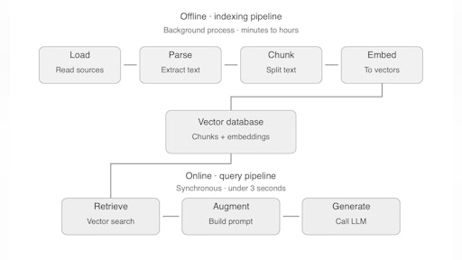
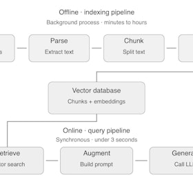
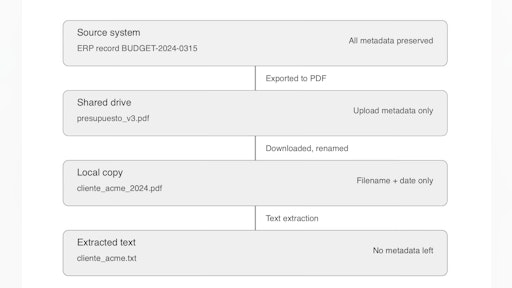
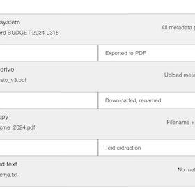
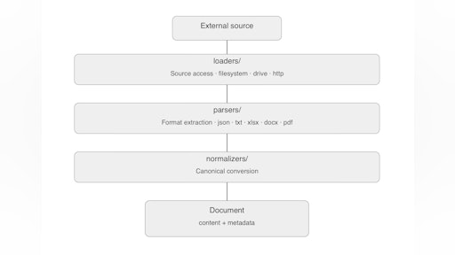
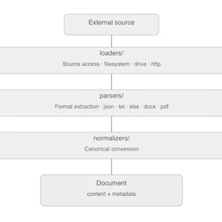
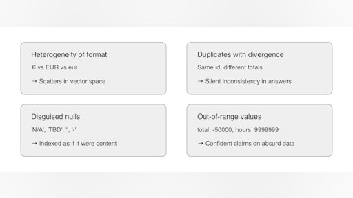
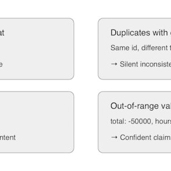
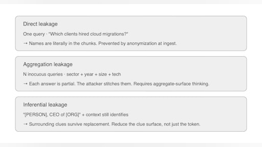
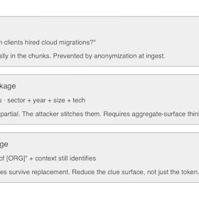

# Sesión 6: Fundamentos de data driven AI - Análisis, formateo y normalización de datos existentes — 132 min

[Antonio Perez](https://training.lidr.co/members/36030888)

⏳Tiempo estimado: 3 min

¡Hola!

[Video](https://player.vimeo.com/video/1194693463?h=b5b293b513)

**Los sistemas RAG no fallan en producción por culpa del modelo de embeddings, ni de la base vectorial, ni de la estrategia de retrieval. Fallan por los datos.**

Esta sesión abre el módulo de data-driven AI y aterriza una idea que recorre toda la literatura seria sobre RAG en producción: ningún chunking inteligente, ningún reranker, ningún cross-encoder arregla un corpus mal auditado. Antes de tocar un modelo de embeddings hay cuatro decisiones operativas que se omiten en la mayoría de tutoriales y que son las que separan un sistema que demo bien al cliente de uno que aguanta seis meses en producción sin sorpresas.

## Lo que vas a descubrir

→**Cuándo el salto de CAG a RAG es una necesidad arquitectónica, no una preferencia.**El ejercicio pre-sesión te lleva a estresar tu CAG contra un corpus realista para que llegues al directo con números propios y entiendas en qué eje concreto se rompe: context window, coste, latencia o la degradación de atención sobre contextos largos.

→**El catálogo de fuentes como artefacto vivo del proyecto.**Auditoría e inventario de los datos empresariales, decisiones explícitas de inclusión y exclusión, evaluación de calidad por dimensiones ortogonales, y un YAML versionado que el pipeline lee directamente para que la disciplina arquitectónica se ejecute por construcción.

→**El subsistema de ingesta multi-formato con un contrato común.**Tres capas claras —loaders, parsers, normalizers— que producen un Document canónico independientemente de si el origen es JSON, PDF, DOCX, XLSX o una transcripción. Estrategia técnica por formato y criterios honestos para elegir entre parsers nativos y la navaja suiza de unstructured.

→**La capa de limpieza y validación como guardián del corpus.**Pandera como contrato de datos sobre el DataFrame intermedio, política explícita de reparar/cuarentena/descartar ante fallos, y por qué validar es trabajo de un módulo dedicado y no parches dispersos en el chunker, el embedder y el retriever.

→**PII, anonimización y GDPR antes del embedding.**Tres modos de filtración semántica vía RAG que los controles de acceso tradicionales no previenen, pseudonimización reversible con Presidio y Faker, mapping table como pieza arquitectónica que sostiene el derecho al olvido, y el marco GDPR mínimo que cualquier sistema empresarial necesita tener interiorizado.

Para finalizar, añade tu opinión sobre el contenido y el ejercicio de este módulo:
🆙Evalúa el contenido y el ejercicio de este Módulo

### 
❗Obtén los recursos completos en las siguientes lecciones👇

- 

[✍️ Ejercicio: Stress test del CAG: Medir donde rompe 🔴

- Visibility: Visible
- Unlocking: None
- Completion: Button
- Comments: On
- Thumbnail: Default
](https://training.lidr.co/posts/ai-engineering-202604-✍️-ejercicio-stress-test-del-cag-medir-donde-rompe-🔴)Guía del ejercicio previo Hasta la sesión 5 hemos construido un sistema CAG (Cache-Augmented Generation): cada turno...
- 

[📄 Calidad del dato y decisiones de arquitectura 🔴 — 24 min

- Visibility: Visible
- Unlocking: None
- Completion: Button
- Comments: On
- Thumbnail: Default
](https://training.lidr.co/posts/ai-engineering-202604-📄-calidad-del-dato-y-decisiones-de-arquitectura-🔴-24-min)⏳ Tiempo estimado: 24 min Si has hecho el ejercicio pre-sesión, has pasado las últimas horas mirando una hoja de...
- 

[📄 Auditoría e inventario de datos empresariales 🔴 — 27 min

- Visibility: Visible
- Unlocking: None
- Completion: Button
- Comments: On
- Thumbnail: Default
](https://training.lidr.co/posts/ai-engineering-202604-📄-auditoria-e-inventario-de-datos-empresariales-🔴-27-min)⏳ Tiempo estimado: 27 min La decisión arquitectónica está tomada: vamos a construir RAG con una capa residual de CAG....
- 

[📄 Pipeline de extracción multi-formato 🔴 — 25 min

- Visibility: Visible
- Unlocking: None
- Completion: Button
- Comments: On
- Thumbnail: Default
](https://training.lidr.co/posts/ai-engineering-202604-📄-pipeline-de-extraccion-multi-formato-🔴-25-min)⏳ Tiempo estimado: 25 min Con el catálogo cerrado tenemos un mapa de qué fuentes van a entrar al sistema. Ahora toca...
- 

[📄Limpieza, normalización y validación de datos🔴 — 28 min

- Visibility: Visible
- Unlocking: None
- Completion: Button
- Comments: On
- Thumbnail: Default
](https://training.lidr.co/posts/ai-engineering-202604-📄limpieza-normalizacion-y-validacion-de-datos🔴-28-min)⏳ Tiempo estimado: 28 min En el artículo anterior cerramos el subsistema ingest/ que produce Documents canónicos a...
- 

[📄PII, anonimización y GDPR en el pipeline de ingest🔴 — 28 min

- Visibility: Visible
- Unlocking: None
- Completion: Button
- Comments: On
- Thumbnail: Default
](https://training.lidr.co/posts/ai-engineering-202604-📄pii-anonimizacion-y-gdpr-en-el-pipeline-de-ingest🔴-28-min)⏳ Tiempo estimado: 28 min El corpus que tenemos ahora ya pasó por inventario, extracción y validación. Los registros...
- 

[🆙 Evalúa el contenido y el ejercicio de este Módulo

- Visibility: Visible
- Unlocking: None
- Completion: None
- Comments: On
- Thumbnail: Default
](https://training.lidr.co/posts/ai-engineering-202604-🆙-evalua-el-contenido-y-el-ejercicio-de-este-modulo-98724265)Evalúa del 1 al 5 el valor aportado por el contenido de este módulo. ⚠ Importante: Debido a una limitación técnica de...
