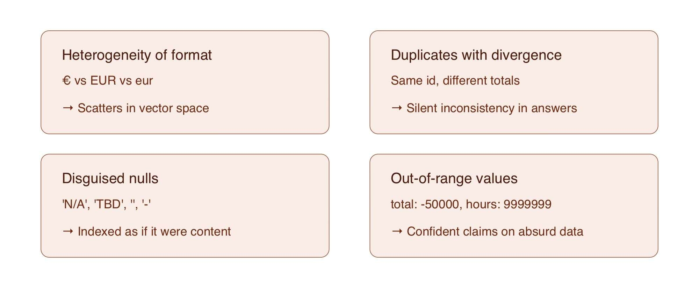

# 📄Limpieza, normalización y validación de datos🔴 — 28 min

⏳ Tiempo estimado: 28 minEn el artículo anterior cerramos el subsistema ingest/ que produce Documents canónicos a partir de cualquier formato. Esos Documents cumplen el contrato Pydantic: tienen un...

Nota: la lección devolvió un error de renderizado en la plataforma durante el archivado automático. Se conserva aquí la metadata pública disponible y el enlace original.

[Abrir lección original](https://training.lidr.co/posts/ai-engineering-202604-📄limpieza-normalizacion-y-validacion-de-datos🔴-28-min)
