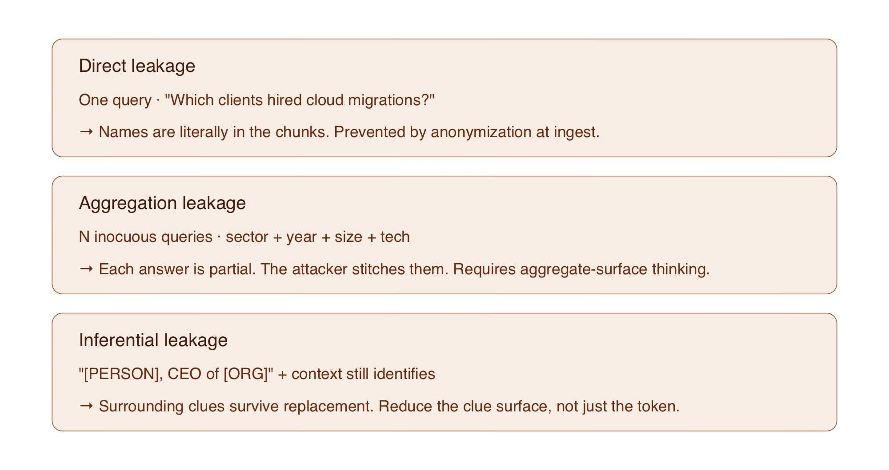

# 📄PII, anonimización y GDPR en el pipeline de ingest🔴 — 28 min

⏳ Tiempo estimado: 28 minEl corpus que tenemos ahora ya pasó por inventario, extracción y validación. Los registros son consistentes, están limpios y respetan los invariantes de negocio. Pero conti...

Nota: la lección devolvió un error de renderizado en la plataforma durante el archivado automático. Se conserva aquí la metadata pública disponible y el enlace original.

[Abrir lección original](https://training.lidr.co/posts/ai-engineering-202604-📄pii-anonimizacion-y-gdpr-en-el-pipeline-de-ingest🔴-28-min)
