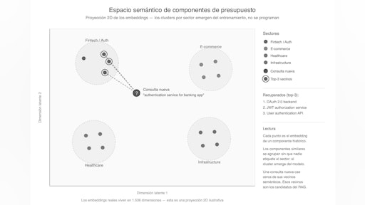
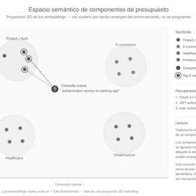
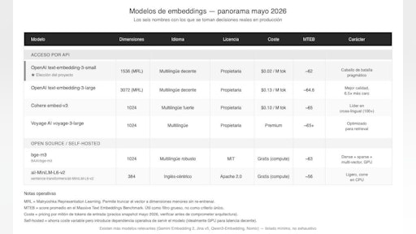
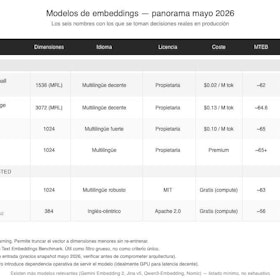
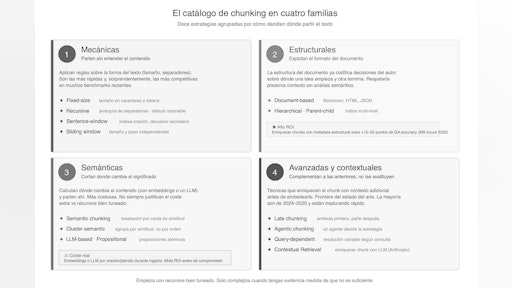
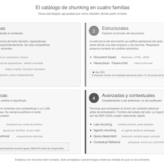
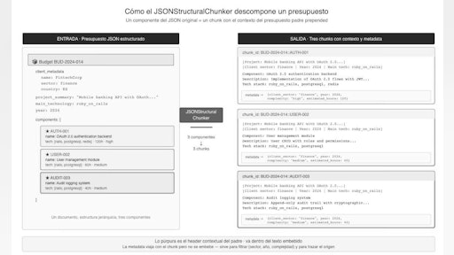
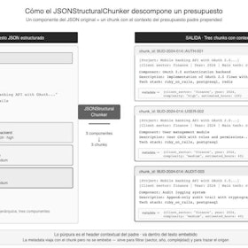

# Sesión 7: Embeddings y representación vectorial — 107 min

[Antonio Perez](https://training.lidr.co/members/36030888)

⏳Tiempo estimado: 1 min

[Video](https://player.vimeo.com/video/1194693462?h=6b9fe331bb)

Cuando un cliente llega con un brief nuevo —"necesitamos un servicio de autenticación con OAuth para una app móvil del sector financiero"— y tu sistema tiene que recuperar componentes históricos relevantes para construir una estimación, la calidad de esa recuperación depende de una decisión técnica que la mayoría de tutoriales de RAG tratan como detalle: cómo conviertes tus documentos en vectores antes de buscarlos.

Esta sesión**cubre la teoría completa de embeddings**—qué son, cómo emerge la geometría semántica del entrenamiento, qué métricas de similitud existen y cuándo usar cada una—, el panorama de modelos disponibles en 2026 con criterios reales de selección (no listas genéricas copiadas de blogs), y el catálogo completo de doce estrategias profesionales de chunking organizadas en cuatro familias mentales. El cierre del material aterriza todo al caso concreto del proyecto: chunkers específicos para presupuestos JSON estructurados y para transcripciones de reuniones de toma de requisitos.

Los benchmarks publicados durante el último año (NAACL 2025, Vecta 2026, Chroma) muestran algo incómodo para los pipelines RAG ya en producción: la estrategia de chunking puede mover la calidad de retrieval tanto como cambiar de modelo de embedding. Y Anthropic ha documentado una técnica de enriquecimiento contextual de chunks —Contextual Retrieval— que reduce los fallos de búsqueda hasta un 67% en sus benchmarks internos. La mayoría de los pipelines en producción están dejando esa palanca sin usar. El material asíncrono incluye cuatro artículos formativos con sus recursos curados, un ejercicio pre-sesión que te pide implementar un pipeline mínimo de chunking + embedding sobre presupuestos reales del proyecto, y un repositorio de referencia. La sesión en vivo de 120 minutos dedica más de 90 a experimentar con distintas estrategias de chunking sobre tus propios datos, midiendo cuál gana en tu corpus con tu propio test set de consultas. No es teoría aplicada: es experimentación rigurosa sobre infraestructura que tú habrás construido durante el ejercicio previo.

Al terminar la sesión tendrás dos cosas. La primera, vectores listos para insertar en una base de datos vectorial —que es exactamente el siguiente paso, con PostgreSQL y pgvector en la Sesión 08—. La segunda, una decisión argumentada sobre qué estrategia de chunking ha funcionado mejor sobre tu corpus específico. No "qué dijo el último blog post", sino "qué probé yo sobre mis datos".

Añade tu opinión sobre el contenido y el ejercicio de este módulo:
🆙Evalúa el contenido y el ejercicio de este Módulo

### 
❗Obtén los recursos completos en las siguientes lecciones👇

- 

[✍️ Ejercicio: Pipeline mínimo de embeddings y chunking🔴

- Visibility: Visible
- Unlocking: None
- Completion: Button
- Comments: On
- Thumbnail: Default
](https://training.lidr.co/posts/ai-engineering-202604-✍️-ejercicio-pipeline-minimo-de-embeddings-y-chunking🔴)Objetivo Construir dentro del servicio IA un pipeline funcional mínimo que reciba presupuestos históricos en formato...
- 

[📄 Embeddings: Del texto a la geometría semántica 🔴 — 21 min

- Visibility: Visible
- Unlocking: None
- Completion: Button
- Comments: On
- Thumbnail: Default
](https://training.lidr.co/posts/ai-engineering-202604-📄-embeddings-del-texto-a-la-geometria-semantica-🔴-21-min)⌛Tiempo estimado: 21 minutos Acabas de terminar la Sesión 06 con proyectos reales de varios sectores. Cada uno con...
- 

[📄 Selección de modelos de embeddings: trade-offs en producción 🔴 — 28 min

- Visibility: Visible
- Unlocking: None
- Completion: Button
- Comments: On
- Thumbnail: Default
](https://training.lidr.co/posts/ai-engineering-202604-📄-seleccion-de-modelos-de-embeddings-trade-offs-en-produccion-🔴-28-min)⌛Tiempo estimado: 28 minutos En el artículo anterior dejamos clavada la teoría: un embedding es un vector, la...
- 

[📄 Estrategias profesionales de chunking 🔴 — 32 min

- Visibility: Visible
- Unlocking: None
- Completion: Button
- Comments: On
- Thumbnail: Default
](https://training.lidr.co/posts/ai-engineering-202604-📄-estrategias-profesionales-de-chunking-🔴-32-min)⌛Tiempo estimado: 32 minutos La pregunta que aún nos falta es la que más impacto tiene en la calidad final de tu...
- 

[📄 Chunking del proyecto: presupuestos JSON y transcripciones🔴 — 26 min

- Visibility: Visible
- Unlocking: None
- Completion: Button
- Comments: On
- Thumbnail: Default
](https://training.lidr.co/posts/ai-engineering-202604-📄-chunking-del-proyecto-presupuestos-json-y-transcripciones🔴-26-min)⌛Tiempo estimado: 26 minutos En el artículo 3 quedó claro un principio que algunos tutoriales tratan como detalle y...
- 

[🆙 Evalúa el contenido de este Módulo

- Visibility: Visible
- Unlocking: None
- Completion: None
- Comments: On
- Thumbnail: Default
](https://training.lidr.co/posts/ai-engineering-202604-🆙-evalua-el-contenido-de-este-modulo-98724277)Evalúa del 1 al 5 el valor aportado por el contenido de este módulo. ⚠ Importante: Debido a una limitación técnica de...
