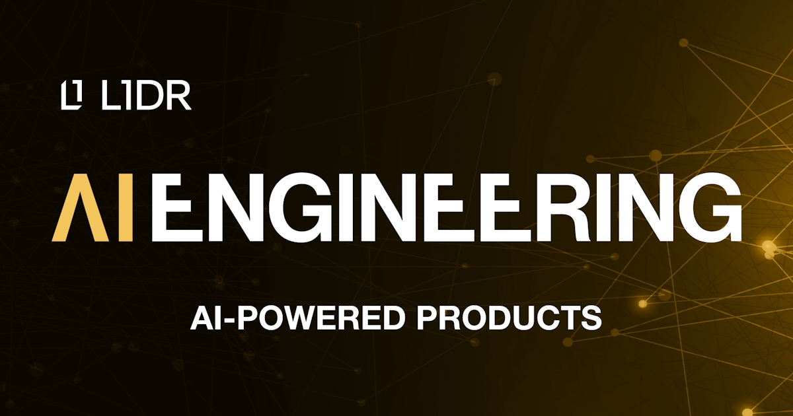

# ✍️ Ejercicio: Pipeline mínimo de embeddings y chunking🔴

ObjetivoConstruir dentro del servicio IA un pipeline funcional mínimo que reciba presupuestos históricos en formato JSON, los parta en chunks respetando la estructura del documento, genere embeddin...

Nota: la lección devolvió un error de renderizado en la plataforma durante el archivado automático. Se conserva aquí la metadata pública disponible y el enlace original.

[Abrir lección original](https://training.lidr.co/posts/ai-engineering-202604-✍️-ejercicio-pipeline-minimo-de-embeddings-y-chunking🔴)
