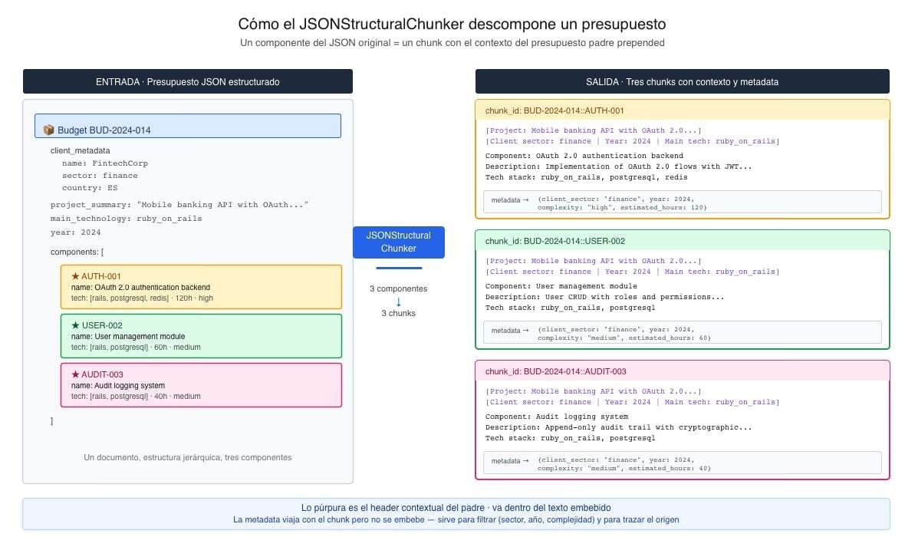

# 📄 Chunking del proyecto: presupuestos JSON y transcripciones🔴 — 26 min

⌛Tiempo estimado: 26 minutosEn el artículo 3 quedó claro un principio que algunos tutoriales tratan como detalle y los benchmarks recientes confirman como decisivo: el mejor chunking depende del ti...

Nota: la lección devolvió un error de renderizado en la plataforma durante el archivado automático. Se conserva aquí la metadata pública disponible y el enlace original.

[Abrir lección original](https://training.lidr.co/posts/ai-engineering-202604-📄-chunking-del-proyecto-presupuestos-json-y-transcripciones🔴-26-min)
