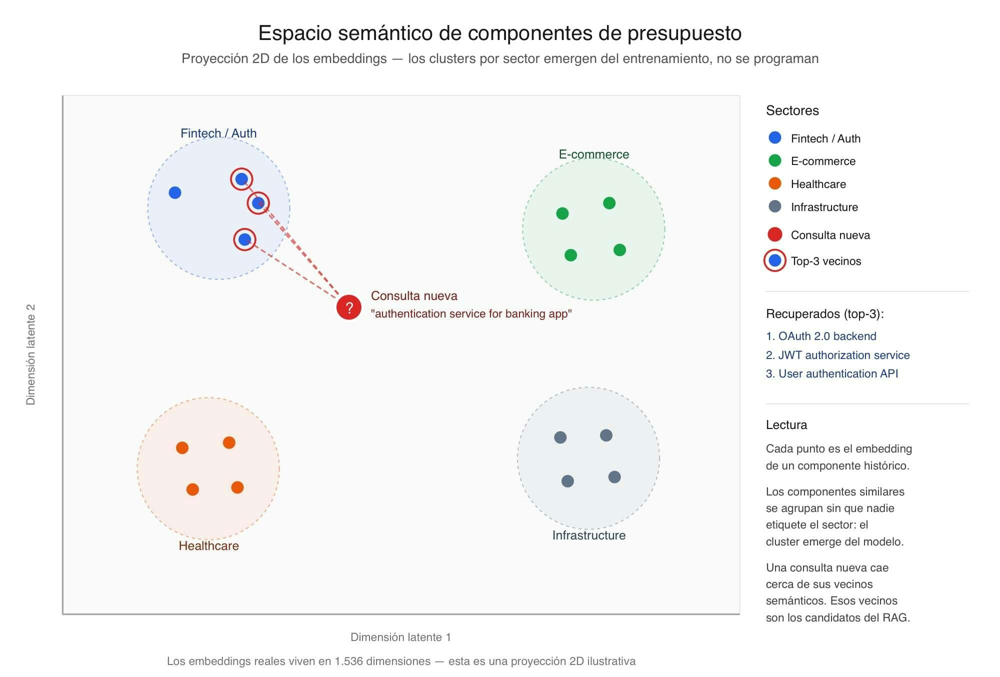

# 📄 Embeddings: Del texto a la geometría semántica 🔴 — 21 min

⌛Tiempo estimado: 21 minutosAcabas de terminar la Sesión 06 con proyectos reales de varios sectores. Cada uno con sus componentes desglosados, horas estimadas, stack tecnológico y descripciones.Lo ...

Nota: la lección devolvió un error de renderizado en la plataforma durante el archivado automático. Se conserva aquí la metadata pública disponible y el enlace original.

[Abrir lección original](https://training.lidr.co/posts/ai-engineering-202604-📄-embeddings-del-texto-a-la-geometria-semantica-🔴-21-min)
