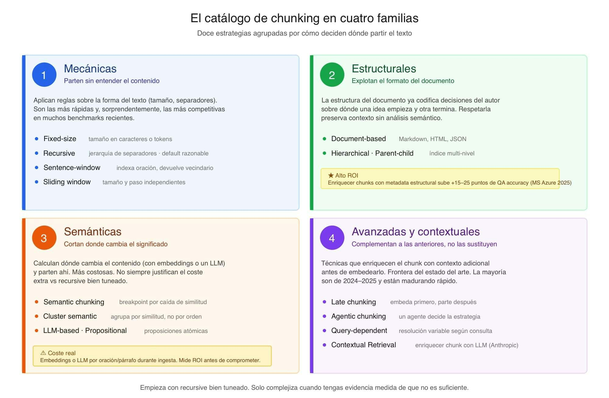

# 📄 Estrategias profesionales de chunking 🔴 — 32 min

⌛Tiempo estimado: 32 minutosLa pregunta que aún nos falta es la que más impacto tiene en la calidad final de tu sistema RAG: ¿cómo partimos los documentos antes de generar los embeddings?No es una ...

Nota: la lección devolvió un error de renderizado en la plataforma durante el archivado automático. Se conserva aquí la metadata pública disponible y el enlace original.

[Abrir lección original](https://training.lidr.co/posts/ai-engineering-202604-📄-estrategias-profesionales-de-chunking-🔴-32-min)
