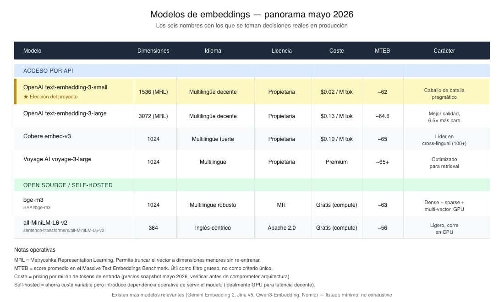

# 📄 Selección de modelos de embeddings: trade-offs en producción 🔴 — 28 min

⌛Tiempo estimado: 28 minutosEn el artículo anterior dejamos clavada la teoría: un embedding es un vector, la geometría inducida por el entrenamiento es lo que hace que vectores cercanos corresponda...

Nota: la lección devolvió un error de renderizado en la plataforma durante el archivado automático. Se conserva aquí la metadata pública disponible y el enlace original.

[Abrir lección original](https://training.lidr.co/posts/ai-engineering-202604-📄-seleccion-de-modelos-de-embeddings-trade-offs-en-produccion-🔴-28-min)
