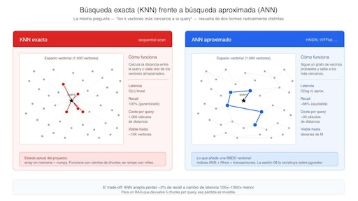
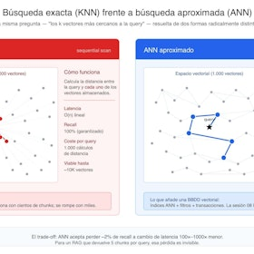
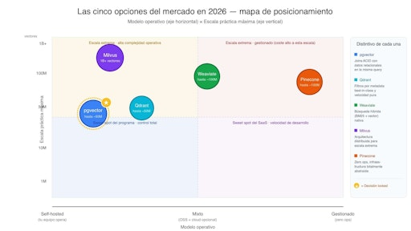
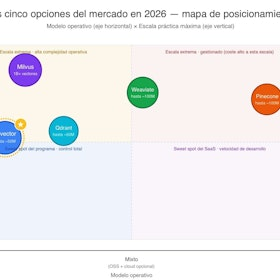
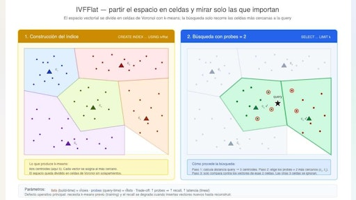
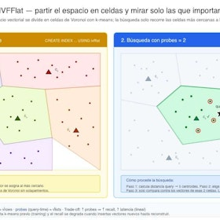
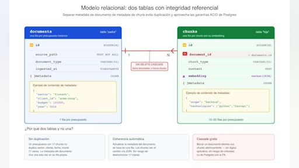
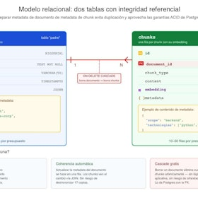
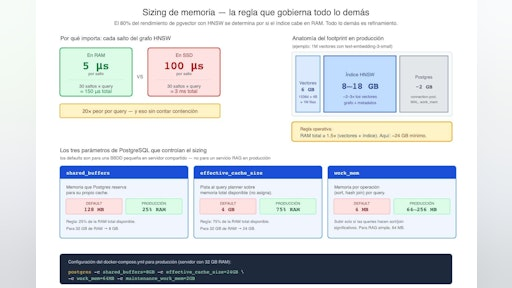
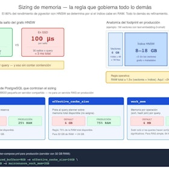

# Sesión 8: Bases de datos vectoriales — 183 min

[Antonio Perez](https://training.lidr.co/members/36030888)

⏳Tiempo estimado: 2 min

[Video](https://player.vimeo.com/video/1194693462?h=6b9fe331bb)

Tienes pgvector funcionando en tu servicio IA. Persistes embeddings, ejecutas búsquedas semánticas, devuelves resultados. Y aun así, todavía no tienes una base de datos vectorial seria. La sesión 08 cierra el Módulo 3 cruzando esa frontera: del setup mínimo del ejercicio pre-sesión a la capa de datos vectorial que cualquier sistema RAG necesita en producción real. Hoy no es recuperación — eso son las sesiones nueve y diez, que dedican todo su tiempo a retrieval. Hoy es lo que pasa dentro de la base de datos antes de que cualquier query la toque.

## Lo que vas a aprender

→ Cómo indexar tu base de datos vectorial para que las búsquedas pasen de cientos de milisegundos a unos pocos, y por qué esa transición define lo que separa un prototipo de un sistema en producción.

→ Los parámetros operativos que gobiernan el trade-off entre velocidad y calidad, ajustados con un barrido empírico sobre tu propio corpus — la decisión razonada, no copiada de un tutorial.

→ Una técnica de compresión moderna que reduce a la mitad el almacenamiento del índice sin pérdida de calidad perceptible, y por qué conviene aplicarla desde el día uno en cualquier proyecto serio.

→ Las herramientas nativas de PostgreSQL para monitorizar el estado de tus índices vectoriales y detectar problemas operativos antes de que se traduzcan en latencia visible para el usuario.

→ El antipatrón silencioso que destruye el rendimiento de tu sistema sin emitir ningún error ni warning, y cómo diagnosticarlo en treinta segundos con la herramienta canónica de PostgreSQL.

→ Las tres señales objetivas — medibles, no estéticas — que indican cuándo tu sistema ha agotado el techo de pgvector y conviene evaluar la migración a una base de datos vectorial dedicada.

Para finalizar, añade tu opinión sobre el contenido y el ejercicio de este módulo:
🆙Evalúa el contenido y el ejercicio de este Módulo

### 
❗Obtén los recursos completos en las siguientes lecciones👇

- 

[✍️ Migración a pgvector + endpoint de búsqueda 🔴

- Visibility: Visible
- Unlocking: None
- Completion: Button
- Comments: On
- Thumbnail: Default
](https://training.lidr.co/posts/ai-engineering-202604-✍️-migracion-a-pgvector-endpoint-de-busqueda-🔴)⏱ La fecha límite es martes 9 de junio al final del día. Objetivo Persistir el pipeline construido en la Sesión 07 en...
- 

[📄 Por qué existen las BBDD vectoriales y cuando realmente las necesitas 🔴 — 31 min

- Visibility: Visible
- Unlocking: None
- Completion: Button
- Comments: On
- Thumbnail: Default
](https://training.lidr.co/posts/ai-engineering-202604-📄-por-que-existen-las-bbdd-vectoriales-y-cuando-realmente-las-necesitas-🔴-31-min)⌛Tiempo estimado: 31 minutos Al final de la sesión anterior tu servicio IA tiene un pipeline funcional: el chunker.py...
- 

[📄 Estado del mercado de BBDD vectoriales 2026 🔴 — 40 min

- Visibility: Visible
- Unlocking: None
- Completion: Button
- Comments: On
- Thumbnail: Default
](https://training.lidr.co/posts/ai-engineering-202604-📄-estado-del-mercado-de-bbdd-vectoriales-2026-🔴-40-min)⌛Tiempo estimado: 40 minutos El artículo anterior cerró con una pregunta abierta. Sabes ya que el proyecto está en el...
- 

[📄 Anatomía de un índice vectorial: HNSW, IVFFlat y el horizonte de DiskANN🔴 — 40 min

- Visibility: Visible
- Unlocking: None
- Completion: Button
- Comments: On
- Thumbnail: Default
](https://training.lidr.co/posts/ai-engineering-202604-📄-anatomia-de-un-indice-vectorial-hnsw-ivfflat-y-el-horizonte-de-diskann🔴-40-min)⌛Tiempo estimado: 40 minutos Si has llegado hasta aquí siguiendo los dos artículos anteriores, sabes ya que vas a...
- 

[📄 Diseño del esquema y búsqueda semántica🔴 — 32 min

- Visibility: Visible
- Unlocking: None
- Completion: Button
- Comments: On
- Thumbnail: Default
](https://training.lidr.co/posts/ai-engineering-202604-📄-diseno-del-esquema-y-busqueda-semantica🔴-32-min)⌛Tiempo estimado: 32 minutos Los tres artículos anteriores han construido la teoría: por qué existen las bases de...
- 

[📄Del prototipo a producción: tuning, monitorización y techo de pgvector 🔴 — 40 min

- Visibility: Visible
- Unlocking: None
- Completion: Button
- Comments: On
- Thumbnail: Default
](https://training.lidr.co/posts/ai-engineering-202604-📄del-prototipo-a-produccion-tuning-monitorizacion-y-techo-de-pgvector-🔴-40-min)⌛Tiempo estimado: 40 minutos Al terminar el ejercicio pre-sesión, tu servicio IA tiene un Postgres con pgvector, un...
- 

[🆙 Evalúa el contenido y el ejercicio de este Módulo

- Visibility: Visible
- Unlocking: None
- Completion: None
- Comments: On
- Thumbnail: Default
](https://training.lidr.co/posts/ai-engineering-202604-🆙-evalua-el-contenido-y-el-ejercicio-de-este-modulo-98724293)Evalúa del 1 al 5 el valor aportado por el contenido del módulo actual. Si al enviar la encuesta te aparece algún...
