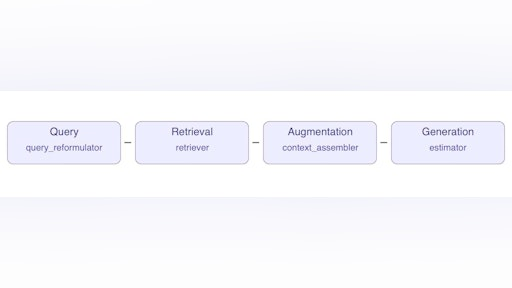
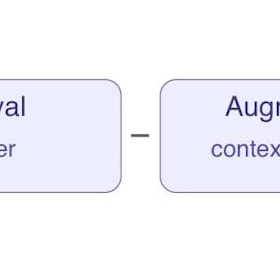
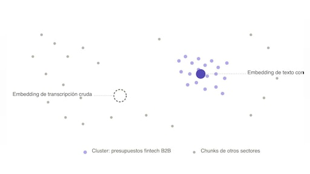
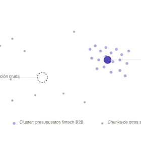
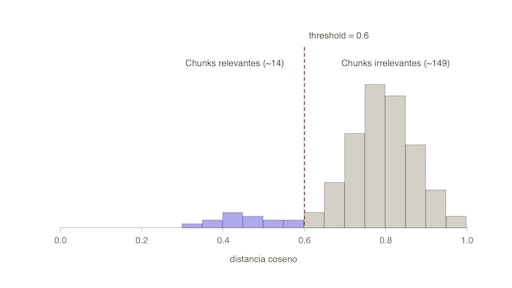
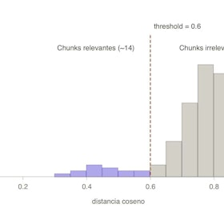
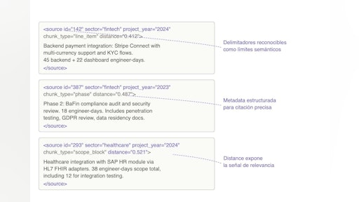
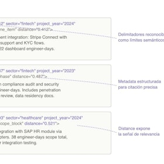
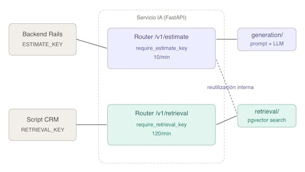
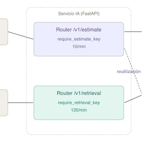

# Sesión 9: Fundamentos de RAG y técnicas de recuperación — 144 min

[Antonio Perez](https://training.lidr.co/members/36030888)

⏳Tiempo estimado: 2 min

[Video](https://player.vimeo.com/video/1200713544?h=ba7cee7e5b)

Al cierre del Módulo 3 tienes el corpus vectorizado en pgvector, los embeddings calculados y los chunks bien estructurados. Pero los datos por sí solos no estiman nada. La Sesión 9 abre el Módulo 4 construyendo las dos capas que faltan para convertir esos datos en respuestas útiles: el retrieval que recupera el material relevante y la generación que produce la respuesta a partir de él. El proyecto sigue siendo el estimador automático de software a partir de transcripciones de reuniones, el mismo que durante las próximas tres semanas vas a convertir en un servicio RAG operable en producción.

**Descubrirás:**

→ Cómo reformular una transcripción cruda en una consulta que la búsqueda vectorial pueda explotar, con extracción estructurada de campos en lugar de embebir el texto entero.

→ Cómo afinar el retriever sobre pgvector para devolver chunks verdaderamente relevantes, no solo similares, usando umbrales de calidad, filtros estructurales sobre metadata y soft-fail explícito cuando la evidencia no es suficiente.

→ Cómo ensamblar el contexto que llega al LLM para que el modelo lo lea con orden, no se pierda en chunks intermedios y reciba la metadata necesaria para citar fuentes.

→ Cómo construir el prompt de generación con grounding explícito, política de "contexto insuficiente" y citación obligatoria de fuentes, para que la respuesta sea trazable y el sistema sepa cuándo no estimar.

→ Cómo aislar la capa de datos como un servicio operable, con autenticación, rate limiting e idempotencia diferenciados entre el retriever y el generador.

Recuerda al finalizar, añadir tu opinión sobre el contenido y el ejercicio de este módulo:
🆙Evalúa el contenido y el ejercicio de este Módulo

### 
❗Obtén los recursos completos en las siguientes lecciones👇

- 

[✍️ Ejercicio: Diagnóstico arquitectónico del sistema RAG actual 🔴

- Visibility: Visible
- Unlocking: None
- Completion: Button
- Comments: On
- Thumbnail: Default
](https://training.lidr.co/posts/ai-engineering-202604-✍️-ejercicio-diagnostico-arquitectonico-del-sistema-rag-actual-🔴)⏱ La fecha límite es martes 16 de junio al final del día. Al cierre de la Sesión 08 tu servicio IA ya puede hacer dos...
- 

[📋 Del CAG estático al flujo RAG: las cuatro etapas y por qué el retrieval domina 🔴 — 25 min

- Visibility: Visible
- Unlocking: None
- Completion: Button
- Comments: On
- Thumbnail: Default
](https://training.lidr.co/posts/ai-engineering-202604-📋-del-cag-estatico-al-flujo-rag-las-cuatro-etapas-y-por-que-el-retrieval-domina-🔴-25-min)⌛ Tiempo estimado: 25 min El sistema que cerraste en la Sesión 05 funciona razonablemente bien hasta un punto...
- 

[📋 Reformulación de queries🔴 — 25 min

- Visibility: Visible
- Unlocking: None
- Completion: Button
- Comments: On
- Thumbnail: Default
](https://training.lidr.co/posts/ai-engineering-202604-📋-reformulacion-de-queries🔴-25-min)⌛ Tiempo estimado: 25 min Tienes ya un servicio IA que sabe embeber texto y buscar chunks similares. La tentación,...
- 

[📋 Retrieval que no es solo cosine: top-K, threshold y filtros sobre pgvector 🔴 — 30 min

- Visibility: Visible
- Unlocking: None
- Completion: Button
- Comments: On
- Thumbnail: Default
](https://training.lidr.co/posts/ai-engineering-202604-📋-retrieval-que-no-es-solo-cosine-top-k-threshold-y-filtros-sobre-pgvector-🔴-30-min)⌛ Tiempo estimado: 30 min Al cierre de la Sesión 08 dejaste construido un endpoint de búsqueda que recibe un vector...
- 

[📋 Augmentation: ensamblar contexto para que el LLM lo use bien 🔴 — 32 min

- Visibility: Visible
- Unlocking: None
- Completion: Button
- Comments: On
- Thumbnail: Default
](https://training.lidr.co/posts/ai-engineering-202604-📋-augmentation-ensamblar-contexto-para-que-el-llm-lo-use-bien-🔴-32-min)⌛ Tiempo estimado: 32 min La tentación del "\\n\\n".join y por qué falla El retriever del Artículo 3 te ha devuelto...
- 

[📋 La capa de datos como servicio: aislar y securizar el retriever🔴 — 32 min

- Visibility: Visible
- Unlocking: None
- Completion: Button
- Comments: On
- Thumbnail: Default
](https://training.lidr.co/posts/ai-engineering-202604-📋-la-capa-de-datos-como-servicio-aislar-y-securizar-el-retriever🔴-32-min)⌛ Tiempo estimado: 32 min Al cierre del Artículo 4 tienes el flujo RAG completo dentro del servicio IA: reformulador,...
- 

[🆙 Evalúa el contenido y el ejercicio de este Módulo

- Visibility: Visible
- Unlocking: None
- Completion: None
- Comments: On
- Thumbnail: Default
](https://training.lidr.co/posts/ai-engineering-202604-🆙-evalua-el-contenido-y-el-ejercicio-de-este-modulo-98724306)Evalúa del 1 al 5 el valor aportado por el contenido del módulo actual. Si al enviar la encuesta te aparece algún...
Explore More Posts[Previous4️⃣ Módulo: Arquitectura RAG](https://training.lidr.co/posts/ai-engineering-202604-4️⃣-modulo-arquitectura-rag)[Next✍️ Ejercicio: Diagnóstico arquitectónico del sistema RAG actual 🔴](https://training.lidr.co/posts/ai-engineering-202604-✍️-ejercicio-diagnostico-arquitectonico-del-sistema-rag-actual-🔴)
