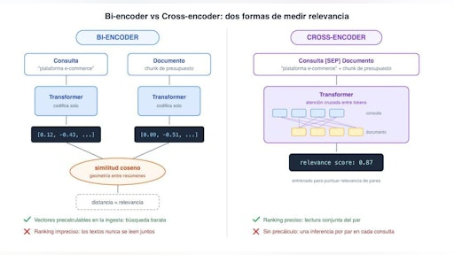
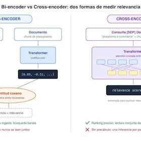
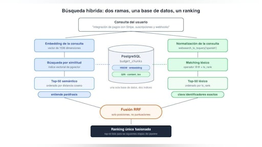
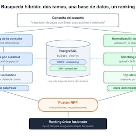
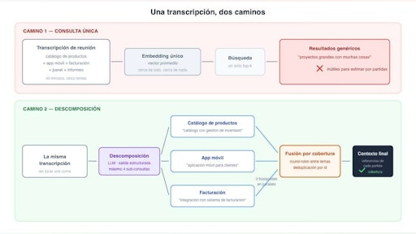
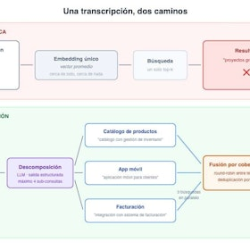
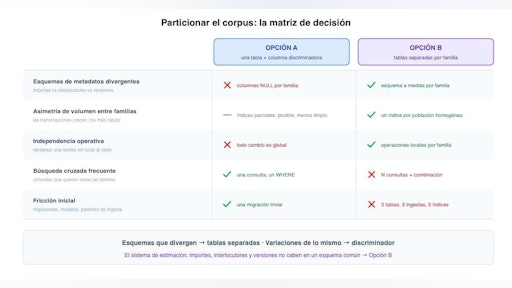
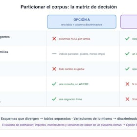
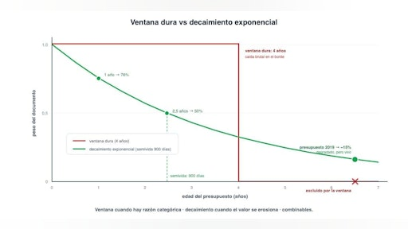
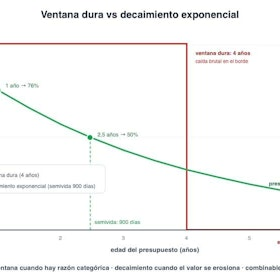

# Sesión 10: Técnicas de recuperación — 129 min

[Antonio Perez](https://training.lidr.co/members/36030888)

⏳Tiempo estimado: 2 min

[Video](https://player.vimeo.com/video/1200715792?h=d4075ef446)

Tu RAG ya funciona: recupera presupuestos parecidos a lo que buscas. Pero parecido no es lo mismo que útil, y cuando el sistema te devuelve una app de pagos al pedirle una plataforma de e-commerce, estás a un paso de una mala estimación. En esta sesión convertimos una recuperación aceptable en una recuperación precisa, y lo demostramos con números, no con sensaciones.

**En esta sesión descubrirás:**

→ Por qué la búsqueda vectorial ordena mal los resultados finos y cómo el reranking con cross-encoders reordena los candidatos leyendo consulta y documento juntos

→ Cómo combinar búsqueda semántica y búsqueda por palabras exactas con full-text search en PostgreSQL, y cómo fusionar ambos rankings con Reciprocal Rank Fusion

→ Cómo medir con un golden set propio si cada técnica compensa su coste en latencia, antes de llevarla a producción

→ Cómo descomponer consultas complejas en sub-búsquedas y dirigir cada una al índice correcto mediante routing

→ Cómo el filtrado por metadatos y el decaimiento temporal evitan que un presupuesto obsoleto contamine tus estimaciones

Al finalizar, añade tu opinión sobre el contenido y el ejercicio de este módulo:
🆙Evalúa el contenido y el ejercicio de este Módulo

### 
❗Obtén los recursos completos en las siguientes lecciones👇

- 

[✍️ Ejercicio: Técnicas avanzadas de recuperación 🔴

- Visibility: Visible
- Unlocking: None
- Completion: Button
- Comments: On
- Thumbnail: Default
](https://training.lidr.co/posts/ai-engineering-202604-✍️-ejercicio-tecnicas-avanzadas-de-recuperacion-🔴)⏱ La fecha límite es martes 23 de junio al final del día. Vuestro pipeline RAG ya funciona de extremo a extremo:...
- 

[📄 Reranking: cuando el top-k vectorial no es suficiente 🔴— 24 min

- Visibility: Visible
- Unlocking: None
- Completion: Button
- Comments: On
- Thumbnail: Default
](https://training.lidr.co/posts/ai-engineering-202604-📄-reranking-cuando-el-top-k-vectorial-no-es-suficiente-🔴-24-min)⌛Tiempo estimado: 24 minutos Imagina esta escena en el sistema de estimación de proyectos. Llega una transcripción de...
- 

[📄 Cómo saber si el reranking compensa: medición artesanal de relevancia 🔴— 23 min

- Visibility: Visible
- Unlocking: None
- Completion: Button
- Comments: On
- Thumbnail: Default
](https://training.lidr.co/posts/ai-engineering-202604-📄-como-saber-si-el-reranking-compensa-medicion-artesanal-de-relevancia-🔴-23-min)⌛Tiempo estimado: 23 minutos "Parece que va mejor" no es un argumento Imagina la situación. Has añadido una etapa de...
- 

[📄 Búsqueda híbrida 🔴— 23 min

- Visibility: Visible
- Unlocking: None
- Completion: Button
- Comments: On
- Thumbnail: Default
](https://training.lidr.co/posts/ai-engineering-202604-📄-busqueda-hibrida-🔴-23-min)⌛Tiempo estimado: 23 minutos Una escena del sistema de estimación de proyectos. Llega la descripción de un proyecto...
- 

[📄 Expansión y descomposición de consultas 🔴— 22 min

- Visibility: Visible
- Unlocking: None
- Completion: Button
- Comments: On
- Thumbnail: Default
](https://training.lidr.co/posts/ai-engineering-202604-📄-expansion-y-descomposicion-de-consultas-🔴-22-min)⌛Tiempo estimado: 22 minutos Hasta ahora, cada mejora de recuperación que uno suele plantearse actúa después de la...
- 

[📄 Multi-indice y routing 🔴— 19 min

- Visibility: Visible
- Unlocking: None
- Completion: Button
- Comments: On
- Thumbnail: Default
](https://training.lidr.co/posts/ai-engineering-202604-📄-multi-indice-y-routing-🔴-19-min)⌛Tiempo estimado: 19 minutos Durante sus primeras semanas de vida, el sistema de estimación tenía un corpus...
- 

[📄 Filtrado contextual y temporal 🔴— 18 min

- Visibility: Visible
- Unlocking: None
- Completion: Button
- Comments: On
- Thumbnail: Default
](https://training.lidr.co/posts/ai-engineering-202604-📄-filtrado-contextual-y-temporal-🔴-18-min)⌛Tiempo estimado: 18 minutos Una última escena del sistema de estimación. Llega la descripción de un proyecto: portal...
- 

[🆙 Evalúa el contenido de este Módulo

- Visibility: Visible
- Unlocking: None
- Completion: None
- Comments: On
- Thumbnail: Default
](https://training.lidr.co/posts/ai-engineering-202604-🆙-evalua-el-contenido-de-este-modulo-98724321)Evalúa del 1 al 5 el valor aportado por el contenido del módulo actual. Si al enviar la encuesta te aparece algún...
Explore More Posts[Previous🆙 Evalúa el contenido y el ejercicio de este Módulo](https://training.lidr.co/posts/ai-engineering-202604-🆙-evalua-el-contenido-y-el-ejercicio-de-este-modulo-98724306)[Next✍️ Ejercicio: Técnicas avanzadas de recuperación 🔴](https://training.lidr.co/posts/ai-engineering-202604-✍️-ejercicio-tecnicas-avanzadas-de-recuperacion-🔴)
