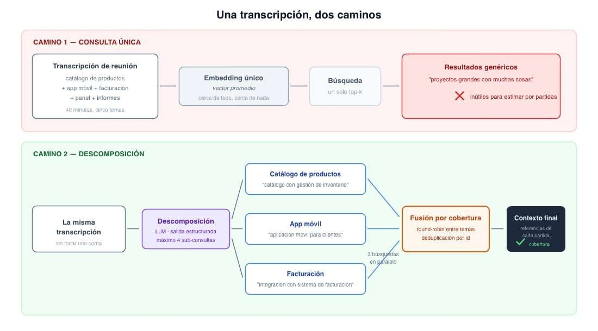
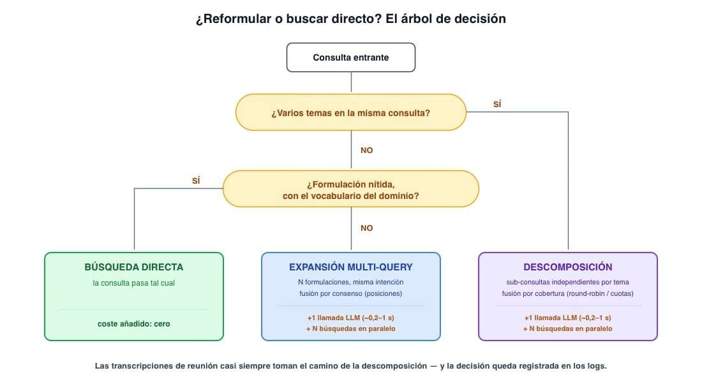

# 📄 Expansión y descomposición de consultas 🔴— 22 min

[Antonio Perez](https://training.lidr.co/members/36030888)

⌛Tiempo estimado: 22 minutos

Hasta ahora, cada mejora de recuperación que uno suele plantearse actúa*después*de la consulta: mejores índices, mejores rankings, mejores filtros. Este artículo mira al otro lado del mostrador, porque en el sistema de estimación de proyectos hay un problema que ninguna mejora del lado de los documentos puede arreglar: la consulta misma.

El caso concreto. La entrada habitual del sistema no es una consulta limpia de buscador — es una transcripción de reunión de cuarenta minutos. El cliente empieza hablando del catálogo de productos, salta a que también quieren app móvil, dedica diez minutos a la integración con su sistema de facturación, y entre medias aparecen el panel de administración y los informes mensuales. Cuando esa transcripción (o su resumen) se convierte en*una*consulta de búsqueda, su embedding es el promedio de todos esos temas a la vez: un vector que está moderadamente cerca de todo y genuinamente cerca de nada. La búsqueda devuelve presupuestos "de proyectos grandes con muchas cosas", que es la peor categoría posible para estimar, porque la estimación se construye por partidas: el catálogo se estima con referencias de catálogos, la integración de facturación con referencias de integraciones.

Hay un segundo problema, más sutil, que afecta incluso a consultas de un solo tema:**la lotería de la formulación**. El cliente dice "que los comerciales vean sus números desde el móvil"; el presupuesto histórico relevante decía "dashboard de KPIs con versión responsive". Mismo concepto, vocabularios distintos, y aunque los embeddings cruzan paráfrasis mejor que cualquier tecnología anterior, no son inmunes: la formulación concreta de la consulta decide qué vecinos tiene en el espacio vectorial, y una formulación desafortunada recupera peor que una afortunada. Que la calidad de la recuperación dependa de la suerte al redactar es exactamente el tipo de fragilidad que un sistema de producción no puede permitirse.

Las dos técnicas de este artículo atacan estos dos problemas reformulando la consulta antes de buscar — y conviene aprenderlas juntas precisamente porque se confunden con facilidad y no son intercambiables.

## Dos técnicas que parecen una

**La expansión de consultas (multi-query)**genera varias formulaciones alternativas de*la misma intención*y busca con todas. Si la consulta original es "que los comerciales vean sus números desde el móvil", las variantes podrían ser "dashboard de métricas comerciales para dispositivos móviles", "visualización de KPIs de ventas en aplicación móvil" y "informes de ventas accesibles desde smartphone". Una de ellas caerá cerca del presupuesto relevante aunque la original no lo hiciera. La expansión es un seguro contra la lotería de la formulación: en lugar de un boleto, juegas cuatro.

**La descomposición de consultas**parte una consulta que mezcla*varias intenciones*en sub-consultas independientes, una por tema. La transcripción del cliente se convierte en "catálogo de productos con gestión de inventario", "aplicación móvil para clientes", "integración con sistema de facturación" y "panel de administración con informes". Cada sub-consulta tiene un embedding nítido que apunta a su rincón del espacio vectorial, y cada una recupera presupuestos de*su*tema — que es como se estima de verdad.

La pregunta que las distingue cabe en una línea:**¿la consulta pide una cosa que puede decirse de muchas maneras, o muchas cosas dichas a la vez?**Lo primero se expande; lo segundo se descompone. Aplicar la técnica equivocada no es neutro: expandir una consulta multi-tema produce cuatro variantes igual de mezcladas (cuatro boletos del sorteo equivocado), y descomponer una consulta de un solo tema fabrica sub-temas artificiales que recuperan ruido.

## Generar las variantes: un LLM con la correa corta

¿Quién escribe las variantes o las sub-consultas? Hace años esto se hacía con diccionarios de sinónimos y reglas; hoy la respuesta natural es un LLM, que entiende la consulta y puede reformularla o trocearla con criterio. Pero "llamar al LLM" sin más es la versión ingenua: la versión de producción exige dos disciplinas.

**Primera disciplina: salida estructurada, no texto libre.**Las sub-consultas son entrada de la siguiente etapa del pipeline, no prosa para un humano. Pedirlas como texto y parsearlas con expresiones regulares es fabricar un punto de rotura. La salida se define como esquema y se exige al modelo cumplirlo:

python

`# app/generation/rag/retrieval/query_[expansion.py](http://expansion.py)

from pydantic import BaseModel, Field

class SubQuery(BaseModel):
"""A self-contained search query targeting a single workstream."""
topic: str = Field(description="Short workstream label, e.g. 'billing integration'") query: str = Field(description="Standalone search query for this workstream")

class QueryDecomposition(BaseModel):
"""Decomposition of a project description into independent sub-queries."""
sub_queries: list[SubQuery] = Field(min_length=1, max_length=4)`

**Segunda disciplina: instrucciones que acotan, no que inspiran.**El riesgo específico de poner un LLM a reescribir consultas es que "mejore" demasiado: que invente requisitos que el cliente no mencionó, que traduzca la terminología del dominio a sinónimos genéricos, o que fabrique ocho sub-consultas donde había dos temas. Cada una de esas creatividades contamina la recuperación aguas abajo. Las instrucciones deben leerse como una correa corta:

python

`DECOMPOSITION_INSTRUCTIONS = """
You split a software project description into independent search queries,
one per distinct workstream, to retrieve similar past project budgets.

Rules:

- 

Produce at most 4 sub-queries. Fewer is better than fragmented.

- 

Each sub-query must be self-contained and understandable without the others.

- 

Preserve the exact domain terms used in the description (product names,
technologies, acronyms). Never replace them with generic synonyms.

- 

Never add requirements, features or technologies that the description
does not mention.

- 

If the description covers a single topic, return exactly one sub-query
that rephrases it cleanly.
"""

async def decompose_query(self, raw_query: str) -> list[SubQuery]:
"""Split a multi-topic query into focused sub-queries."""
response = await self._client.responses.parse(
model=settings.query_expansion_model,
instructions=DECOMPOSITION_INSTRUCTIONS,
input=raw_query,
text_format=QueryDecomposition,
)
sub_queries = response.output_parsed.sub_queries
[logger.info](http://logger.info)(
"query_decomposed",
sub_query_count=len(sub_queries),
topics=[sub_query.topic for sub_query in sub_queries],
)
return sub_queries`

Dos detalles del código que son decisiones, no accidentes. El límite de cuatro sub-consultas vive*en dos sitios*— en el esquema (max_length=4, que el modelo no puede violar) y en las instrucciones (que le explican por qué) — porque el esquema garantiza y la instrucción orienta, y en producción se quieren las dos cosas. Y el modelo se elige por configuración: para reformular consultas no hace falta el modelo más capaz del catálogo, hace falta el más rápido que haga bien una tarea pequeña y muy acotada — esta llamada está en el camino crítico de cada búsqueda, y cada punto de capacidad de sobra se paga en latencia.

La expansión multi-query es el mismo patrón con otras instrucciones (generar N formulaciones alternativas de la misma intención, conservando los términos exactos del dominio); no merece código aparte.

## Fusionar sin perder de vista para qué se buscaba

Cada sub-consulta produce su propio ranking de presupuestos. Falta el último paso: convertir N rankings en el conjunto único que consumirá el resto del pipeline. Y aquí hay una sutileza que casi todo el material introductorio pasa por alto:**expansión y descomposición no deben fusionar igual, porque persiguen cosas distintas**.

En la**expansión**, las N variantes buscaban lo mismo. Un presupuesto que aparece bien posicionado en varias variantes es una señal fuerte de relevancia, así que la fusión correcta premia el consenso. La herramienta natural es la fusión por posiciones — al estilo de Reciprocal Rank Fusion: cada documento suma puntuación inversamente proporcional a su posición en cada ranking donde aparece —, que hace flotar a los documentos que todas las formulaciones respetan.

En la**descomposición**, las N sub-consultas buscaban cosas*deliberadamente distintas*. Premiar el consenso aquí es sabotear el objetivo: un presupuesto de catálogo jamás aparecerá en el ranking de la integración de facturación, y si fusionamos por consenso global, el tema con más presupuestos en el histórico inundará el resultado y los temas minoritarios se quedarán sin representación — exactamente el problema del que veníamos huyendo. La fusión correcta para la descomposición garantiza**cobertura por tema**: un reparto del presupuesto de contexto entre sub-consultas (los dos mejores de cada una, por ejemplo) o una intercalación en round-robin que va tomando el siguiente mejor de cada ranking por turnos. Para estimar, esto no es un matiz técnico: es la diferencia entre un contexto con referencias de*cada*partida del proyecto y un contexto monotemático.

python

`# app/generation/rag/retrieval/[fusion.py](http://fusion.py)(fragment)

def interleave_rankings(
rankings: list[list[RetrievedChunk]],
top_k: int,
) -> list[RetrievedChunk]:
"""Round-robin across rankings to guarantee per-topic coverage."""
fused: list[RetrievedChunk] = []
seen_ids: set[str] = set()
for position in range(max(len(ranking) for ranking in rankings)): for ranking in rankings: if position < len(ranking) and ranking[position].id not in seen_ids: fused.append(ranking[position]) seen_ids.add(ranking[position].id) if len(fused) == top_k: return fused return fused`

La deduplicación que se ve en el código (seen_ids) no es defensiva por capricho: cuando un presupuesto cubre dos temas — los hay —, aparece en dos rankings, y sin deduplicar consumiría dos plazas del contexto contando una sola vez como información. Las N búsquedas, por su parte, son independientes entre sí, así que se lanzan en paralelo (asyncio.gather); el coste en latencia de buscar cuatro veces es aproximadamente el de buscar una, no el cuádruple.

## El precio: una llamada al LLM antes de cada búsqueda

Toca la parte de la factura, porque estas técnicas tienen un coste estructuralmente distinto al de las demás mejoras de recuperación: meten**una generación de LLM en el camino crítico, antes incluso de empezar a buscar**.

El coste tiene tres partidas.**Latencia:**una llamada de reformulación con un modelo pequeño y salida corta se mueve típicamente entre doscientos milisegundos y un segundo; es, con diferencia, el sumando más caro que estas técnicas añaden, y llega antes de que la búsqueda haya hecho nada.**Tokens:**cada búsqueda paga ahora una generación; con modelos pequeños es calderilla por consulta, pero es calderilla*multiplicada por cada consulta del sistema*, y conviene tenerla en el panel de costes desde el primer día.**Carga:**N búsquedas paralelas son N consultas a la base de datos y un conjunto de candidatos N veces mayor entrando a las etapas posteriores del pipeline, que también cobran por volumen.

Las mitigaciones sensatas, por orden de rentabilidad: usar el modelo más pequeño que haga la tarea con fiabilidad (y comprobar con ejemplos reales que la hace — la reformulación es una tarea humilde, pero "humilde" no es "gratis de verificar"); limitar las variantes a tres o cuatro, porque la ganancia marginal de la quinta formulación es indistinguible de cero; y cachear las reformulaciones — la misma consulta repetida no necesita repensarse, y en sistemas donde las consultas se parecen mucho entre sí la tasa de acierto de esa caché sorprende.

Y la mitigación mayor de todas:**no aplicar la técnica cuando no toca**. Una consulta corta, nítida y de un solo tema no necesita ni expansión ni descomposición; reformularla es pagar latencia para revolver un ranking que ya estaba bien. El sistema puede decidirlo con una heurística humilde (longitud y estructura de la consulta como primera aproximación: las transcripciones largas se descomponen siempre, las consultas cortas pasan directas) y dejar la decisión registrada en los logs, para que cuando una recuperación se audite quede claro qué camino siguió la consulta y por qué.

## Dónde vive y cómo se enchufa

En la arquitectura del servicio IA, la reformulación es una etapa más de la capa de recuperación, con la misma propiedad componible que el resto: recibe una consulta, devuelve una lista de consultas (de tamaño uno si no hay nada que reformular), y la etapa siguiente busca con todas y fusiona. Activarla, desactivarla o cambiar su estrategia es configuración, no cirugía — y por tanto su impacto se puede medir como el de cualquier otra pieza: misma referencia fija de consultas anotadas, con y sin la técnica, y que decidan los números. Con un matiz de honestidad: estas técnicas brillan en las consultas difíciles (las largas, las mezcladas, las mal formuladas), así que si el conjunto de consultas con el que se mide solo contiene consultas limpias de laboratorio, el veredicto saldrá injustamente tibio. La medición vale lo que valga su parecido con el tráfico real.

## La consulta también es código

La idea para llevarse: tendemos a tratar la consulta como un dato inmutable que el usuario nos da, y todo el ingenio lo gastamos aguas abajo. Pero la consulta es la mitad de la ecuación de relevancia, y es la mitad que peor llega: promediada cuando mezcla temas, frágil cuando la formulación cae lejos del vocabulario del corpus. Expandir multiplica las formulaciones de una misma intención y fusiona premiando el consenso; descomponer separa las intenciones y fusiona garantizando cobertura. Las dos pagan una llamada al LLM en el camino crítico, y las dos se aplican con criterio, no por defecto.

En la sesión en vivo trabajaremos la descomposición sobre el caso más exigente del sistema de estimación — transcripciones reales de reunión, con sus temas entrelazados — y veremos cómo cambia el contexto que llega al generador cuando cada partida del proyecto trae sus propias referencias.

Explore More PostsReady to move on to the next Lesson?[Mark as Complete](#)[Previous📄 Búsqueda híbrida 🔴— 23 min](https://training.lidr.co/posts/ai-engineering-202604-📄-busqueda-hibrida-🔴-23-min)[Next📄 Multi-indice y routing 🔴— 19 min](https://training.lidr.co/posts/ai-engineering-202604-📄-multi-indice-y-routing-🔴-19-min)[Previous Comments](#)

[More Comments](#)

Drag photo, video or file here[Comment](#)[Cancel](#)
