# Sesión 11: RAG Avanzado - Generación y calidad — 114 min

[Antonio Perez](https://training.lidr.co/members/36030888)

⏳Tiempo estimado: 1 min

## Generación verificable

Tu RAG recupera bien. Pero recuperar presupuestos similares y*generar una estimación de la que puedas defender cada número*son dos cosas distintas. En esta sesión, transformamos el sistema de una caja negra que "parece acertada" a un sistema donde cada cifra es trazable hasta su fuente, donde los rangos honestos reemplazan a los números falsos, y donde tienes números concretos que te dicen si está mejorando o empeorando.

Hoy, cuando dos presupuestos históricos dicen cosas distintas, el modelo elige uno sin que entiendas por qué. Cuando se inventa una cifra, no hay nada que lo ataje. Cuando dices que todo es mejor, no tienes cómo comprobarlo. En esta sesión eso cambia.

En esta sesión descubrirás:

→ Cómo preparar el contexto recuperado, comprimir, destilary ordenarlo, para que el modelo trabaje con señal en lugar de ruido, sin pagar el coste de un LLM por cada fragmento

→ Cómo sintetizar presupuestos que se contradicen en un rango honesto con una razón auditable, en lugar de promediar a ciegas

→ Cómo hacer que cada cifra cite exactamente la línea del presupuesto histórico de la que salió, de forma que un humano pueda verificarla en un clic

→ Cómo detectar alucinaciones antes de que salgan del sistema, desde lo barato (anclaje numérico) hasta lo que cuesta (un modelo como juez), y abstenerse en lugar de inventar

→ Cómo mantener sano el índice vectorial para que nada se degrade en silencio cuando cambias modelos, corriges documentos o añades presupuestos nuevos

→ Cómo medir con RAGAS si el sistema está de verdad mejorando o si una "mejora" fue una regresión disfrazada

**Pre-work:**Citación verificable + evaluación RAGAS. Trae la tabla de métricas y el reporte de verificación. Sin eso, el directo será más lento.

Por favor, recuerda añadir tu opinión sobre el contenido y el ejercicio de este módulo:
🆙Evalúa el contenido y el ejercicio de este Módulo

### 
❗Obtén los recursos completos en las siguientes lecciones👇

- 

[✍️ Ejercicio: RAG avanzado: generación y calidad🔴

- Visibility: Visible
- Unlocking: None
- Completion: Button
- Comments: On
- Thumbnail: Default
](https://training.lidr.co/posts/ai-engineering-202604-✍️-ejercicio-rag-avanzado-generacion-y-calidad🔴)⏱ La fecha límite es Martes 30 de Junio, al final del día. La recuperación ya funciona bien. Tras las sesiones 9 y 10...
- 

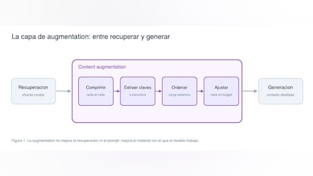

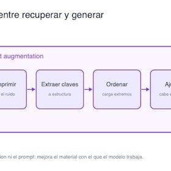

[📄 Content augmentation: preparar el contexto recuperado antes de generar 🔴 — 19 min

- Visibility: Visible
- Unlocking: None
- Completion: Button
- Comments: On
- Thumbnail: Default
](https://training.lidr.co/posts/ai-engineering-202604-📄-content-augmentation-preparar-el-contexto-recuperado-antes-de-generar-🔴-19-min)⏳ Tiempo estimado: 19 min Cuando el sistema de estimaciones recibe una transcripción y la convierte en una consulta,...
- 

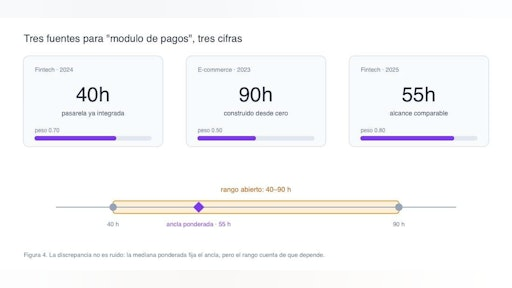

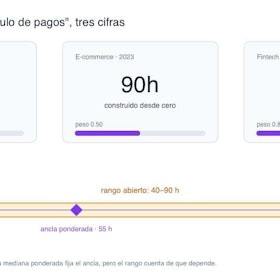

[📄 Síntesis de múltiples presupuestos: combinar fuentes que se contradicen 🔴 — 19 min

- Visibility: Visible
- Unlocking: None
- Completion: Button
- Comments: On
- Thumbnail: Default
](https://training.lidr.co/posts/ai-engineering-202604-📄-sintesis-de-multiples-presupuestos-combinar-fuentes-que-se-contradicen-🔴-19-min)⏳ Tiempo estimado: 19 min El sistema de estimaciones rara vez se apoya en un solo presupuesto histórico. Para estimar...
- 

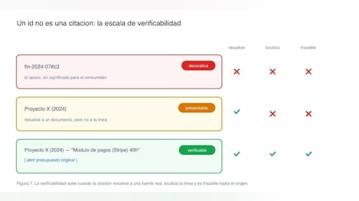

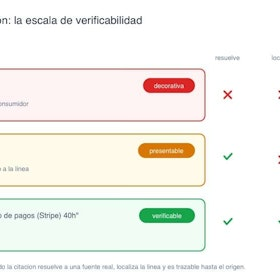

[📄 Citación y atribución verificable 🔴 — 19 min

- Visibility: Visible
- Unlocking: None
- Completion: Button
- Comments: On
- Thumbnail: Default
](https://training.lidr.co/posts/ai-engineering-202604-📄-citacion-y-atribucion-verificable-🔴-19-min)⏳ Tiempo estimado: 19 min La estimación que produce el sistema ya no es una cifra suelta. Cada componente llega con...
- 

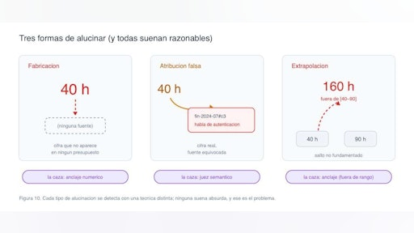

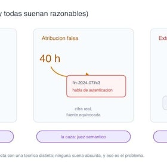

[📄 Detección y mitigación de alucinaciones 🔴 — 21 min

- Visibility: Visible
- Unlocking: None
- Completion: Button
- Comments: On
- Thumbnail: Default
](https://training.lidr.co/posts/ai-engineering-202604-📄-deteccion-y-mitigacion-de-alucinaciones-🔴-21-min)⏳ Tiempo estimado: 21 min Llegamos al punto donde la estimación parece intachable. Cada componente lleva su cifra,...
- 

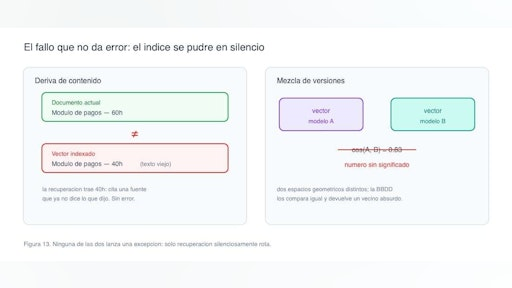

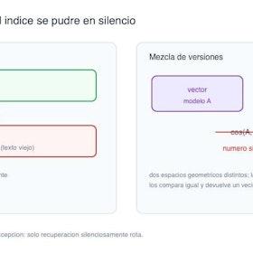

[📄 Reindexación y versionado de embeddings🔴 — 17 min

- Visibility: Visible
- Unlocking: None
- Completion: Button
- Comments: On
- Thumbnail: Default
](https://training.lidr.co/posts/ai-engineering-202604-📄-reindexacion-y-versionado-de-embeddings🔴-17-min)⏳ Tiempo estimado: 17 min El sistema de estimaciones tiene un corpus de presupuestos históricos ya vectorizado y...
- 

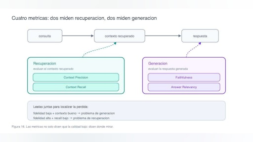

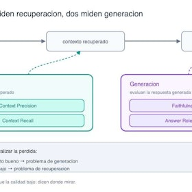

[📄 Evaluación de calidad con RAGAS🔴 — 19 min

- Visibility: Visible
- Unlocking: None
- Completion: Button
- Comments: On
- Thumbnail: Default
](https://training.lidr.co/posts/ai-engineering-202604-📄-evaluacion-de-calidad-con-ragas🔴-19-min)⏳ Tiempo estimado: 19 min El sistema de estimaciones ya hace cosas que hace unas semanas parecían difíciles: recupera...
- 

[🆙 Evalúa el contenido de este Módulo

- Visibility: Visible
- Unlocking: None
- Completion: None
- Comments: On
- Thumbnail: Default
](https://training.lidr.co/posts/ai-engineering-202604-🆙-evalua-el-contenido-de-este-modulo-98724340)Evalúa del 1 al 5 el valor aportado por el contenido del módulo actual. Si al enviar la encuesta te aparece algún...
Explore More Posts[Previous🆙 Evalúa el contenido de este Módulo](https://training.lidr.co/posts/ai-engineering-202604-🆙-evalua-el-contenido-de-este-modulo-98724321)[Next✍️ Ejercicio: RAG avanzado: generación y calidad🔴](https://training.lidr.co/posts/ai-engineering-202604-✍️-ejercicio-rag-avanzado-generacion-y-calidad🔴)
